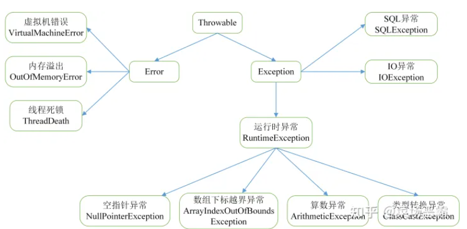
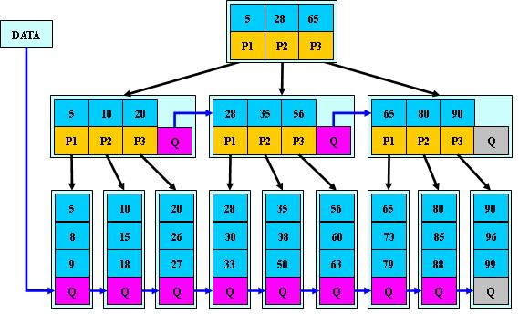
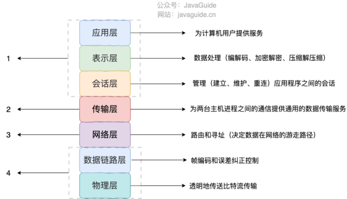
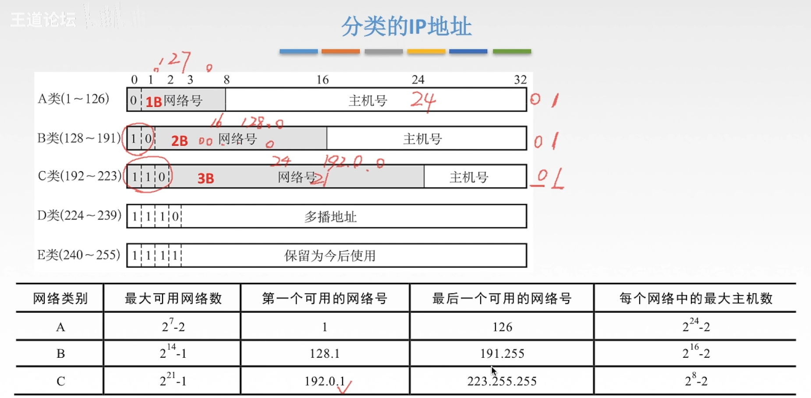
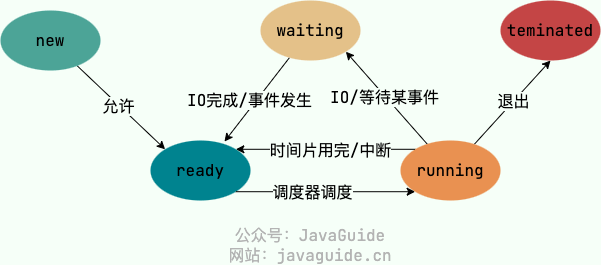
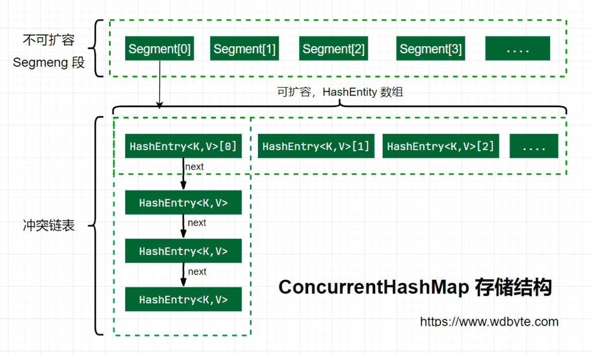
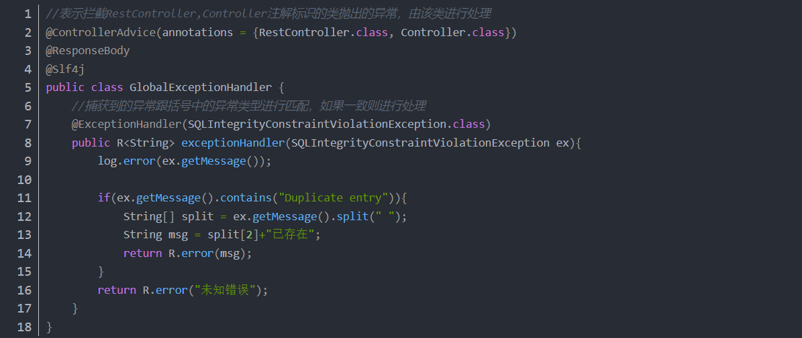

## Java基础

#### Java为什么是”编译与解释并存“的语言？（编译体现在JIT）

- **编译型语言**：编译器会把代码一次性编译成平台可以执行的机器码，这种语言开发效率低，但是执行快。比如C，C++，Go。
- **解释性语言**：解释器把代码一行一行解释为机器码后执行，执行慢，开发效率高。比如Python。

- **Java代码从源代码到运行的过程**：`.java`文件到`.class`文件这一步是编译过程，`.class`是字节码文件，然后通过JVM类加载器首先加载字节码文件，通过解释器逐行解释，而热点代码由**JIT**（just in time compilation）编译器完成编译后把机器码保存下来，下次可以直接使用（机器码效率肯定高于Java解释器）。


#### Java有哪些数据类型

- 基本数据类型（八种）：byte（1字节），short（2），int（4），long（8），float（4），double（8），boolean（保存为int，4字节），char（2）
- 引用数据类型

#### Java运算符优先级

- 单目乘除为关系，逻辑三目后赋值。
- 单目：单目运算符+ –(负数) ++ -- 等 
  乘除：算数单目运算符* / % + - 
  为：位移单目运算符<< >> 
  关系：关系单目运算符> < >= <= == != 
  逻辑：逻辑单目运算符&& || & | ^ 
  三目：三目单目运算符A > B ? X : Y 
  后：无意义，仅仅为了凑字数 
  赋值：赋值=

#### 1. **解释下什么是面向对象？面向对象和面向过程的区别？**   ✅

**Java是完全面向对象的语言，比如想执行个什么程序，都要用类里面写一个public static void main方法作为执行入口。**

面向过程是一种**以事件为中心**的编程思想，编程时把解决问题的步骤分析出来，**用函数把步骤实现**，按照具体步骤顺序调用函数。

面向对象是一种**以对象为中心**的编程思想，当事件变得复杂庞大时，面向过程就不够了。面向对象把事物看作对象，每个对象都有自己的**属性和行为**，对象和对象之间通过方法来交互。把解决的问题分解成各个对象，通过使用对象的属性和方法解决问题。

**区别：**

1. 编程思路不同：面向过程以实现功能的方法开发为主，而面向对象首先要抽象出类、属性、方法，然后通过实例化类、执行方法来完成功能。
2. 封装性：都具有封装性，但是面向过程封装的是功能，而面向对象封装的是属性和行为。
3. 面向对象具有多态性和继承性，而面向过程没有多态性和继承性，所以面向对象具有明显的优势。

#### 2. static方法为什么不能调用非静态成员变量

- 因为静态方法属于类，在类加载过程中就存储在方法区了，而非静态成员变量是在对象实例化时才会分配堆内存，所以当类的非静态成员不存在时，静态方法就已经存在了，此时去调用非静态成员变量是非法的。

#### 3. 类的初始化和实例化的区别

- 类初始化（属于类加载过程的一部分）：
  - 这个阶段，静态变量赋值，静态代码块执行，同时开辟方法区内存存放类的静态数据，初始化只在类加载时执行一次。
- 类实例化（实例化对象）：
  - 是指创建一个对象的过程，为对象分配堆内存。程序执行时可以实例化多个对象（创建多个对象）。

#### 4. 方法重载和重写的区别

- **重载**：指的是一个类的多个方法，方法名相同，访问修饰符/返回值/参数类型、个数、顺序/异常不同，构成重载（比如有参构造和无参构造）
- **重写**：子类继承父类后，对父类的方法重新编写。方法名和参数列表必须相同，子类返回值和异常类型范围必小于等于父类，访问修饰符范围大于等于父类。

| 区别点       | 重载方法 | 重写方法                                                     |
| ------------ | -------- | ------------------------------------------------------------ |
| 发生范围     | 同一个类 | 子类                                                         |
| **参数列表** | 必须修改 | 一定不能修改                                                 |
| 返回类型     | 可修改   | 子类方法返回值类型应比父类方法返回值类型更小或相等           |
| **异常**     | 可修改   | 子类方法声明抛出的异常类应比父类方法声明抛出的异常类更小或相等； |
| 访问修饰符   | 可修改   | 一定不能做更严格的限制（可以降低限制）                       |
| **方法名**   | 相同     | 相同                                                         |
| 发生阶段     | 编译期   | 运行期                                                       |

- 重写要满足”两同两小一大“原则：
  - 两同：方法名、参数列表相同。
  - 两小：子类返回值和异常类型小于等于父类。
  - 一大：子类访问权限修饰符大于等于父类。
- 为什么要”两同两小一大“：因为要满足”里氏代换原则“：父类出现的地方一定能用子类代替，如果返回值和异常类型是子类大，或者访问权限是子类小，那就不能代换。

#### 5. 访问修饰符

public > protected > default > private


#### 6. 静态绑定和动态绑定（只有方法有）

- Java程序从编写到运行要经过两个步骤：编译器将`.java`文件**编译**成字节码`.class`文件；字节码文件由JVM**解释**执行。
- **绑定**：把一个**方法的调用**和**调用这个方法的类**连接起来的过程。（确定这个方法是哪个类的）分为**静态绑定（前期绑定，编译时绑定）**和**动态绑定（后期绑定，运行时绑定）**。
- **静态绑定**：程序运行前，也就是编译时期JVM就能确定方法是由谁调用的，如果一个方法由**private，final，static**修饰，那么就是静态绑定。
  - private：私有方法，无法由本类之外的类调用，所以能编译时确定。
  - final：无法被重写，但是能被子类调用，所以能编译时确定。
  - static：属于类方法，直接用类名.方法名调用，不会产生多态，所以能编译时确定。
  - 构造方法(所以不能被重写，可以重载)。
- **动态绑定**：除了由private、final、static修饰的方法和构造方法外，JVM在运行期间决定方法由哪个对象调用的过程为动态绑定。

#### **Java动态绑定的过程**：✅

```java
public class Demo {
    public static void test(Animal animal){
        animal.eat();
        System.out.println(animal.toString());
        System.out.println(animal.getClass().getName().toString());
    }
    public static void main(String[] args) throws IOException {
        test(new Cat());
        test(new Dog());
        System.in.read();
    }
}
abstract class Animal {
    public abstract void eat();
    @Override
    public String toString() {return "我是"+this.getClass().getSimpleName();}
}
class Cat extends Animal{
    static int i = 55555;
    @Override
    public void eat() {
        System.out.println("吃鱼");
    }
}
class Dog extends Animal{
    @Override
    public void eat() {
        System.out.println("啃骨头");
    }
}
```

执行invokevirtual指令时，

1.**先通过栈帧中的对象引用找到对象**

2.**分析对象头，找到对象的实际Class**

3.**Class结构中有vtable，它在类加载的==链接==阶段就已经根据方法的重写规则生成好了**

4.**查表得到方法的具体地址**

5.**执行方法的字节码**

使用HSDB工具查看

new Dog()之后，使用select d from Dog d，查出Dog类的实例在堆中的地址（包含静态变量），包含markword和指向方法区对象的指针，根据指针我们查看方法区的vtable


#### 7. **Java 中是否可以重写（覆盖）一个 private 或者 static 方法？**   ✅

Java中static方法不能被覆盖，**因为方法覆盖是基于运行时动态绑定的**，而static方法是编译时静态绑定的。static方法跟类的任何实例都不相关，所以概念上不适用。

Java中也不可以覆盖private的方法，因为private修饰的变量和方法只能在当前类中使用，如果是其它类继承当前类，是不能访问到private变量或方法的，当然也不能覆盖。

**静态方法的补充：**

静态的方法在子类可以被继承，但是不能重写。**如果父类和子类中存在同样名称和参数的静态方法，那么该子类的方法会把原来继承过来的父类的静态方法隐藏，而不是重写。**通俗的讲就是父类的方法和子类的同名静态方法是两个没有关系的方法，具体调用哪个方法是看是哪个对象的引用，这种父子类方法也不再存在多态的性质。

**构造方法与普通方法的区别？**

编写代码的角度：没有共同点。声明格式、作用都不同

字节码文件的角度：构造器会以`<init>()`方法的形态呈现

**main()方法的public能不能换成private？**

可以改，但是改完以后就不是程序入口了

**静态代码块，普通代码块，构造方法，从类加载开始的执行顺序？**

静态代码块(class init 字节码clinit) -> 普通代码块(字节码init) -> 构造器(字节码init)

**类变量赋值的顺序？**

由于静态代码块和静态变量直接赋值，会被合并成一个`<cinit>`==类的构造==方法，所以是按代码顺序执行

```java
static int i = 10;
static {
    i = 20;
}
```

同理非静态类变量赋值也会被合并成一个`<init>`==类的实例的构造==方法，也是按程序执行入口开始代码顺序执行

```java
private String a = "s1";		//一
{
    b=20;						//二
}
private int b = 10;				//三
{
    a="s2"						//四
}
public Demo(String a, int b){	//五
    this.a = a;
    this.b = b;
}
public static void main(){
    Demo d = new Demo("s3",30);
}
```

新的`<init>`方法顺序如图所示

**以下表述正确：接口可以继承接口，抽象类可以实现接口，抽象类可以继承实现类**

#### 8. 抽象类和接口的共同点和区别

- 抽象类是加了abstract修饰的类，抽象方法是加了abstract修饰的方法，抽象类不一定有抽象方法，但是有抽象方法的一定是抽象类。接口的属性必须是public static final的。
- 共同点：
  - 都不能被实例化。
  - 都可以包含抽象方法。
- 不同点：
  - 抽象类是用来继承的，接口是用来实现的。
  - 抽象类可以有构造方法，接口不行。
  - 一个类只能继承一个类，但能实现多个接口。
  - 抽象类中可以有非抽象方法、具体实现的方法和静态方法，接口中不行。
  - 接口中成员只能是public（方法默认public abstract，变量默认是public static final），而抽象类可以是public，protected，default，private（抽象方法不能private，因为就是要被重写，非抽象方法可以）。
- 不能和抽象类共存三个关键字：
  - 抽象类不能用final修饰，因为要被继承；抽象方法不能用private修饰，因为要被重写；外部抽象类不能用static，内部抽象类可以。

**JDK8中的改变：**   ✅（接口可以有实现了的方法吗？ 可以）

一句话总结：JDK8后接口可以包含静态方法和具体实现的方法了。

+ 在 JDK1.8中，允许在接口中包含带有具体实现的方法，使用 default 修饰，这类方法就是默认方法。 
+ 抽象类中可以包含静态方法，接口在JDK8之前接口中不可以包含静态方法，JDK8之后可以包含。之前不能包含是因为接口不可以实现方法，只可以定义方法，所以不能使用静态方法（因为静态方法必须实现）。现在可以包含了，只能直接用接口调用静态方法。JDK8仍然不可以包含静态代码块。

#### 9. 深拷贝，浅拷贝和引用拷贝


- Java实现深拷贝：
  - 重写`clone()`方法。
  - 直接把所有可能发生浅拷贝的内部引用变量的属性，再构造函数执行时全部传参传进去。

#### 10. Object的`==`和`equals()`方法

- 对于基本数据类型，`==`比较的是值，对于引用数据类型`==`比较的是地址。（本质上都是比较值，只是引用数据类型对象保存的是引用地址的值）
- `equals()`不能用于基本数据类型，用于引用数据类型，判断两者是否相等，是Object类定义的一个方法，一般要重写。

#### 11. Object的`hashCode()`和`equals()`方法

- 用于比较两个对象是否相等，`hashCode()`可能发生碰撞，此时需要`equals()`进一步判断。两者必须一起重写。
  - 如果两个对象`hashCode()`相同，两个对象也不一定相同（哈希碰撞），还要进一步用`equals()`判断。
  - 如果两个对象`hashCode()`不相同，那就一定不相同。
- 如果只重写`hashCode()`不重写`equals()`，那么比如用到HashMap时，会导致第二个相同的对象存进去，发生哈希碰撞但`equals()`返回值表示两个对象”不同“，然后存到里面，一个HashMap在不同位置存了两个相同的对象。
- 如果只重写`equals()`而不重写`hashCode()`，那么会导致两个相同的对象hashcode不同。
- **hashCode()与equals()的相关规定：**
  1. 如果两个对象相等，则hashCode一定是相同的；
  2. 两个对象相等，对两个对象分别调用equals方法都返回true；
  3. 两个对象有相同的hashCode值，它们也不一定是相等的；
  4. hashCode()的默认行为是对堆上的对象的内存地址进行计算产生独特值。**如果没有重写hashCode()，则该class的两个对象无论如何都不会相等（即使这两个对象指向相同的数据）**
  5. 因此，equals方法被覆盖过，则hashCode方法也必须被覆盖；

#### 35. **为什么 wait/notify 方法放在 Object 类中而不是 Thread 类中？**  ✅

一个很明显的原因是Java提供的**锁是对象级的而不是线程级的**，每个对象都有锁，通过线程获得。如果线程需要等待某些锁，那么调用对象中的wait()方法就有意义了。如果wait()方法定义在Thread类中，线程正在等待的是哪个锁就不明显了。简单的说，由于wait，notify和notifyAll都是锁级别的操作，所以把他们定义在Object类中，因为锁属于对象。

线程为了进入临界区（也就是同步块内），需要获得锁并等待锁可用，它们并**不知道也不需要知道哪些线程持有锁**，它们只需要知道**当前资源是否被占用**，是否可以获得锁，**对象可以作为多个线程之间的通信机制**，所以锁的持有状态应该由同步监视器来获取，而不是线程本身。

#### 12. **Java 中创建对象的几种方式？**    ✅

[Java中创建对象的5种方法](https://www.cnblogs.com/wxd0108/p/5685817.html)

1. 使用new关键字
2. 使用java.lang.Class类或者java.lang.reflect.Constructor类的newInstance方法，该方法调用无参的构造器创建对象（反射）
3. 使用clone()方法
4. 反序列化，比如调用ObjectInputStream类的readObject()方法

#### 13. String、StringBuilder、StringBuffer

- StringBuilder性能高，但不是线程安全，StringBuffer性能低，但是线程安全。
- String的`+`和`+=`操作是运算符重载过的，底层是使用的是StringBuilder。如果在循环中用`+`拼接多个字符串，会创建多个StringBuilder不能复用，所以建议循环时直接用StringBuffer。

#### 14. **String 为什么要设计为不可变类？怎么设计成不可变的？**   ✅

在Java中将String设计成不可变的是综合考虑到各种因素的结果。主要的原因有以下三点：

1. **字符串常量池的需要**：字符串常量池是Java堆内存中一个特殊的存储区域，当创建一个Str+ing对象时，假如此字符串已经存在于常量池中，则不会创建一个新的对象，而是引用已经存在的对象，**所以如果字符串可变，改变一个字符串可能会影响另一个独立对象**；
2. **允许String对象缓存HashCode**：Java中String对象的哈希码被频繁地使用，比如在HashMap等容器中。字符串不变性保证了hash码的唯一性，因此可以放心地进行缓存。这也是一种性能优化手段，意味着不必每次都去计算新的哈希码。
3. **安全性**：String被许多的Java类（库）用来当做参数，例如：网络连接地址URL、文件路径path、还有反射机制所需要的String参数等，假若String不是固定不变的，将会引起各种安全隐患。

**追加问题：String是怎么设计成不可变的？-- polarDB春招二面问题**

```java
public final class String {

    /** The value is used for character storage. */
    private final char value[];

    /** Cache the hash code for the string */
    private int hash; // Default to 0
}
```

1. **使用final关键字**：String类声明为final，这意味着它不能被继承。这样可以防止其他类通过继承来修改String类的行为。
2. **字符数组存储**：String类内部使用一个字符数组（char[]）来存储字符串的字符序列。这个字符数组被声明为private和final，以保证其不可被外部修改。
3. **私有构造函数**：String类的构造函数被声明为私有的，这意味着不能直接通过构造函数创建String对象。而是通过字符串字面量或者调用String类的静态方法（如**``String.valueOf()``**、**``String.format()``**等）来创建String对象。
4. **操作返回新对象**：String类的方法（如**``concat()``**、**``substring()``**等）都是返回一个新的String对象，而不是修改原有对象的值。这样确保了字符串的不可变性。
5. **字符串连接优化**：当进行字符串连接操作时（用“+”），Java编译器会自动优化为使用StringBuilder或StringBuffer来构建新的字符串，以提高性能。这是因为StringBuilder和StringBuffer是可变的，效率更高，但在最终得到结果后，会将其转换为不可变的String对象。

#### 15. **StringBuilder 和 String 有长度限制吗？**   ✅

严格来说，String确实有长度限制。

1、【不能超过32位整数】String内部使用一个char[]数组来存放字符串的内容，数组下标是整型（也可以参考String的构造方法String(char value[], int offset, int count) ，可以知道字符数量是用整型表示），整型（Java规定32位）表示范围是2G，也就是说，Java数组最大的长度是2G，即字符串不能超过2G个字符。

2、【不超过堆的大小】Java的数组大小还有没有别的限制？事实上数组大小不能超过Java堆的大小，而Java堆的最大尺寸可以通过启动参数指定，如果Java堆开得足够大，数组的最大长度是可以不断增大的。

3、所以，理论上，字符串不能超过2G个字符，少于2G个字符都有可能。

#### 16. 字符串常量池，字符串new和直接`=`的区别


- 常量折叠优化：`String a = "a" + "b";`会被优化为`String a = "ab";`。
- 没有加`final`情况下：String变量+String常量会指向堆中，然后value数组再指向常量池，而不是直接指向常量池。

```java
String s1 = "hello";  // 直接创建的字符串位于字符串常量池
String s2 = new String("hello");  // new 先在堆上创建String对象，value数组指向字符串常量池中
System.out.println(s1 == s2);  // false

String s1 = "hello";
String s2 = "world";
String s3 = "helloworld";
    
String s4 = s1 + "world";//s4字符串内容也helloworld，s1是变量，"world"常量，变量 + 常量的结果在堆中
String s5 = s1 + s2;//s5字符串内容也helloworld，s1和s2都是变量，变量 + 变量的结果在堆中
String s6 = "hello" + "world";//常量+ 常量 结果在常量池中，因为编译期间就可以确定结果
    
System.out.println(s3 == s4);//false
System.out.println(s3 == s5);//false
System.out.println(s3 == s6);//true
System.out.println(s4 == s5);//false

// final修饰的String在相加的时候等同于字符串直接相加：因为+号两边都是常量，其值在编译期就可以确定，由于编译器优化，在编译期就将+两边拼接合并了，直接合并成是一个常量"helloworld"。但是如果把final去掉，s1+s2 == "hello" + "world" 就是false了，因为不用final修饰，a和b都是对象，在编译期无法确定其值，所以要等到运行期再进行处理,处理方法：先new一个StringBuilder，然后append a和 b,最后相加的结果是一个堆中new出来的一个对象
final String s1 = "hello";
final String s2 = "world";
String s3 = "helloworld";

String s4 = s1 + "world";//s4字符串内容也helloworld，s1是常量，"world"常量，常量+常量结果在常量池中
String s5 = s1 + s2;//s5字符串内容也helloworld，s1和s2都是常量，常量+ 常量 结果在常量池中
String s6 = "hello" + "world";//常量+ 常量 结果在常量池中，因为编译期间就可以确定结果
    
System.out.println(s3 == s4);//true
System.out.println(s3 == s5);//true
System.out.println(s3 == s6);//true
```


#### 17. **String s = new String("abc")创建了几个对象**   ✅

一个或者两个。

如果字符串常量池中没有"abc"对象，就会分别在字符串常量池中创建"abc"对象，并在堆内存中创建"abc"对象。

如果字符串常量池中已经存在"abc"对象，则只在堆内存中创建"abc"对象。

#### 18. **final关键字的4种用法？修饰基本类型和引用类型有什么区别？**   ✅

https://www.cnblogs.com/dotgua/p/6357951.html

1. 修饰变量
   + 修饰基本类型时：值不可以改变
   + 修饰引用类型时：不可以改变引用哪个地址，但是可以改变引用的对象的值（其实也是值不可改变，只不过引用数据类型存储的就是引用的地址）
2. 修饰方法参数：表示在变量的生命周期中值是不可变的
3. 修饰方法：表示该方法**无法被重写**
4. 修饰类：表示该类**无法被继承**


---

#### 19. **final、finally、finalize 的区别？**   ✅

final：用于声明属性、方法和类，分别表示属性不可变、方法不可重写、被其修饰的类不可继承

finally：异常处理语句结构的一部分，表示总是执行

finalize：Object类的一个方法，在垃圾回收时会调用被回收对象的finalize

#### 20. try-catch-finally中的return

[try、catch、finally、return执行顺序超详解析（针对面试题）_finally是在return后面的表达式运算后执行的是什么意思-CSDN博客](https://blog.csdn.net/weixin_45759791/article/details/107687466)

- 任何执行try 或者catch中的return语句之后，在返回之前，如果finally存在的话，都会先执行finally语句（此时return的结果先保存，等执行完finally再返回）。
- 如果finally中有return语句，那么程序就return了，所以finally中的return是一定会被return的。
- 编译器把finally中的return实现为一个warning。
- 不管有没有异常，finally代码块（包括finally中return语句中的表达式运算）都会在return之前执行。
- 多个return（中的表达式运算）是按顺序执行的，多个return执行了一个之后，后面的return就不会执行。不管return是在try、catch、finally还是之外。

#### 21. **error 和 exception 的区别？**   ✅

Error类和Exception类的父类都是Throwable类。主要区别如下：

- **Error类：**无法捕获，程序无法处理的错误。一般是指与虚拟机相关的问题，如：系统崩溃、虚拟机错误、内存空间不足、方法调用栈溢出等。这类错误会导致应用程序中断，仅靠程序本身无法恢复和预防。**OutOfMemoryError**，**StackOverFlow Error**。

- **Exception类：**表示程序可能捕获的异常情况或程序可以处理的异常情况。可分为受检查异常和不受检查异常。

  - Checked Exception：受检查异常（编译时异常），编译时能检查到的异常，如果没有处理会导致编译错误，如**IOException**、SQLException

  - Unchecked Exception：不受检查异常，RuntimeException（运行时异常）以及其子类异常，如**ArrayIndexOutOfBoundsException**、**NullPointerException**、**ClassNotFoundException**、**ArithmeticException**、IllegalArgumentException




#### 22. **什么是 Java 的序列化，如何实现 Java 的序列化？**   ✅

- **序列化：**将数据结构或对象转换成二进制字节流的过程。
- **反序列化：**将在序列化过程中所生成的二进制字节流转换成数据结构或者对象的过程。
- **什么时候需要序列化和反序列化：**把对象状态保存到文件系统或数据库时；对象状态要通过网络传输时。
- **序列化的实现过程：**需要序列化的类实现Serializable接口，然后创建一个输出流ObjectOutputStream对象，使用输出流对象的的writeObject()方法。反序列化使用输入流。
- **transient关键字**用来修饰变量，被transient修饰的变量不会被序列化，反序列化时使用默认初值，比如int型是0，引用数据类型的是null；
- 序列化不会序列**static变量**，因为这个是类变量。
- 序列化与反序列化属于TCP/IP中的应用层。
- JDK自带序列化不常使用，因为**不安全**，**性能差**，**无法跨语言**。
- serialVersionUID用来表示版本，反序列化时，会检查 serialVersionUID 是否和当前类的 serialVersionUID 一致。如果 serialVersionUID 不一致则会抛出 InvalidClassException 异常
- 常用序列化协议：Kryo；Protobuf

#### 23. 常见语法糖

JVM不支持语法糖，语法糖都是编译器解糖之后成为`.class`文件再给JVM解释运行。

- switch结构匹配String
- 泛型（泛型擦除）
- 自动装拆箱
- 可变长参数
- 枚举类
- 内部类
- 条件编译
- 数值字面量
- for-each
- try-with-resource
- lambda表达式

#### 23. Java8新特性

- **Lambda表达式**：允许把函数作为一个方法的参数。
- **函数式接口**：有且仅有一个抽象方法，但可以有多个非抽象方法的接口。
- **接口能有具体实现的方法和静态方法**
- **Stream API**

#### 24. Java反射

- 反射机制是框架设计的灵魂。反射机制指的是在动态运行过程中，对于任意一个类，都能知道这个类的属性和方法，对于任意一个对象，都能调用它的属性和方法。
- 核心是根据**.class字节码文件对应的类加载后，会生成一个Java.Lang.Class对象**。
- 流程：
  - **获取Class对象**：
    - 通过该类实例的`getClass()`方法得到。（不常用，因为都有对象实例了还要反射干什么）
    - 通过类的静态属性`class`获取。（不常用，要导入类的包）
    - 通过`Class`类的静态方法`forName(String className)`获取。（常用）
  - **获取构造方法**：
    - `getConstructors()`得到Constructor类的实例即为构造方法。、
    - 然后调用该实例的`newInstance()`方法获得对象。
  - **获取成员变量并调用**：
    - Class对象的`getFields()`得到所有公有成员变量，`getField(String fieldName)`得到特定字段`f`，是一个Field类的实例。
    - 用Field类实例`f`来设置对象的成员变量，`f.set(obj, "刘德华")`。
  - **获取成员方法并调用**：
    - Class对象的`getMethods()`得到所有公有方法，`getMethod(String name,Class<?>... parameterTypes)`得到特定方法`m`，是一个Method类的实例。
    - 用Method类实例`m`来调用方法，`m.invoke(obj, 方法实参)`。

#### 25. Java注解原理

[java注解的本质以及注解的底层实现原理-CSDN博客](https://blog.csdn.net/qq_20009015/article/details/106038023)

- 注解`@interface`实际上是实现了Annotation接口的接口，在调用`getDeclaredAnnotations()`方法时，返回一个**代理类对象**，是通过**JDK动态代理**创建的（原理与spring里的动态代理一致）。在创建这个代理对象之前，解析注解的时候，从注解类的常量池中取出注解的信息，传入到**代理类对象**的构造函数中。

## Java IO

#### 1. IO是什么

- 根据操作系统知识，一个进程的地址空间划分为用户空间和内核空间，用户空间无法进行系统资源相关的操作，比如文件管理、内存管理、网络管理等，因此要执行IO操作需要依靠内核空间。
- 应用程序对操作系统发起IO调用（系统调用）时，操作系统负责具体的IO操作，应用程序实际上只是发起了调用。
- 应用程序发起IO调用后，经历了两个过程：
  - 内核等待IO设备准备好数据。
  - 内核将数据从内核空间拷贝到用户空间。
- 常见IO模型：同步阻塞IO，同步非阻塞IO，IO多路复用，信号驱动IO和异步IO。

#### 2. Linux/Unix五种IO模型

1. **同步阻塞IO模型**：应用进程在IO过程中会阻塞，我们通过图可以看到，在应用进程调用recvfrom，系统调用直到数据从内核从复制到用户空间，应用进程在这一段时间内一直是被阻塞的。简单方便，但是并发处理能力低。


2. **同步非阻塞IO模型**：应用进程不停的通过recvfrom调用不停的和内核交互，直到数据被被准备好，将数据复制到用户空间中，如果recvfrom调用没有数据可以返回时返回一个EWOULDBLOCK错误，**我们将这样的操作称作轮询，这么做往往需要耗费大量的CPU时间**。


3. **IO复用模型**：在Liunx中为我们提供了select/poll，也就是管道，我们就可以将调用它们的线程阻塞在这两个系统调用中的一个上，而不是阻塞在真正的I/O调用上。多路I/O复用本质上并不是非阻塞的，对比阻塞I/O模型它并没有什么优势，事实上使用select需要**两个系统调用**（select/poll和recvfrom）而不是阻塞IO那样的单个调用（recvfrom），I/O复用其实稍有劣势，它的好处就在于**单个进程就可以同时监听多个网络连接的IO**。


4. **信号驱动IO**
5. **异步IO**：应用程序发起系统调用进行IO，然后不阻塞，自己管自己做别的事去了，系统负责在IO完成时通知应用程序。


#### 3. Java中的三种IO：BIO，NIO，AIO有什么区别？✅

BIO：一个线程负责一个IO连接，NIO：一个线程负责多个IO连接。

* **BIO**：Block IO，**属于5种IO模型中的同步阻塞IO模型**，服务器实现模式为一个连接一个线程，即客户端有连接请求时服务器端就需要启动一个线程进行处理，虽然服务器具有高并发能力，但是线程数目增多会消耗内存资源，导致服务器变慢甚至崩溃。

  

* **NIO**: New IO / Non-Blocking IO，**属于5种IO模型中的同步非阻塞IO模型**，服务器实现模式为一个线程处理多个请求(连接)，即客户端发送的连接请求都会注册到**多路复用器**上，多路复用器**轮询到连接有I/O请求就进行处理**。有三个核心组件：selector，channel，buffer

  * **Selector 选择器**：选择器提供了选择已经就绪的任务的能力。**Selector会不断的轮询注册在上面的所有channel，发现出就绪的channel，进行后续的IO操作**。一个Selector能够同时轮询多个channel，这样，**一个单独的线程就可以管理多个channel**，从而管理多个网络连接，这样就不用为每一个连接都创建一个线程，同时也避免了多线程之间上下文切换导致的开销。
  * **Channel 通道**：表示一个打开的连接，这个连接可以连接到 I/O 设备（例如：磁盘文件，Socket）或者一个支持 I/O 访问的应用程序，Java NIO 使用缓冲区和通道来进行数据传输。-
  * **Buffer 缓冲区**：所有数据都是用缓冲区处理的。在读取数据时，它是直接读到缓冲区中的，在写入数据时，它也是写入到缓冲区中的，任何时候访问 NIO 中的数据，都是将它放到缓冲区中。

  

* **AIO**：Asynchronous IO，是NIO的升级，也叫NIO2，实现了**异步非阻塞IO**，异步IO的操作基于事件和回调机制。也就是应用操作之后会直接返回，不会堵塞在那里，当后台处理完成，操作系统会通知相应的线程进行后续的操作。

  

==**同步和异步指的是I/O操作是不是同步的，即是不是业务线程自己完成的。**==

#### 4. Linux IO多路复用的三个实现：select/poll/epoll的区别✅

三者都是IO多路复用的具体体现，==用于监视一组文件描述符，等待一个或者多个文件描述符成为就绪状==

> 文件描述符：简称fd，当应用程序请求内核打开/新建一个文件时，内核会返回一个文件描述符用于对应这个打开/新建的文件，其实fd本质上就是一个非负整数，读写文件也是需要使用这个文件描述符来指定待读写的文件的

[浅谈select，poll和epoll的区别 ](https://juejin.cn/post/6844904174862204935)

- select监控多个连接（fd，文件描述符，linux系统把所有IO请求/网络请求以一个fd来标识）
- 过程：
- 将fd的状态（可读，可写，异常事件）存在一个fd_set数组中。
  - 应用进程调用select时将fd_set传给内核（有一次fd_set从用户空间到内核空间的复制），内核收到后遍历fd_set，检查每个fd是否满足可读写事件。
  - 若发现有fd有读写事件，会更新fd_set中fd的状态，把fd_set从内核空间复制回用户空间。
  - 应用进程收到了select返回的活跃事件·类型的fd_set，再向对应的fd读写。
- **缺点**：
  - fd_set需要复制，fd_set大了很消耗性能。
  - 要遍历轮询fd_set检查可读写状态，较耗时。
  - fd_set数据结构有1024长度限制，也就是最多监控1024个连接。

- poll仍然采用轮询方式，需要复制，这两个select有的问题poll都有，但是poll采用**链表**代替fd_set，解决了长度限制问题。
- epoll：对select和poll的改进了(**这两种都没有在内核中创建存放fd的数据结构**)。它的核心思想是基于事件驱动来实现的，就是给每个fd注册一个回调函数，当fd对应的设备发生IO事件时，就会调用这个回调函数，将该fd放到一个链表中，然后由客户端从该链表中取出一个个fd，以此达到O（1）的时间复杂度。epoll操作实际上对应着有三个函数：**epoll_create**，**epoll_ctr**，**epoll_wait**
  - **epoll_create**：创建内核事件表，是存放fd的红黑树结构，没有数量限制。
  - **epoll_ctrl**：select和poll会一次性把所有fd都从用户空间复制到内核空间，而epoll需要添加一个fd时，会**调用epoll_ctrl，为fd注册一个回调函数**，并将其**添加到红黑树上**。当fd有读写事件时，调用回调函数，将其添加到**就绪链表**中，解决了整个fd_set复制的问题。
  - **epoll_wait**：从就绪链表中取结点，解决了遍历的问题。


补充:epoll的水平触发和边缘触发

**水平触发**的意思就是说，只要条件满足，对应的事件就会一直被触发。所以如果条件满足了但未进行处理，那么就会一直被通知

**边缘触发**的意思就是说，条件满足后，对应的事件只会被触发一次，无论是否被处理，都只会触发一次。

## Java集合


暂时先不用背，都比较熟悉

#### 1 List

- ArrayList，LinkedList，Vector

##### 1.1 ArrayList和Array的区别

- ArrayList支持**动态扩容**，Array容量创建时就固定。
- ArrayList不支持**基本数据类型**，Array支持。
- ArrayList有很多**扩展操作**，比如add()和remove()。
- ArrayList允许**泛型**保证类型安全。

##### 1.2. ArrayList 和 LinkedList 的区别？ ✅

* **ArrayList**：底层是基于数组实现的，查找快，增删较慢（主要是移动数据比较慢）
* **LinkedList**: 底层是基于链表实现的。确切的说是循环双向链表,查找慢、增删快。

- 除此之外LinkedList还是实现了**Deque接口**。

- ArrayList插入/删除时间复杂度：头部O(n)，尾部O(1)，随机位置O(n)。
- LinkedList插入/删除时间复杂度：头部O(1)，尾部O(1)，随机位置O(n)，因为不支持随机访问，要遍历。
- 都不是线程安全的。
- ArrayList底层数据结构是Object数组，LinkedList是双向链表
- ArrayList支持随机访问，LinkedList不支持。
- ArrayList内存空间浪费主要是数组后面会预留一部分余量空间，LinkedList单个元素存储空间要求大一些，因为要存前驱节点和后继节点。
- LinkedList其实不如ArrayList适合元素增删，因为不支持随机访问。

##### 1.3 ArrayList和LinkedList用for和for each哪个快

- 用for的话ArrayList快，因为支持随机存取。
- 用for each的话LinkedList快，底层是一个迭代器，用hasNext()访问下一个元素。

##### 1.4 ArrayList底层扩容机制

- 无参构造时，底层初始化赋值的是一个空数组（**懒惰初始化**），只有真正向数组添加元素时，才会分配容量，添加一个时扩容到10，之后不扩容，直到超过10，每次都会扩容到原本的1.5倍左右，因为用了移位操作计算新容量：

```java
int newCapacity = oldCapacity + (oldCapacity >> 1);
```

- 扩容时实际上是新创建了数组，将老数组元素复制过去。
- 因此，当容量非常大的时候，扩容预留的空间也很大，可能导致**大量空间浪费**，**此时LinkedList更优越**。

##### 1.5 ArrayList线程安全问题

- 问题主要出在插入元素的时候。

```java
public boolean add(E e) {
/**
 * 添加一个元素时，做了如下两步操作
 * 1.判断列表的capacity容量是否足够，是否需要扩容
 * 2.真正将元素放在列表的元素数组里面
 */
    ensureCapacityInternal(size + 1);  // Increments modCount!!
    // 这一步的size++也不是原子的
    elementData[size++] = e;
    return true;
}
```
- 问题一：
  - 判断容量是否充足和末尾填充元素不是原子操作。
  - 只剩一个空位置了，线程A和B同时判断元素充足，都不扩容，然后都插入了，就会发生数组下标越界问题。
- 问题二：
  - 第二步插入时的size++也不是原子操作，可能两个线程都获取了size（比如1），然后插入了同一个位置，然后再把2写回size，就导致有一个插入操作被覆盖了。

##### 1.6 CopyOnWriteArrayList

- JUC包中供给多线程用的ArrayList，取代了Vector。
- 与ReentrantReadWriteLock读写锁设计思想类似，读读不互斥，读写互斥，写写互斥。CopyOnWriteArrayList读操作不加锁，更进一步，写操作也不会阻塞读。
- 核心在于**写时复制CopyOnWrite**的策略。

##### 1.7 LinkedList线程安全问题

- 底层是双向循环链表，会导致多线程插入时有的节点被跳过了。
- 插入逻辑：
  - 先找到链表尾节点，记录到`l`中。
  - 把新插入的节点的前驱节点设置成原本尾节点`l`。
  - 移动`last`使其指向新的尾节点。
  - 把`l`的后继节点设置成插入的节点，也就是新的尾节点。
- 产生的问题如下图：
  - 如果线程A插入n4，B插入n5，都拿到了老的尾节点n3，保存为`l`，然后线程A此时完成了插入逻辑。
  - 线程B的`l`此时已经还是老的尾节点n3，不再是真正的尾节点n4了，但是线程B仍然会把`l`即n3的后继节点指向n2，那么就导致n4被跳过了。


#### 2 Set

##### 集合的不可重复性

- 不可重复性：根据`hashCode()`和`equals()`判断元素是否相同，不能有相同元素。
- 集合不一定无序，比如LinkedHashSet和TreeSet。

#### 3 Queue

##### 3.1 ArrayBlockingQueue

- 实现原理：
  - 底层用一个数组存储元素。
  - 用ReentrantLock对读写进行同步。
  - 用Condition实现线程等待和唤醒。
  - 容量有限，创建就不能改。
  - 有非阻塞存取元素方法，一般不用。
- ArrayBlockingQueue和LinkedBlockingQueue
  - **底层实现**：ABQ是数组，LBQ是链表。
  - **是否有界**：ABQ有界，LBQ默认Integer.MAX_VALUE，所以无界。
  - **锁是否分离**：ABQ不分离，LBQ分离。
  - **内存占用**：ABQ会留出余量。
- ArrayBlockingQueue和ConcurrentLinkedQueue
  - **底层实现：**ABQ是数组，CLQ是链表。
  - **是否有界：**ABQ有界，CLQ无界。
  - **是否阻塞操作：**ABQ有，CLQ只支持非阻塞。

##### 3.2 PriorityQueue

- 二叉堆，默认使用自然排序对插入元素排队，默认是小顶堆，可以用自定义比较器排序。

##### 3.3 DelayQueue

- **实现原理：**底层使用优先队列PriorityQueue，实际上是使用二叉小顶堆确保值小的元素排在前面；使用ReentrantLock实现线程安全；使用Condition实现多个线程的等待和唤醒。
- **使用场景：**任务调度和缓存过期场景。任务调度时，DelayQueue中默认根据任务所剩时间升序排序，确保任务按剩余时间顺序执行；缓存过期场景中，数据进入缓存时，可以将其key封装成一个任务加入DelayQueue，当到时间了则删除。
- **Delay接口：**DelayQueue中存储的元素必须实现Delay接口，重写getDelay()方法和compareTo()方法。Delay接口定义了任务的剩余时间和比较大小方式。

#### 4 Map

##### 4.1 HashMap为什么长度是2的幂次

object中的hashcode() native方法默认是使用异或和移位来获得散列值（可以查看cpp文件得知）

- 为了使用哈希函数时更高效，如果长度是2的幂次，能用移位操作代替取模操作。计算下标的算法当length为2的幂次时，`hash % length` 可以用 `hash & (length - 1)`代替。
- HashMap扩容时，一开始没有容量（**懒惰初始化**），然后第一次put后容量16，每次到达扩容阈值（看负载因子）后容量左移一位，变成原来2倍，保持2的幂次。

```java
int index = hash(key) & (n-1);  // 计算index方法
```


##### 4.2 HashMap底层原理；`put()`，`get()`，`resize()`原理

- **底层数据结构**：

  

  - JDK1.7之前是**数组+链表**，JDK1.8之后是**数组+链表/红黑树**。当调用`put()`方法时，增加一个新的key-value对，HashMap通过key的hash值和数组长度计算一个index，然后把hash，key，value创建一个node对象，根据index存入数组中。

- **构造方法**：懒惰初始化，刚初始化时没有指定大小，只有第一次`put()`后才有初始容量**16**。

- **`put()`原理**：

  1. 首先判断哈希表，是否存在，不存在的时候，通过resize进行创建（**懒惰初始化**）。
  2. 然后在通过哈希值和索引算法计算index，看数组是否存在该数据，不存在就新增node节点存储，然后方法结束。
  3. 如果目标index上存在数据，则需要用equals方法判断key的内容，要是判断命中，就是替换value，方法结束。
  4. 要是key内容不一样，索引一样，那么就是**哈希冲突**，HashMap解决哈希冲突的策略就是遍历链表，找到最后一个空节点，存储值。如果是JDK1.8，那么如果是红黑树，就是执行红黑树的添加逻辑。
  5. JDK1.8：如果判断**数组长度是否大于等于64**，**链表长度是否大于等于8**，如果不是就执行6扩容逻辑。如果是，则需要把链表转换成红黑树。
  6. 最后一步就是判断是否到**扩容阀值**，容量达到阀值后，进行一次扩容，按照2倍的规则进行扩容，因为要遵循哈希表的长度必须是2次幂的概念。

- **`get()`原理**：核心逻辑就是取出来索引上的节点，是链表的话挨个匹配hash和equals，直到找出节点。

- **resize原理**：

  - 首先记录当前数组信息，当前数组、数组长度还有扩容阈值。
  - 接着就到了一个if-elseif-else的代码块，这些就是用来判断当前是**进行初始化操作还是扩容操作**，如果是扩容操作则需要进行双倍扩容，如果是初始化数组则需要设置数组容量。
  - 如果是扩容操作或者初始化的时候用户指定了初始容量，则要用新数组的大小重写计算扩容阈值
  - 重新生成一个数组（无论是扩容操作还是初始化操作都需要）。
  - 如果是初始化操作，到生成数组就已经结束了，但如果是扩容操作，则把老数组上的**元素转移**到新数组上

- **resize元素迁移**：

JDK1.8则因为巧妙的设计，性能有了大大的提升：由于数组的容量是以2的幂次方扩容的，那么一个Entity在扩容时，新的位置要么在原位置，要么在原长度+原位置的位置。原因如下图：


数组长度变为原来的2倍，表现在二进制上就是**多了一个高位**参与数组下标确定。此时，一个元素通过hash转换坐标的方法计算后，恰好出现一个现象：最高位是0则坐标不变，最高位是1则坐标变为“10000+原坐标”，即“**原长度+原坐标**”。因此，在扩容时，不需要重新计算元素的hash了，**只需要判断最高位是1还是0就好了。**

##### 4.3 JDK1.8 HashMap为什么使用红黑树而不是BST或AVL

- BST是**二叉搜索树**，左子树每个节点都小于父节点，右子树每个节点都大于父节点，会在极端情况下**退化成链表**。
- AVL是**平衡二叉树**，左右子树高度差不得超过1，为了位置自身平衡，插入和删除时要频繁旋转**。维护很麻烦，每次插入和删除都要大幅度调整树的结构。**
- RBT是**红黑树**。相比于AVL，牺牲了一部分平衡性，提高了插入和删除的效率，但是查找不如AVL。综合考虑增删改查比AVL性能好。
  - 节点红色或黑色。
  - 根节点黑色。
  - 每个叶子节点都是黑色的空节点。
  - 每个红色节点子节点都是黑色节点，也就是一条路径上不会存在两个连续红色节点。
  - 任意路径上都包含同样数量黑色节点。

##### 4.4 HashMap负载因子loadfactor

- 表示数组存放数据的疏密程度。默认0.75f，默认容量16，乘以0.75为12，存放的数据量超过12就要考虑扩容。扩容涉及rehash，复制数据，比较消耗性能。

##### 4.5 HashMap 与 HashTable的区别是什么? ✅

* **线程安全性：**HashMap线程不安全，Hashtable线程安全。
* **效率：**HashMap效率高一些。**HashTable的方法都加了synchronized，所以慢。**
* **底层实现：**jdk1.8之后，HashMap底层时数组加链表/红黑树，当链表长度大于阈值（默认8）且数组长度小于64时，优先扩容链表，大于64时转成红黑树；HashTable没有这种机制。

##### 4.6 HashSet和HashMap

- HashSet底层是基于HashMap实现的。

##### 4.7 HashMap多线程问题

- HashMap的多线程导致死循环：多线程环境下扩容操作可能存在死循环，某个桶位需要扩容时，多个线程同时对链表进行操作，头插法导致节点指向错误位置形成循环。JDK1.8后采用尾插法避免这个问题。多线程推荐使用ConcurrentHashMap。
- HashMap多线程不安全：线程1，2同时put，1检测完hash冲突后挂起，2检测hash冲突并插入，此时1再插入，覆盖了数据。

##### 4.8 ConcurrentHashMap底层原理

- JDK1.7：使用数组+链表。Segment数组每个部分一个锁，对不同的segment操作不会并发冲突。每个segment都对应一个类似HashMap的结构，segment数组初始化后容量不变，每个segment内部的结构可以扩容。segment继承自ReentrantLock。


- JDK1.8：和HashMap一样使用Node数组（Node即key+value）+链表/红黑树，使用Node+CAS+synchronized保证并发安全。只对Node进行细粒度的锁。


##### 4.9 LinkedHashMap和HashMap

- LinkedHashMap是HashMap子类，在HashMap基础上在各个节点之间维护一条双向链表。

- 两者**最大区别**：迭代元素顺序，HashMap不确定，LinkedHashMap可以根据**插入顺序**或者**访问顺序**迭代元素。

- 实现原理：LinkedHashMap 通过继承 HashMap 中的 Entry，增加了 before 和 after两个指针，用于维护双向链表。

  **LinkedHashMap在执行put()、get()操作后，会把Entry移动到双向链表的末尾（相当于LRU，其实就是先插入再删除）**。所以LinkedHashMap是顺序输出的。

## MySQL

### 基础问题

#### 0 介绍一下MySQL

介绍一下MySQL？SQL全称结构化查询语言（Structured Query Language），MySQL是一种关系型数据库，关系型数据库就是一种建立在关系模型的基础上的数据库。

关系模型表明了数据库中所存储的数据之间的联系（一对一、一对多、多对多）（使用==关系模型（二维表格模型）==来组织数据的数据库）。大部分关系型数据库都使用 SQL 来操作数据库中的数据。并且，大部分关系型数据库都支持事务的四大特性(ACID)。MySQL用于持久化存储我们的系统中的一些数据比如用户信息。可以在规则许可下根据个性化的需要对其进行修改，默认端口号是3306。

**关系型数据库**：是以表格的形式存储数据，也就是关系模型（简单说就是二维表格模型）。**非关系型数据库**NoSQL（Not Only SQL )，意为不仅仅是 SQL：数据以对象的形式存储在数据库中，而对象之间的关系通过每个对象自身的属性来决定，常用于存储非结构化的数据。比如Redis，键值数据库。

SQL：非过程化语言，只需要知道要做什么，不必担心如何去做。

#### 1. MySQL字段类型

- **数值类型**：整型（TINYINT、SMALLINT、MEDIUMINT、INT 和 BIGINT）、浮点型（FLOAT 和 DOUBLE）、定点型（DECIMAL）
- **字符串类型**：CHAR、VARCHAR、TINYTEXT、TEXT、MEDIUMTEXT、LONGTEXT、TINYBLOB、BLOB、MEDIUMBLOB 和 LONGBLOB 等，最常用的是 CHAR 和 VARCHAR。
- **日期时间类型**：YEAR、TIME、DATE、DATETIME 和 TIMESTAMP 等。

#### 2. **请说下你对MySQL架构的了解？**   ✅

MySQL 的基本架构图：

* **连接层**
* **Server层**：分析器，优化器（解释器），执行器，查询缓存
* **存储引擎层**


#### 3. **InnoDB 和 MyISAM 的比较？两种引擎的应用场景？**   ✅

[MyISAM与InnoDB 的区别](https://blog.csdn.net/qq_35642036/article/details/82820178)

**区别：**

1. **事务**：MyISAM不支持事务，InnoDB支持事务，InnoDB每一条SQL语言都默认封装成事务，自动提交，这样会影响速度；
2. **外键**：MyISAM 不支持外键，InnoDB 支持外键；
3. **锁**：MyISAM 只支持表锁，InnoDB 可以支持行锁；
4. **索引**：InnoDB用的聚簇索引，MyISAM用的二级索引
5. **主键**：MyISAM表可以没有主键，InnoDB表必须有主键（没有指定主键的话会默认指定指定一个主键）
6. 全文索引：MyISAM 支持全文索引，在涉及全文索引的领域上MyISAM的查询效率更高，InnoDB 5.6 之前不支持全文索引；
7. 关于 count(\*)：MyISAM会通过一个变量直接存储总行数，InnoDB 则不会，需要按行扫描。意思就是对于 select count(*) from table; 如果数据量大，MyISAM 会瞬间返回，而 InnoDB 则会一行行扫描；
8. 备份：InnoDB支持在线热备份
9. **崩溃恢复**：MyISAM崩溃后发生损坏的概率比InnoDB大得多（InnoDB有redo log），而且恢复的速度也很慢；

**应用场景：**

1. 是否要支持事务，如果要支持，选择InnoDB，如果不需要可以考虑MyISAM；
2. 如果表中绝大多数都只是读查询，可以考虑MyISAM，如果既有读也有写，请使用InnoDB；
2. **MyISAM不需要维护复杂的聚簇索引。**
2. **MyISAM使用表锁，批量插入快，并且不容易死锁**
3. 系统崩溃后，MyISAM恢复起来更困难，能否接受；
4. MySQL5.5版本开始Innodb已经成为MySQL的默认引擎(之前是MyISAM)，说明其优势是有目共睹的，如果你不知道用什么，那就用InnoDB，至少不会差。

#### 4. 什么是存储过程

​	我们可以把存储过程看成是**一些 SQL 语句的集合**，中间加了点逻辑控制语句。存储过程在业务比较复杂的时候是非常实用的，比如很多时候我们完成一个操作可能需要写一大串 SQL 语句，这时候我们就可以写有一个存储过程，这样也方便了我们下一次的调用。存储过程一旦调试完成通过后就能稳定运行，另外，使用存储过程比单纯 SQL 语句执行要快，因为存储过程是预编译过的。

​	存储过程在互联网公司应用不多，因为存储过程难以调试和扩展，而且没有移植性，还会消耗数据库资源。

​	阿里巴巴 Java 开发手册里要求禁止使用存储过程。

#### 6. **数据库的三范式是什么？**   ✅

[Mysql - 什么是三大范式（通俗详解） - 知乎 (zhihu.com)](https://zhuanlan.zhihu.com/p/590135927)

主属性/关键字：就是主键字段的意思

+ 第一范式：强调的是**列的原子性**，即数据库表的每一列都是不可分割的原子数据项（比如商品列不能分成名称和数量，应该单独成两列：商品名称，商品数量）；

+ 第二范式：要求实体的属性完全依赖于关键字。所谓完全依赖是指不能存在仅依赖主关键字一部分的属性（换一种说法：**一张数据表中的任何非主键字段都全部依赖于主键字段，没有任何非主键字段只依赖于主键字段的一部分**）；
  + 比如表中有：学号，姓名，课程，课程学分，学号和课程是联合主键，但是姓名只依赖于学号，课程学分只依赖于课程。
  + 会发生什么问题？数据冗余，多个学生可能有相同课程，课程学分会冗余地出现多次；跟新数据不方便，学分要更新，表中每个学分都得更新。

+ 第三范式：任何非主属性不依赖于其它非主属性（换一种说法：**非主键字段之间没有依赖关系，全部只依赖于主键字段**）。
  
  + 比如表中有：学号，姓名，班级，班主任，主键是学号，能唯一确认姓名，班级，班主任，符合第二范式，到那时非主键班主任依赖于非主键班级，不满足第三范式。
  
+ 巴德范式（对第三范式的修正）：任何非主属性不能对主键子集依赖。比如

  （仓库，物品，管理员，数量）**管理员**这个非主属性对主键**仓库**的子集有依赖

  应该拆分为（仓库，管理员）（仓库，物品，数量）

不满足数据库的三范式会有什么问题？满足三范式的好处？  ：==**主要是减少数据的冗余**==

#### 7. WHERE / GROUP BY / HAVING / ORDER BY顺序

```
FROM 
JOIN ON
WHERE （先过滤单表／视图／结果集，再JOIN） 
GROUP BY 
HAVING （WHERE过滤的是行，HAVING过滤的是组，所以在GROUP之后） 
ORDER BY
LIMIT
```

#### 8. **char 和 varchar 的区别？**

**char(n) ：固定长度类型**，比如：定义`char(10)`，当你输入"abc"三个字符的时候，它们占的空间还是 10 个字节，其他 7 个是空字节。char 优点：效率高；缺点：占用空间；适用场景：存储密码的 md5 值，固定长度的，使用 char 非常合适。

**varchar(n) ：** **可变长度**，**存储的值是每个值占用的字节再加上一个用来记录其长度的字节的长度**。

所以，从空间上考虑 varchar 比较合适；从效率上考虑 char 比较合适，二者使用需要权衡。

#### 9. NULL和""的区别

- NULL代表一个不确定的值，两个NULL不一定相等，占用空间，影响聚合函数的结果，比较的时候必须用IS NULL和IS NOT NULL判断。
- ""代表空字符串，长度为0。

#### 10. **什么是内连接、外连接、左连接、右连接、全外连接？**   ✅

左(外)连接，左表(a_table)的记录将**会全部表示出来（无论是否满足条件）**，而右表(b_table)只会显示符合搜索条件的记录。右表记录不足的地方均为NULL。


   + **左连接：**外连接的一种，以左表为准，去匹配右表，结果与左表中的数据量相同，右表记录不足的地方是null。

     ```mysql
     select * from A left join B on A.id = B.id;
     ```

   + **右连接：**外连接的一种，以右表为准，去匹配左表，结果与右表中的数据量相同，左表记录不足的地方是null。

     ```mysql
     select * from A right join B on A.id = B.id;
     ```

   + **全外连接：**相当于左外连接和右外连接的总和

     ```mysql
     select * from A full outer join B on A.id = B.id;
     ```

   + **内连接：**保留左表和右表相同的数据，查询并集

     ```mysql
     select * from A inner join B on A.id = B.id;
     ```

---

#### 11. **谈谈你对索引的理解？**   ✅

**索引的出现是为了提高数据的查询效率**，就像书的目录一样。对于数据库的表而言，索引其实就是它的“目录”。由B+树维护，有几个字段有索引就有几个B+树。

同样，索引也会带来很多负面影响：

* 创建索引和维护索引需要耗费时间，这个时间随着数据量的增加而增加；
* 索引需要占用物理空间，不光是表需要占用数据空间，每个索引也需要占用物理空间；
* 当对表进行增、删、改的时候索引也需要动态维护，这样就降低了数据的维护速度。

#### 30. **哪些情况适合使用索引？哪些情况不适合建立索引？**   ✅

 **适合使用索引的情况：**

 + 表记录条数较多（中大型表）
 + 不需要经常增删改的表
 + 最经常查询和最经常排序的字段适合建立索引
 + **索引区分度较大的表**（区分度可以通过`COUNT(distinct a) / count(*)`计算，值越大，区分度越大）

 **不适合使用索引的情况：**

 + 表记录太少，直接全表扫描比建立索引更高效
 + 经常增删改的表，建立索引会降低更新表的速度
 + 数据大量重复==且分布均匀的表字段，不适合建立索引==

#### 为什么主键通常要自增

因为InnoDB引擎使用基于B+树的索引结构，索引关键字都是有序的，如果插入不连续的值，会导致**索引页的分裂和数据的移动**，所以最好插入连续的自增值。

mysql 在底层又是以**数据页**为单位来存储数据的，一个数据页大小默认为 16k，当然你也可以自定义大小，也就是说如果一个数据页存满了，mysql 就会去申请一个新的数据页来存储数据。

如果**主键为自增 id 的话**，mysql 在写满一个数据页的时候，**直接申请另一个新数据页**接着写就可以了。

如果**主键是非自增 id**，为了**确保索引有序**，mysql 就需要将每次插入的数据都放到合适的位置上。

当**往一个快满或已满的数据页中插入数据时**，新插入的数据会将数据页写满，mysql 就需要申请新的数据页，并且**把上个数据页中的部分数据挪到新的数据页**上。

这就造成了页分裂，这个大量移动数据的过程是会严重影响插入效率的。


#### 16. **谈谈你对 B+ 树的理解？**   ✅

 [B树、B+树、B*树之间的关系](https://blog.csdn.net/u013411246/article/details/81088914)

 [B树、B+树对比](https://blog.csdn.net/qq_26222859/article/details/80631121)

B 树也称 B-树,全称为 **多路平衡查找树** （多叉平衡查找树），B+ 树是 B 树的一种变体。B 树和 B+树中的 B 是 `Balanced` （平衡）的意思。

- B树，每次查询相当于做多次二分查找。


- B+树


- B*树



```
二叉搜索树：二叉树，每个结点只存储一个关键字且值大于左子树，小于右子树。
B（B-）树：多路搜索树，每个结点存储M/2到M个关键字，非叶子结点存储指向关键字范围的子结点； 所有关键字在整颗	树中出现，且只出现一次，非叶子结点可以命中；
B+树：在B-树基础上，为叶子结点增加链表指针，所有关键字都在叶子结点中出现，非叶子结点作为叶子结点的索引；		B+树总是到叶子结点才命中；
B*树：在B+树基础上，为非叶子结点也增加链表指针，将结点的最低利用率
```


    1. B+树是基于B树和叶子节点顺序访问指针进行实现，它具有B树的平衡性，并且通过顺序访问指针来提高区间查询的性能。
    2. 在B+树中，一个节点中的key从左到右非递减排列，如果某个指针的左右相邻key分别是key[i]和key[i+1]，且不为null，则该指针指向节点的所有key大于等于key[i]且小于等于key[i+1]。
    3. 进行查找操作时，首先在根节点进行二分查找==，找到一个key所在的指针，然后递归地在指针所指向的节点进行查找。直到查找到叶子节点，然后在叶子节点上进行二分查找，找出key所对应的data。
    4. 插入、删除操作会破坏平衡树的平衡性，因此在插入删除操作之后，需要对树进行一个分裂、合并、旋转等操作来维护平衡性。
    5. ==B+树的叶子节点都是通过指针相互连接的，这使得范围查询变得非常高效，只需要定位到起始叶子节点然后顺序遍历即可。==（这个被美团问了没答出来）
    6. 在 B 树中进行范围查询时，首先找到要查找的下限，然后对 B 树进行中序遍历，直到找到查找的上限；而 B+树的范围查询，只需要对链表进行遍历即可。

#### 47. **说一下MySQL的行锁和表锁？**   ✅

 MyISAM只支持表锁，InnoDB支持表锁和行锁，默认为行锁。

 表级锁：开销小，加锁快，不会出现死锁。锁定粒度大，发生锁冲突的概率最高，并发量最低；针对**非索引字段加的锁**。

 行级锁：开销大，加锁慢，会出现死锁。锁粒度小，发生锁冲突的概率小，并发量最高。针对**索引字段加的锁**。

- 使用注意事项：当我们执行 `UPDATE`、`DELETE` 语句时，如果 `WHERE`条件中**字段没有命中主键索引/唯一索引或者索引失效的话**，就会导致扫描全表对表中的所有行记录进行加锁。这个在我们日常工作开发中经常会遇到，一定要多多注意。
- 行锁会出现死锁是因为，如果一个事务锁定了行A，需要行B，另一个事务锁定了行B，需要行A，他们互相想要对方锁住的行（请求保持）。

---

### 索引

#### MySQL索引类别

- **主键索引**：它是一种特殊的唯一索引，不允许有空值。一般是在建表的时候指定了主键，就会创建主键索引， CREATE INDEX不能用来创建主键索引，使用 ALTER TABLE来代替。
- **唯一索引**：与普通索引类似，不同的就是：索引列的值必须唯一，但允许有空值。如果是组合索引，则列值的组合必须唯一。
- **普通索引**：这是最基本的索引，它没有任何限制。
- **全文索引**：FULLTEXT索引用于全文搜索，适用于快速检索大文本数据中的关键字。只有InnoDB和 MyISAM存储引擎支持 FULLTEXT索引和仅适用于 CHAR， VARCHAR和 TEXT列。
- 加入索引命令 ALTER：

```sql
ALTER TABLE tbl_name ADD PRIMARY KEY (column)
ALTER TABLE tbl_name ADD UNIQUE index_name (column)
ALTER TABLE tbl_name ADD INDEX index_name (column)
ALTER TABLE tbl_name ADD FULLTEXT index_name (column)

ALTER TABLE tbl_name MODIFY column
比如 ALTER TABLE student MODIFY id int unique
```


#### 17. **为什么索引的底层数据结构采用 B+ 树而不是B树？**   ✅

- **B+树高度更低**：由于mysql通常将数据存放在磁盘中，读取数据就会产生磁盘IO消耗。而**B+树的非叶子节点中不保存数据，B树中非叶子节点会保存数据**，通常**一个节点大小会设置为磁盘页大小**，这样**B+树每个节点可放更多的key，B树则更少**。这样就造成了，B树的高度会比B+树更高，从而会产生更多的磁盘IO消耗。
- **B+树的链表更适合范围查找和全节点遍历**：在 B 树中进行范围查询时，首先找到要查找的下限，然后对 B 树进行中序遍历，直到找到查找的上限；而 B+树的范围查询，只需要对链表进行遍历即可。

#### 19. **什么叫 聚簇索引 和 非聚簇索引（二级索引、辅助索引）？** ✅

 [聚簇索引与非聚簇索引](https://www.jianshu.com/p/fa8192853184)

聚簇索引是将索引与数据存储放在一起，找到索引也就找到了数据结构。特点是存储数据的顺序和索引顺序一致。一般情况下主键会默认创建聚簇索引，且一张表只允许存在一个聚簇索引。

非聚簇索引叶子节点指向了数据对应的数据行（主键）。

**聚簇索引和非聚簇索引（二级索引、辅助索引）的区别：**    ✅

- 一般聚簇索引建立在主键上，且一张表只允许存在一个聚簇索引。MyIsam不支持聚簇索引。
- 聚簇索引的叶子节点就是数据节点，而非聚簇索引的叶子节点仍然是索引节点，只不过有指向对应数据块的指针，非聚簇索引要回表。

**聚簇索引优缺点**：

- **优点**：
  - 查询速度快，使用B+树，定位到索引节点就相当于定位到了数据。
  - 对排序查找和范围查找速度非常快。
- **缺点**：
  - 依赖于有序的数据，插入时需要排序，需要维护。
  - 更新代价大，叶子节点存放着数据，修改代价大，所以一般用主键建立聚簇索引，且不可修改主键。

**非聚簇索引优缺点**：

- **优点**：
  - 叶子节点不存放数据，更新代价小
- **缺点**：
  - 依赖于有序数据，这一点和聚簇索引一样。
  - 可能会回表（二次查询）。当查到索引对应的指针或主键后，可能还需要根据指针或主键再到数据文件或表中查询。


---

#### 20. **什么叫联合索引(复合索引)、覆盖索引？**   ✅

 在多个字段上建立的索引叫做复合索引。

**从辅助索引中直接获取查询的数据，叫做覆盖索引**。比如我要查年龄，性别；我建立的索引字段有年龄，班级，性别。这就是一种覆盖索引（索引覆盖了要查询的列）。
辅助索引不包含整行数据信息，也不需要回表（**直接索引就包含字段了**）。

回表：索引到叶子节点只有，会有一个对应的主键，再去索引主键，找到聚簇索引，即整行数据。聚簇索引只有一个。没有主键，就会自动建立。

- **怎么建立联合索引**：区分度高的放前面（用`COUNT(DISTINCT a) / COUNT(*)`计算。
- **经典面试题**：注意MySQL优化器会调整查询WHERE条件的前后顺序，比如第二题中就是会把c放到b前面，所以建立索引时要把c放在b前面。


#### 什么是回表


- 先通过辅助索引定位到主键。
- 再通过逐渐定位到行记录。


#### 什么是覆盖索引？-- 05✅

**覆盖索引：**假设对表t有一个联合索引 index (id_card, name)

```sql
select id_card,name from t where id_card = "3542742";
```

一般来说，是通过id_card这个索引找到主键id,然后回表找出id_card 和 name返回。

但是由于有 id_card 和 name 的 联合索引，所以直接在用联合索引的时候读到了id_card 和 name两个值，就不需要回表，直接返回就行了。

#### 什么是索引下推？

**索引下推（Index Condition Pushdown，ICP）**： **MySQL5.6后的一个优化**。用在**建立了联合索引，但是违背了最左前缀原则，没有完全用上联合索引所有字段时，减少回表次数。**

联合索引要符合**最左前缀原则**，使用联合索引时，MySQL根据联合索引的字段顺序，从左到右依次到查询条件中匹配，当遇到范围语句时或者模糊查询时，后续的字段就用不上联合索引了。（如 **`>`**、**`<`** ）才会停止匹配。对于 **`>=`**、**`<=`**、**`BETWEEN`**、**`like`** 前缀匹配的范围查询，并不会停止匹配。

假设对a,b,c做了联合索引, index(a,b,c)

```sql
select * from t where a = 1 and b = 'hello' and c = 3 -- 可以用上联合索引(a,b,c)
select * from t where a = 1 and b = 'hell%' and c = 3 -- 可以用上联合索引(a,b)，碰到%后续用不了索引
```

假设我有这样一个联合索引 index（name, age）

```sql
select * from tuser where name like '张%' and age=10 and ismale=1; -- 这个语句只能用上name这个索引
```

- 如果没有索引下推：InnoDB先把`name like '张%'`的行的**主键id**取出来，然后用主键id去回表，把所有`name like '张%'`的行都查出来，然后把里面满足`age = 10 and ismale = 1`的行筛选出来😓。
- 如果有索引下推：InnoDB先把`name like '张%'`的行的**主键id**取出来，因为有`(name, age)`的联合索引，会现在联合索引内部把`age = 10`的筛选出来，然后回表的次数就会因为筛掉了一部分行而减少。

但是InooDB会**把联合索引中的值取出来，在索引内部判断age是否等于10**，从而减少回表次数。这就是索引下推的原理。


#### 21. **谈谈你对哈希索引的理解？**   ✅

哈希索引能以 O(1) 时间进行查找，但是**失去了有序性**。无法用于排序与分组、只支持精确查找，无法用于部分查找和范围查找。

 InnoDB 存储引擎有一个特殊的功能叫“自适应哈希索引”，当某个索引值被使用的非常频繁时，会在 B+ 树索引之上再创建一个哈希索引，这样就让 B+Tree 索引具有哈希索引的一些优点，比如：快速的哈希查找。

#### 25. **什么情况下索引会失效？即查询不走索引？**   ✅

 下面列举几种不走索引的 SQL 语句：

 1. 索引列参与表达式计算：

    ```mysql
    SELECT 'sname' FROM 'stu' WHERE 'age' + 10 = 30;
    ```

 2. 函数运算：

    ```mysql
    SELECT 'sname' FROM 'stu' WHERE LEFT('date',4) < 1990; 
    ```

 3. %词语%--模糊查询（前置通配符）：

    ```mysql
    SELECT * FROM 'manong' WHERE `uname` LIKE '码农%' -- uname走索引 
    
    SELECT * FROM 'manong' WHERE `uname` LIKE "%码农%" -- uname不走索引 
    ```

 4. 字符串类型的变量不加单引号会索引失效：假设a字段的类型为VARCHAR，则下列语句中的a = 1由于缺少了'1'的单引号，所以会导致索引失效

    ```mysql
    SELECT * FROM table WHERE a = 1;
    ```

 5. **违背最左前缀法则会索引失效**：假设索引字段为a、b、c，则下列语句只有a可以使用索引，因为缺少了b字段，所以会索引失效。如果 **`>`**、**`<`** 才会停止匹配。对于 **`>=`**、**`<=`**、**`BETWEEN`**、**`like`** 前缀匹配的范围查询，并不会停止匹配。

    `SELECT * FROM table WHERE a = 1 AND c = 3;`

 6. **存储引擎不能使用索引中范围条件右边的列；**(age>44是一个逐个比对的过程，不可能用到class_id的索引，因此是索引下推的场景)

    `select * from student where name = 'Mitsunari' and age > 44 and class_id = 2`

 7. 不等号`!=`或者`<>`会使索引失效；

 8. ~~查询语句中带有IS NULL 或者 IS NOT NULL，会导致索引失效。~~

 9. **查询条件中有 OR** ，**即使其中有条件带索引也不会使用**。这里dname就算建立了索引也不会使用。

    ```mysql
    select * from dept where dname='xxx' or loc='xx' or deptno = 45;
    ```

 10. 正则表达式不使用索引。

 11. MySQL 内部优化器会对 SQL 语句进行优化，如果优化器估计使用全表扫描要比使用索引快，则不使用索引。

#### 26. 最左匹配原则

[MySQL最左匹配原则，道儿上兄弟都得知道的原则-CSDN博客](https://blog.csdn.net/qq_39390545/article/details/108540362)

- 最左匹配原则：建立联合索引时会产生的问题。比如在(a, b, c)上建立了索引，那么其实mysql在(a), (a, b), (a, b, c)上建立了索引。

  - 当查询条件为(b)/(b, c)/(c)时，无法用到索引。

  - 当查询条件为(a, c)时，只能用到a索引。

  - 当查询条件为(b, a)时，优化器会优化，能用到a, b索引。

  - ```sql
    这种情况会用到a和b，c不会用到。mysql会进行索引下推优化
    select * from LOL where a = 2 and b > 1000  and c='JJJ疾风剑豪';
    ```

#### 28. **索引优化的几种方法？**   ✅

    1. 不在索引列上做任何操作（计算、函数、类型转换）
    2. 不要违背最左前缀原则
    3. ==尽量使用覆盖索引，避免回表==
    4. 减少使用`SELECT *`
    5. 字符串类型变量不要忘记单引号
    6. 少用形如`('%...%')、('%...')`的模糊查询
    7. 少用OR，否则会索引失效
    8. 少用IS NULL，IS NOT NULL，否则会索引失效

### 分库分表与主从复制与读写分离

#### 31. **为什么要分库分表？分库分表后，主键 ID 怎么设置？**   ✅

**因为数据量过大时，B+树高度会过高，数据库的性能会下降**。业界公认MySQL单表容量在1千万以下是最佳状态，因为这时它的B+树高为3~5。

> Mysql的默认存储引擎是`Innodb`
> Innodb的最小存储单位是页
> 一页大小等于16K
>
> 主键占8个字节，加上innodb隐藏字段，一共可能12个字节左右。
>
> 而对于高度为3的B+树，就可以存放 1170 x 1170 x 16 = 21902400 条数据（两千多万条数据）

主键ID的设置方法：每次往一个库的一个表里面插入一条没有业务意义的数据，然后获取数据库的一个自增ID，拿到这个ID之后，再往相应的分库、分表中写入。

1 建立一个数据库A专门用来存储主键，每次加入之前先往A加入一下，获取到一个数字ID（这个ID一定是自增的），之后往特定分表中插的时候就采用这个ID。不适合高并发。
2 UUID，一定是唯一的，但是比较长，效率会低
3 获取系统当前时间，不太适合高并发的场合，容易重复
4 （一般想要这个答案）**snowflake算法-分布式ID**：用一个64位的long数字，一般用一长串二进制表示，有几段意义：时间戳+机房id+机器id+序列号（用于区分同一毫秒内的不同的数据，因为时间戳最小单位是毫秒）

#### 33. 主从复制原理

MySQL binlog记录了数据的所有变化，从库根据binlog同步数据。

1. 主库把数据变化写入binlog。
2. 从库连接主库。
3. 从库创建I/O线程向主库请求更新的binlog。
4. 主库创建一个binlog dump线程发送binlog，从库I/O线程负责接收。
5. 从库I/O线程将接受的binlog写入到relay log中。
6. 从库的SQL线程读取relay log同步数据到本地（也就是再执行一遍SQL）。

#### 34. **主从复制中涉及到哪三个线程？**   ✅

 主要涉及三个线程：①binlog线程、②I/O线程、③SQL线程。

    1. binlog线程：负责将主服务器上的数据更改写入二进制日志(Binary log)中。
    2. I/O线程：负责从主服务器上读取二进制日志，并写入从服务器的重放日志(Relay log)中。
    3. SQL线程：负责读取重放日志并重新执行其中的SQL语句。

 

#### 37. **谈下你对读写分离的理解？**   ✅

​	读写分离是讲数据库的读和写操作分散到不同的节点上，小幅提升写性能，大幅提升读性能。

​	读写分离常用代理方式来实现，代理服务器接收应用层传来的读写请求，然后决定转发到哪个服务器。主服务器处理写操作以及实时性要求比较高的读操作，而从服务器处理读操作。

 **读写分离能提高性能的原因在于：**

    1. 主从服务器负责各自的读和写，极大程度缓解了锁的争用；
    2. 从服务器可以使用MyISAM，提升查询性能以及节约系统开销；
    3. 增加冗余，提高可用性。

**读写分离步骤**

1. 部署多台数据库，一台作为主数据库，其他作为从数据库。
2. 保证主从数据库实时同步，**也就是主从复制**。
3. 写交给主，读交给从。

**实现方式**：

1. 代理方式：应用和数据之间加一个代理层，负责分离读写请求，类似的中间件有MySQL Router、Atlas等。
2. 组件方式：引入第三方组件，比如sharding-jdbc。

#### 36. **如何解决 MySQL 主从同步延迟问题？**  ✅

 - **主从同步的延迟的原因：**
   - 主从复制三个线程都是单线程的。
   - 由于从库重放relay log的SQL语句的线程SQL Thread是**单线程**的，当主库的并发较高时，产生的DML数量超过slave的SQL Thread所能处理的速度（因为master可以并发，SQL Thead不可以，从库配置一般比主库差），或者当slave中有大型query语句产生了锁等待那么延时就产生了。
   - 如果slave中有大型的query语句产生了锁，阻塞了SQL Thread也会产生延迟。


 假如一个服务器开放 Ｎ 个连接给客户端，这样就会有大并发的更新操作, 但是**从服务器的里面读取 binlog 的线程仅有一个**， 当**某个 SQL 在从服务器上执行的时间稍长或者由于某个 SQL 要进行锁表就会导致主服务器的 SQL 大量积压**，未被同步到从服务器里。这就导致了主从不一致， 也就是主从延迟。


 - **主从同步延迟的解决办法：**   ✅

 实际上**主从同步延迟根本没有什么一招制敌的办法**， 因为所有的 SQL 必须都要在从服务器里面执行一遍，但是主服务器如果不断的有更新操作源源不断的写入，那么一旦有延迟产生，那么延迟加重的可能性就会越来越大。当然我们可以做一些缓解的措施。

    1. 强制将读请求路由到主库处理，从库只用来作备份。会提高主库压力。
    2. 延迟读取：主从同步延迟0.5s，那就1s之后再读取数据，给一点缓冲时间，比如支付成功后跳转到支付成功页面，点击返回才能返回账户余额。
    3. 我们知道因为**主服务器要负责更新操作**， 它**对安全性的要求比从服务器高**，所以有些设置可以修改，比如sync_binlog=1，innodb_flush_log_at_trx_commit = 1 之类的设置，而 slave 则不需要这么高的数据安全，完全可以将 sync_binlog 设置为 0 或者关闭 binlog、innodb_flushlog、innodb_flush_log_at_trx_commit 也 可以设置为 0 来提高 SQL 的执行效率。
    4. **增加从服务器**，这个目的还是分散读的压力， 从而降低服务器负载。
    5. 并行复制（从库上起多个SQL Thread线程来执行relay log）

 ==如果对写数据也有大量需求，有什么解决方案（答配置多个写数据库）==

 ==如果配置多个写库，如何分割，有没有什么思路==

分库分表？分为核心表和非核心表？然后异步？

#### 什么是分库分表

- **分库**：数据库的数据分散到不同数据库，可以垂直分库/水平分库
  - **垂直分库**：不同的业务使用不同的数据库，进而将一个数据库的压力分担到多个数据库，比如数据库的用户表和订单表放到用户数据库和订单数据库中。
  - **水平分库**：把同一个表按一定规则拆分到不同的数据库中，每个库可以位于不同的服务器上，这样就实现了水平扩展，解决了单表的存储和性能瓶颈的问题。
- **分表**：对单表数据拆分，垂直拆分/水平拆分。
  - **垂直分表**：是对数据表列的拆分，把一张列比较多的表拆分为多张表。
  - **水平分表**：是对数据表行的拆分，把一张行比较多的表拆分为多张表，可以解决单一表数据量过大的问题。

#### 分库分表带来的问题

- **join操作**：同一个数据库的表分布在了不同数据库，导致无法使用join。
- **事务问题**：数据库自带事务不支持多个数据库操作，要引入分布式事务。
- **分布式ID**：分库后，数据遍布在不同数据库，数据库自增主键没法满足唯一，要引入分布式ID。
- **跨库聚合查询问题**：group by，order by等需要在多个分库进行了，而不是单个数据库，业务代码需要很复杂。

#### 老表迁移到新表的过程中，保证老表业务正常运行，怎么做？ -- 13✅

1. 新建一个表B，在表A开启一个事务，隔离级别设置为**可重复读**
2. 将表A读取的内容同步到表B，读取过程中**新建一个日志**，将同步期间对表A的所有操作记录到日志文件中。（或者找到Binlog的某一个节点）
3. 由于是可重复读，所以开启事务后表A相当于不会改变读取的值，最后再将日志中对表A的操作对表B重做一次，从而实现两个表数据一致。

4. 由于是MVCC控制的，此时表A仍然能对外提供服务。

#### MySQL主从切换，有哪些方案？

- **可靠性优先策略**

不会出现数据不一致的问题，但会出现短暂的不可用

1. 判断备库B和A之间的主从延迟，是否小于5s，如果小于5sj继续下一步，否则重试
2. 把主库A改为**只读状态**  --- 此时开始系统进入不可用状态
3. 等待备库B和主库A数据完全同步
4. 把备库B改为读写状态
5. 业务请求切换到备库B -- 此时系统重新进入可用状态

- **可用性优先策略**

把上述步骤4、5调整到最开始执行，也就是说不等主备数据同步，直接把连接切到备库 B，并且让备库B可以读写，那么系统几乎就没有不可用时间了。但是AB会出现数据不一致的问题。

如果采用可用性优先策略，最后要通过bin log来修复数据不一致的情况。

### MySQL锁

#### 表级锁和行级锁

MyISAM只支持表级锁，一锁就锁整张表。

- **表级锁**：粒度较大，针对**非索引字段**加的锁。对当前操作的整张表加锁。**优点**：实现简单，加锁快，不会出现死锁。**缺点**：锁冲突概率高，高并发下效率低。
- **行级锁**：粒度最小的锁，针对**索引字段**加的锁。
  - 使用注意事项：当我们执行 `UPDATE`、`DELETE` 语句时，如果 `WHERE`条件中**字段没有命中主键索引/唯一索引或者索引失效的话**，就会导致扫描全表对表中的所有行记录进行加锁。这个在我们日常工作开发中经常会遇到，一定要多多注意。
  - 索引失效会导致扫描全表，对整个表锁定，所以query也会导致表锁。

#### InnoDB有哪几类行锁

- **记录锁（Record Lock）**：单个行记录上的锁，有S锁和X锁之分。
- **间隙锁（Gap Lock）**：为了防止幻读，因为事务第一次执行读取时，幻影记录还不存在，所以没法加记录锁，此时需要间隙锁来防止幻读。锁定一个范围。作用是为了防止再当前记录前插入幻影记录。

- **临键锁（Next-Key Lock）**：想锁住某条记录，又想防止在他之前插入幻影记录，实际上是记录锁和间隙锁的结合。**左开右闭合。**

#### 共享锁和排他锁

​	无论是**表级锁**还是**行级锁**，都存在共享锁和排他锁区别。

​	**共享锁（S 锁）**：又称读锁，事务在读取记录的时候获取共享锁，允许多个事务同时获取（锁兼容）。

​	**排他锁（X 锁）**：又称写锁/独占锁，事务在修改记录的时候获取排他锁，不允许多个事务同时获取。如果一个记录已经被加了排他锁，那其他事务不能再对这条事务加任何类型的锁（锁不兼容）。

​	S-S不冲突，S-X，X-X冲突。

#### 意向锁

​	意向锁是**表级锁**！

- **在用到表锁时，要判断表中记录是否有行锁。因为表锁是为了事务能操作整个表，此时不能有别的事务加了行锁。如果一行一行检查有没有行锁太慢，所以加行锁前要加意向锁。**

- **意向锁如何让表锁和行锁共存**：每次事务去申请**行锁**（写锁）之前，InnoDB会自动给事务申请**表**的意向排他锁，此时别的事务想申请表的写锁就会被阻塞。
- 意向锁分类：
  - 意向共享锁（Intention Shared Lock，IS）：事务有意向对表中某些记录添加行级共享锁，必须先获取IS锁。
  - 意向排他锁（IX）：同上。
- **意向锁之间相互兼容**
- 意向锁和表级锁：
  - S-IS兼容，S-IX，X-IS，X-IX互斥
- 意向锁和行级锁都兼容。

### 事务与MVCC

#### 事务是什么

​	逻辑上的一组操作，要么都执行，要么都不执行。

#### 事务特性ACID是什么

AID是手段，C是目的。

1. 原子性（Atomicity）：事务是最小执行单位，要么都执行，要么都不执行。
2. 一致性（Consistency）：事务执行前后数据保持一致，比如转账前后转账人和收款人总额不变。
3. 隔离性（Isolation）：并发访问数据库时，一个用户的事务不被其他事务干扰。
4. 持久性（Durability）：事务提交后对数据的改变是持久的，数据库即使故障也不应有影响。

#### 40. **谈谈你对事务隔离级别的理解？实现方式？**   ✅

    1. **READ_UNCOMMITTED（读未提交）**: 最低的隔离级别，允许读取尚未提交的数据变更，可能会导致脏读、不可重复读或幻读；
    
    2. **READ_COMMITTED（读已提交）**: 允许读取并发事务已经提交的数据，可以阻止脏读，但是幻读或不可重复读仍有可能发生；
    
    3. **REPEATABLE_READ（可重复读）**: 对同一字段的多次读取结果都是一致的，除非数据是被本身事务自己所修改，可以阻止脏读和不可重复读，但幻读仍有可能发生；
    
    4. **SERIALIZABLE（串行化）**: 最高的隔离级别，完全服从 ACID 的隔离级别。所有的事务依次逐个执行，这样事务之间就完全不可能产生干扰，也就是说，该级别可以防止脏读、不可重复读以及幻读。但是这将严重影响程序的性能。通常情况下也不会用到该级别。

---

#### 41. **不同隔离级别下会产生什么问题？（解释下什么叫脏读、不可重复读和幻读？）怎么解决？**   ✅

+ **脏写**

  是事务 B 去修改了事务 A 修改过的值，但是此时事务 A 还没提交，所以事务 A 随时会回滚，导致事务 B 修改的值也没了，这就是脏写的定义。

+ **脏读**

  表示一个事务A能够读取另一个事务B中还未提交的数据，然后B回滚了，A独到的数据就是脏数据。

  例如：某个事务尝试插入记录A，此时该事务还未提交，然后另一个事务尝试读到了记录A。

+ **不可重复读**

  同一个事务中，多次读出的同一数据是不一致的。特指读的是别的用户已经提交的事务，不是因为回滚而不一致。

  例如：事务 A 多次读取同一数据，事务 B 在事务A多次读取的过程中，对数据作了更新并提交，导致事务A多次读取同一数据时，结果不一致。

+ **幻读**

  **指同一个事务内多次查询返回的结果集不一样**。比如同一个事务 A 第一次查询时候有 n 条记录，但是==第二次同等条件下查询==却有 n+1 条记录，这就好像产生了幻觉。发生幻读的原因也是另外一个事务==新增或者删除或者修改==了第一个事务结果集里面的数据，同一个记录的数据内容被修改了，所有数据行的记录就变多或者变少了。

  ```
  银行 A 开启了一个事务窗口，查询当前系统中有没有 "ayue" 用户，发现没有，银行 B 也开启了一个事务窗口，查询当前系统中也没有 "ayue" 用户，银行 A 先创建 "ayue" 用户并且提交，由于可重复读取，银行 B 在一次事务中必须保证查询的数据一致性，因此查询不到 "ayue"，结果银行 B 窗口认为 "ayue" 没有被注册想注册 "ayue" 用户，就创建 "ayue" 用户结果发现系统提示 "ayue" 用户已经被注册"，但是在本次事务中又查询不到 "ayue"，就好像出现幻觉一样。
  ```

  

+ **不可重复读和幻读区别**：不可重复读强调的是内容修改或者记录减少，比如多次读取**同一条记录**，发现记录值被改了。幻读强调的是多次执行同一条查询语句，查到的记录增加了。**前者侧重于修改，后者侧重于增删**。

+ **什么时候RR会发生幻读：**

  + 事务A修改了事务B已经提交的数据时（此时更改这个数据的最终事务变成了A，但是其实A不应该看到并修改这些数据的）。


#### 42. **MySQL 默认的隔离级别是什么？**    ✅

 **MySQL InnoDB默认采用的 REPEATABLE_READ (可重复读)隔离级别。**

 Oracle 默认采用的 READ_COMMITTED 隔离级别。

#### 45. **快照读（一致性非锁定读）与当前读（锁定读）了解吗？**

 + **快照读**

   使用MVCC读取的是快照中的数据，这样可以减少加锁所带来的开销。使用版本号或时间戳，在事务第一次查询时的版本之后的版本不可见。

   一般的SELECT语句都是。

   只有在RC和RR隔离级别下InnoDB才会使用一致性非锁定读。

   - 在 RC 级别下，对于快照数据，一致性非锁定读总是读取被锁定行的最新一份快照数据。
   - 在 RR 级别下，对于快照数据，一致性非锁定读总是读取本事务开始时的行数据版本。

+ **当前读**

  读取的是最新的数据，需要加锁。

  ```sql
  # 对读的记录加一个X锁
  SELECT...FOR UPDATE
  # 对读的记录加一个S锁
  SELECT...LOCK IN SHARE MODE
  # 对读的记录加一个S锁
  SELECT...FOR SHARE
  # 对修改的记录加一个X锁
  INSERT...
  UPDATE...
  DELETE...
  ```

  

#### 并发事务控制方式有哪些

- **锁**：悲观方式
  - 共享锁（S）：读锁，允许多个事务同时获取。
  - 排他锁（X）：写锁/独占锁，不允许多个事务共同获取，如果一个记录已经加了X锁，其他事务不能再对该记录加任何类型锁。
- **MVCC**：乐观方式

#### 43. **谈谈你对MVCC（多版本并发控制）的了解？**    ✅

 - **数据库并发场景：**

   1. 读-读：不存在任何问题，也不需要并发控制；

   2. 读-写：有线程安全问题，可能会造成事务隔离性问题，可能遇到脏读，不可重复读，幻读；

   3. 写-写：有线程安全问题，可能会存在**更新丢失问题**。
      第一类更新丢失：A事务回滚时导致覆盖了B事务的修改；第二类更新丢失：A事务做完后，覆盖了B事务对数据的修改内容。

 多版本并发控制(MVCC)是一种**用来==解决读-写冲突==**的**无锁并发控制**，也就是为事务分配了单向增长的时间戳，为每个修改保存一个版本，版本与事务时间戳相关联，读操作只读该事务开始前的数据库的快照。

 + **MVCC 可以为数据库解决以下问题：**

  1. 在并发读写数据库时，可以做到在**读操作时不用阻塞写操作，写操作也不用阻塞读操作**，**实现读写并发**，提高了数据库并发读写的性能；

  2. 同时还可以解决脏读、不可重复读、幻读等事务隔离问题，但不能解决更新丢失问题。

     * 更新丢失问题：一个事务对数据进行了修改，另一个事务对数据进行了回滚

       

#### 000快速复习MVCC   ✅

MVCC是通过无锁的方式解决不同隔离级别下读写并发问题。

1. 表中有四个隐藏字段：事务ID：db_trx_id。回滚指针：db_roll_pointer。隐藏主键：db_row_id。或者还有一个删除版本号。历史数据通过回滚指针可以以链表的形式穿起来存在。
2. 每一个事务开启时都会有一个事务ID，它是随时间自增的。
3. 每当一个事务对数据进行操作时，就会把该事务ID记录在字段里面。
4. 当一个事务读操作时，会产生一个 read view（可以简单理解为是一个当前ID号（自增的那一个））

​		根据隔离级别不同，会有不同的情况：

​		在RR隔离级别下，同一个事务中的第一个快照读才会创建Read View, 之后的快照读获取的都是同一个Read View，之后的查询就不会重复生成了，所以一个事务的查询结果每次都是一样的。

​		RC隔离级别下，是每个快照读都会生成并获取最新的Read View，所以如果在第一次第二次读数据之间有其他事务更改了数据，那么第二次读的时候，会发现数据变了，即产生了不可重复读现象。

5. 实际上read view包含的信息比较多，具体可以参考https://www.php.cn/mysql-tutorials-460111.html。

   比如：里面还包含了活跃事务ID，如果发现读的版本号在活跃事务ID里面，也不会算数。

#### 44 MVCC的实现原理是什么？✅

MVCC的实现依赖于：**隐藏字段中的事务id，Undo Log 、Read View.**

##### **隐藏字段**：

每个记录行包含的隐藏字段。

* **事务ID** `trx_id`：每次一个事务对某条记录进行更改时，都会把当前的`事务ID`赋值给trx_id，每一个新事务会有一个`事务ID`，==**它是保证自增的**==。
* **回滚指针** `roll_pointer`:回滚指针，该指针指向上一个修改记录的版本，所有历史版本通过回滚指针相连形成了一个`版本链`。


##### Undo Log：

存放行记录的历史快照，实现快照读。历史版本存放于Undo日志中。

##### Read View:

用来做可见性判断，保存了**当前事务开启时所有活跃的事务列表**，即**当前对本事务不可见的其他事务ID列表**。

当一个事务==读操作==时，会产生一个 Read view。Read view包含了四个重要的字段（简单总结：==Read View记录了当前活跃的事务ID==）

* `creator_trx_id`:创建这个Read view的事务ID（读事务ID为0）
* `m_ids`: 记录当前活跃（未提交）的`事务ID列表`，不包括当前事务自己的ID和已提交的事务
* `m_low_limit_id` : 目前出现过的最大的事务ID+1，即分配给下一个事务的`事务ID`值，**大于这个ID的数据版本不可见**。
* `m_up_limit_id`: 活跃的事务中最小的事务ID值。如果m_ids为空，则等于`m_low_limit_id`。**小于这个的均可见**。


​	**判断数据可见性步骤**：起始总是从mysql表中记录的隐藏字段的事务ID开始（比如下图中的20），表示最近修改该记录的事务

（注意上图中黄条内存在活跃事务和已提交事务）==对当前要操作的记录而言==

比如m_up_limit_id = 5, m_low_limit_id = 11，当前活跃事务为5 6 10，当前事务为8，而事务7 9已提交。（当前事务8在事务9提交之后才开始操作当前记录）

由于事务8在开启时的快照不可能有事务9，所以上述情况在**RR下不可能**，即黄条中非活跃/已提交的事务ID只可能比创建当前事务的ID小。**RC下有可能**。

1. 如果访问记录的版本的`trx_id`和`creator_trx_id`相同，则读取的事务是本事务修改的，说明可以读取。

2. （绿条）如果访问版本的`trx_id`小于`m_up_limit_id`，则说明读取的事务已提交，可以读取。

3. （红条）如果访问版本的`trx_id`大于等于`m_low_limit_id`，则说明最新修改改记录的事务在当前事务创建快照之后才修改该记录，不能读取。

4. （黄条中的活跃事件）如果`trx_id`在`m_ids`列表中，说明事务还处于活跃中，不能读取。

5. （黄条中的已提交事件）如果`trx_id`不在`m_ids`列表中，说明事务已提交，可以读取。

6. 如果不能读取才会执行第七步（注意在指针循环遍历过程中`creator_trx_id`是不变的，Readview也是不变的），在该记录行的 `DB_ROLL_PTR` 指针所指向的 `undo log` 取出快照记录，用快照记录的 `DB_TRX_ID` 跳到步骤 1 重新开始判断，直到找到满足的快照版本或返回空

   比如creator_trx_id=8，RR级别下，当时创建事务8的时候活跃事务最大为10，m_low_limit_id=11

   20大于11，不能读取，跳到下面20

   20大于11，不能读取，跳到下面10

   10小于11，说明10已经处于黄条中，由于创建事务8的时候10是活跃事务，所以不能读取，跳到下面10

   同上，跳到8

   8=creator_trx_id，可以读取

   

   要注意的是20和20之间也是可以有10的

   

**查询一条记录时MVCC的整体流程：**

1. 首先获得自身的事务ID
2. 获取ReadView
3. 查询得到的数据，然后看是否满足Read View中事务的版本号进行比较
4. 不符合规则，则根据回滚指针`roll_pointer`从Undo Log中获取历史快照，然后返回符合规则的数据。

**不同隔离级别的MVCC**：

* **读已提交（Read Committed）**：在每次查询前都重新获取一次Read View。**解决脏读**，但是会不可重复读，幻读。
* **可重复读（Repeatable Read ）**: 只在该事务第一次查询时生成一个Read View，之后查询不再重复生成。**解决不可重复读，幻读**

### MySQL日志

#### 1 redolog binlog undolog

**redo log**:

- InnoDB独有。保证了**持久性**。工作在**物理层**，属于**物理日志**它的作用主要是为了减少磁盘开销。因为磁盘操作是极为耗时的，因此，不可能每次对数据的更改都直接写入磁盘。redolog的作用就是缓存起来这些数据改动（缓存到redo log buffer），等缓存到达一定的数量后再统一写磁盘。

- **作用**：1.防止多次磁盘读写 2.保证持久性，崩溃恢复。

**bin log**：

- 二进制日志是server层（即mysql）实现的，不用引擎单独再实现。它**记录了所有对数据修改的过程**，属于**逻辑日志**。例如当我们把某个字段增加了1，那么binlog就会记录一条日志，它是直接写入到文件系统的。
- **作用**：复制和同步数据，在多台设备间保持数据一致（数据备份、主从复制都离不开binlog）。

**undo log**：

- **保证原子性**，回滚日志主要的用途是**多版本并发控制中的回滚**，多个事务同时更新数据时会生成回滚日志。通过回滚指针去找。
- **作用**：MVCC中的回滚。

#### 2 redo log和bin log的区别

- **存储内容不同**：redo log是物理日志，bin log是逻辑日志，
  - 可以理解为redo log记录的是改动的数据，记录的是 “在某个数据页上做了什么修改”。
  - 而bin log记录的是sql语句，记录的是这个语句的原始逻辑，比如 “给 id = 1 这一行的 age 字段加 1”。
- **适用对象不同**：redo log是InnoDB特有的，bin log是MySQL的Server层实现的，所有引擎都能用。
- **用途不同**：
  - redo log用来崩溃恢复。
  - bin log用来主从复制和误删恢复。

- **写入方式不同**：redo log采用循环写，全部写完就从头开始覆盖，**只记录未刷盘的数据**；bin log采用追加写，写满则创建一个新文件

#### 3 为什么bin log不能用来崩溃恢复

- **redo log 只会记录未刷入磁盘的日志**，已经刷入磁盘的数据都会从 redo log 这个有限大小的日志文件里删除。
- 而 **bin log** 是追加日志，保存的是**全量的日志**。这就会导致一个问题，那就是**没有标志能让 InnoDB 从 bin log 中判断哪些数据已经刷入磁盘了，哪些数据还没有**。

#### 4 说说MySQL的两阶段提交，为什么要两阶段提交？-- 02✅

MySQL的两阶段提交是一种分布式事务的思想，==为了让两份日志逻辑一致==，从而实现主从一致。

**MySQL写redo log时并不是一次性写完的，而是分为了两个阶段**

两阶段提交步骤：

1. 先写redo log，此时redo log处于prepare阶段
2. 写bin log
3. 提交事务，redo log处于commit阶段。

假设MySQL在这几个阶段宕机：

1. 写redo log前宕机，直接rollback
2. redo log处于prepare阶段
   * 如果 bin log记录了该语句，提交事务，redo log 转为commit阶段
   * 如果bin log没有记录该语句， rollback
3. redo log处于commit阶段，bin log肯定记录了该数据。


#### 5 为什么要写两次redo log，一次不行吗？

写一次的情形：

- **先写binlog，再写redo log**：
  - 当前事务提交后，写入binlog成功，之后主节点崩溃。在主节点重启后，由于**没有写入redo log，因此不会恢复该条数据**（因为redo log是用来崩溃恢复的）。而**从节点依据binlog在本地回放后**，会**多出来一条数据**，从而产生主从不一致。

- **先写redo log，再写binlog**
  - 当前事务提交后，写入redo log成功，之后主节点崩溃。在主节点重启后，**主节点利用redo log进行恢复，就会s多出来一条数据**，造成主从数据不一致。
  - 因此，只写一次redo log与binlog，无法保证这两种日志在事务提交后的一致性。

- 也就是只写一次redo log**无法保证主节点崩溃恢复与从节点本地回放数据的一致性**。

#### 6 bin log的三种格式设置有了解过吗？

bin log的三种格式：

* Statement-Based 格式：以 SQL 语句为单位记录对数据库的修改操作，记录了 SQL 语句的执行过程，因此 binlog 记录量相对较小，同时由于只记录每个语句的操作命令，因此执行时间比 Row 方式快，但可能会存在主从不一致问题

* Row-Based 格式：以行为单位记录数据变更操作的细节信息，适用于所有类型的语句，能够保持最准确的数据同步，但会导致 binlog 日志文件比较大

* Mixed 格式：综合使用 Row-Based 和 Statement-Based 两种格式，根据待处理的语句来自动选择采用哪一种日志格式进行记录，以便充分发挥各种日志格式的优劣特性，并实现主从库之间的高效数据同步

### SQL优化

#### 51. **EXPLAIN怎么用？有哪些重要的字段？**   ✅

 在查询语句前加EXPLAIN关键字。**可以查看语句执行计划**。

[explain 扫盲 ](https://mp.weixin.qq.com/s/izOKK9Ft5wLts8hWIo4ODQ)

 比较重要的字段有：

 + select_type：查询类型，SIMPLE、PRIMARY、SUBQUERY、DERIVED、UNION等（简单查询、联合查询、子查询等）
 + type：查找的范围，system、const ... all
   + System:一条数据
   + const:通过主键索引或唯一二级索引定位数据
   + ref：普通二级索引定位数据
   + all:全表扫描
 + key：使用的索引
 + key_len：使用的索引长度，比如建立了3个int的联合索引，使用到3个的话key_len就是12。
 + row：扫描的行数，保证查询精确度的前提下，行数越少越好
 + Extra：Using filesort、Using temporary、Using index

---

#### 52. **SQL查询性能优化有哪些技巧？**   ✅

 [MySQL优化的8种方式](https://blog.csdn.net/zhangbijun1230/article/details/81608252)

 [MySQL数据库优化](https://segmentfault.com/a/1190000018631870)

1. 只返回必要的列，尽量不使用`SELECT *`
2. 只返回必要的行，使用LIMIT语句来限制返回的数据。分页查询
3. 在MySQL前加缓存，重复的数据缓存在Redis中。
4. 加索引
5. 变更隔离级别
6. 查看慢查询日志。可以通过调整 `long_query_time` 和启用 `slow_query_log` 来配置。
7. 换存储引擎

#### MySQL怎么查看一条SQL语句的运行情况？MySQL有哪些调优手段？

答案By ChatGPT

1. **SHOW PROCESSLIST**:
   - **描述**: 显示哪些线程正在运行。可以看到所有线程的信息，或者只看某个用户的线程。
   - **输出**: 包括线程ID、连接的用户、主机、数据库、命令类型（例如，Sleep、Query、Locked 等）以及相关的 SQL 查询。
   - 使用场景
     - 当数据库响应缓慢或不响应时，查看当前执行的查询和查询的状态。
     - 查看哪些查询导致了资源的争夺或锁定。
     - 查看系统中当前活跃或等待的连接。
2. **SHOW PROFILE**:
   - **描述**: 提供关于查询的资源使用情况的信息。需要设置 `set profiling=1` 后，对于执行的每个查询，MySQL 将在 `information_schema` 数据库中的 `PROFILING` 表里保留一些性能统计信息。
   - **输出**: 根据不同的查询类型，它可能包括 CPU 时间、上下文切换次数、页面错误数量等各种详细的资源使用统计。
   - 使用场景
     - 性能调优，分析查询在哪些部分消耗了大部分的资源。
     - 在开发或测试环境中，检查新查询或对现有查询进行修改后的性能影响。
     - 深入分析查询的执行计划和资源消耗，找出性能瓶颈。

**总结**:

- 当你想查看数据库的实时操作或正在执行的查询时，使用 `SHOW PROCESSLIST`。
- 当你想对查询的性能进行深入的分析和调优时，使用 `SHOW PROFILE`。

需要注意的是，过于频繁地使用这些命令，特别是在高并发的生产环境中，可能会对数据库性能造成影响。因此，在生产环境中要慎重使用。


## 计算机网络

#### 1 网络分层模型

##### 1.1 为什么要分层

- 就像平时开发框架一样，分为控制层，业务逻辑层，持久层
- 优点：
  - 各层独立，互不影响。
  - 灵活性好，每一层内部可以修改。
  - 易于实现和维护。
  - 促进标准化，每一层的服务都有说明。

##### 1.2 OSI七层
Please Do Not Tell Stupid People Anything
Physical Datalink Netword Transaction Session Presentation Application


##### 1.3 TCP/IP四层



应用层，传输层，网络层，**网络接口层**

##### 1.4 五层

应用层，传输层，网络层，数据链路层，物理层

##### 1.5 五层模型每层作用和数据单元

- **应用层**：为用户的**应用进程**提供数据传输服务，单位是**报文**
- **传输层**：为不同**主机的进程提供数据**传输服务，网络层只负责将数据从源节点发送到目标节点，但是传输层负责**如何传输**。包含TCP和UDP协议，TCP数据单位为**报文段**，UDP数据单位为**用户数据报**。
- **网络层**：为**不同主机之间**提供传输服务，负责路由和寻址。把传输层传递下来的报文段和用户数据报封装成数据单位：**分组/包**。
- **数据链路层：**网络层负责不同主机之间传输，而主机之间存在很多数据链路，数据链路层负责为**同一链路的主机**提供传输服务。数据单位：把网络层传下来的分组（加上MAC地址后）封装成**帧**。
- **物理层：**在**物理媒介**上传输比特流。数据单位：**比特流**。物理层的作用是尽可能地屏蔽传输媒体和通信手段的差异，使数据链路层感受不到这些差异。

##### 1.6 每层常见协议


##### 1.7 五层模型中，各层有哪些设备

- 应用层：无，通过软件实现。
- 传输层：无，通过软件实现。
- 网络层：路由器。
- 数据链路层：交换机。
- 物理层：集线器、中继器。

#### 2 从输入网址到网页显示，发生了什么

[2.2 键入网址到网页显示，期间发生了什么？ | 小林coding (xiaolincoding.com)](https://www.xiaolincoding.com/network/1_base/what_happen_url.html)

1. **HTTP**：输入URL，对URL解析，得到Web服务器域名和请求的文件名，生成HTTP请求。
2. **DNS**：域名解析成目标IP地址，`www.server.com`中，其实最后还有一个`.`，`.`为根域DNS服务器，`.com`为顶级域DNS服务器，`server.com`为权威DNS服务器。若缓存中有这个域名的IP地址，则直接得到目标IP，否则从**根域DNS服务器**开始往下顺藤摸瓜查找到目标IP。查询过程看上面网址。
3. **协议栈**：属于操作系统，通过DNS获取IP后，将传输工作交给协议栈，协议栈内部对传输规则进行了规定。
4. **TCP**：三次握手建立连接，若应用层给的报文太长，需要进行分割，之后添加TCP头部，成为TCP报文段。TCP只记录发出和目标的端口，没有具体位置。
5. **IP**：将TCP报文段添加IP头部，成为分组/包。
6. **MAC**：以太网上不用IP这套，要用MAC地址，网络包需要加上MAC头部，通过ARP缓存或广播方式得到目标的MAC地址，加上MAC头部。
7. **网卡**：将数字信息转换为电信号，加分隔符和校验序列。网卡有自己的MAC地址。
8. **交换机**：交换机将电信号转换为数字信号，交换机没有MAC地址，也不核验MAC地址，根据MAC地址发送到自己对应的端口上。


9. **路由器**：路由器每个端口都有MAC地址和IP地址，和计算机网卡一样，如果MAC包是自己的，那就放入接收缓冲区中，接收了之后**去掉MAC头部**，重新将转发的下一个MAC头部包上去。
9. 回传的HTTP数据通过浏览器渲染成页面展示。


#### 3 TCP与UDP

##### 3.1 TCP与UDP各自特点和区别

- **TCP三大特点**：面向连接，可靠传输，面向字节流。

- **区别**：

  - **是否面向连接：**TCP传输前要建立连接，结束了要释放连接，而UDP不用。

  - **是否可靠传输：**TCP可靠传输，UDP不可靠。TCP有三次握手四次挥手、确认、窗口、重传、拥塞控制等机制，保证传的数据无差错、不重复、不丢失、无乱序。UDP只尽最大可能交付，不保证可靠交付。

  - **是否有状态：**TCP有状态，会维护自己发送消息的状态，比如是否发送了，是否接收了，但是UDP没有。

  - **传输效率：**TCP低，UDP高。

  - **传输形式：**TCP面向字节流（字节流之间没有明显分隔符），UDP面向报文（或数据报，把数据划分为这些单元，每个报文都有边界）。

  - **首部开销：**TCP首部开销（20-60字节）大于UDP（8字节）。
  - **是否支持广播/多播：**TCP不支持，只能点对点（全双工，两边都有发送和接收缓存），UDP支持。

##### 3.2 使用TCP和UDP的协议

- 使用TCP的协议：

- - HTTP（3.0之前）：用于本地浏览器和服务器之间传输超文本信息。 
  - FTP：用于文件传输，可以屏蔽操作系统差异和文件存储方式。不安全。
  - SMTP：简单邮件传输协议，只负责邮件发送，不负责接受。
  - POP3/IMAP：邮件接收协议。
  - Telnet：远程登录，不安全。
  - SSH：远程登陆，安全。

- 使用UDP的协议：
  - HTTP（3.0之后）
  - DNS：域名解析协议，负责域名和IP地址的映射。
  - TFTP（Trivial File Transmission Protocal）：简单文件传输协议。

##### 3.3 TCP首部字段

- **源端口（Source Port）和目标端口（Destination Port）：**标识发送端和接收端的应用程序。
- **序列号（Sequence Number）：**用于对报文段排序，使接收端能按序重组数据。
- **确认号（Acknowledgment Number）：**用于可靠传输，表示期望接收的下一个报文段的序列号。和对方发来的报文段的序列号有关
- **数据偏移（Data Offset）：**用来表示首部的长度，分割首部和数据。
- **控制位（Control Bits）：**

- - **SYN：**同步位，表明是连接请求报文或连接接收报文。
  - **ACK：**确认位，表示收到了某次操作的响应。
  - **FIN：**终止位，表示此报文段的发送方已经发完，要求释放连接。
  - **URG：**紧急位，表示此报文段为紧急数据。

- **窗口大小（Window Size）：**用于表示接收端可接受的数据量。
- **校验和（Checksum）：**用于错误检测。

##### 3.4 TCP三次握手过程


- 名词解释：

- - SYN：同步位，表示建立连接，TCP规定SYN=1时不能携带数据，但是要消耗一个序列号seq，因此随机选取一个序列号seq=x的报文段。
  - ACK：确认位，表示响应。ACK=1表示连接成功。
  - seq：序列号，发送端（发送端可以是客户端，也可以是服务端，不固定，看方向而定）报文段的初始序号。
  - ack：确认号，接收方希望发送方下一个传的报文段的序列号，接收方ack=x+1表示接收方已经接收到x及之前所有报文段。

- 因此SYN和ACK同时为1表示建立连接之后的响应，单个的SYN=1只是建立连接。
- 三次握手过程：
  - 第一次：A端发送一个SYN=1，随机选取一个seq=x的报文段发送。A端进入**SYN-SENT（同步已发送）**阶段。
  - 第二次：B端收到连接请求报文后，返回一个SYN=1，ACK=1，随机选取seq=y，ack=x+1的报文段，B端进入**SYN-RCVD（同步收到）**阶段。
  - 第三次：A收到B的确认报文段后，还要给B确认，发送一个ACK=1，seq=x+1，ack=y+1的报文段，此时连接建立，A进入**ESTABLISHED（已建立连接）**阶段。

##### 3.5 为什么只有第三次握手能携带数据

- 因为第一次和第二次握手发送的报文段syn都为1，按照规定syn为1的报文段不能携带数据。
- 为了防止有人不管握没握上，都用syn=1的报文段携带大量数据攻击服务器。

##### 3.6 为什么不能两次握手

A发起

- 第一次握手：A端什么都不能确认，B确认了A的发送和B的接收没问题。
- 第二次握手：A确认了A的发送和接收，B的发送和接收没问题。
- 第三次握手：B确认了A的接收和B的发送没问题。至此完整。

##### 3.7 为什么不用四次握手

A发起

- 有人可能会说 A 发出第三次握手的信息后，在没有接收到 B 的请求的情况下就已经进入了连接状态，那如果 A 的这个确认包丢失或者滞留了怎么办？
- 我们需要明白一点，完全可靠的通信协议是不存在的。在经过三次握手之后，客户端和服务端已经可以确认之前的通信状况，都收到了确认信息。所以即便再增加握手次数也不能保证后面的通信完全可靠，所以是没有必要的。

##### 3.8 TCP四次挥手过程


- **第一次挥手：**A发起终止连接请求，FIN=1，seq=u（等于起那面已经发送过的报文段的seq+1），进入**FIN-WAIT-1（终止等待1）状态**。
- **第二次挥手：**B收到A发来的连接释放报文段后立即发出确认，ACK=1，seq=v（等于B前面已经发送过的的报文段的seq+1），ack=u+1，**B进入CLOSE-WAIT（关闭等待）**阶段，**TCP连接处于半关闭状态**。
- **第三次挥手：**由于A发送完了，B可能还没发送完，B要过一会。等B发送完后，B发一个连接释放报文段，FIN=1，seq=w（在半关闭状态，B可能又发送了一些数据，但是没有接收到数据了，因此seq和之前v不一样），ack=u+1，**B进入LAST-ACK（最后确认）状态**，等待A的确认。
- **第四次挥手：**A在收到B的连接释放报文后，发出一个报文段ACK=1，ack=w+1，seq=u+1，进入**TIME-WAIT（时间等待）状态**。经过时间等待计数器设置的时间2MSL（MSL：最长报文段寿命maximum segment lifetime）才能进入**CLOSED状态**。

##### 3.9 为什么主动发起请求的一方有TIME-WAIT状态，且要等待2MSL时间

- 因为主动发起断开的那一端数据肯定发完了，要等对面数据发完，所以要有个
- 为了保证第四次挥手时，A发出的ACK报文段能到达B，如果B没接收到，会超时重传第三次挥手时的FIN报文段。因此A需要等待（2MSL是A传ACK但B没收到，B重传FIN，两个加起来的时间），确保B没有重传（即收到了A第四次挥手发出的ACK报文段）。规定ACK报文是不会重传的，SYN报文会重传。

##### 3.10 为什么不把服务端B的ACK和FIN合在一起（即第二次和第三次挥手）

因为B发送ACK时，可能还有部分数据没有传完，不能立即发送FIN。

- **第一次挥手**：A 说“我没啥要说的了”
- **第二次挥手**：B 回答“我知道了”，但是 B 可能还会有要说的话，A 不能要求 B 跟着自己的节奏结束通话
- **第三次挥手**：于是 B 可能又巴拉巴拉说了一通，最后 B 说“我说完了”
- **第四次挥手**：A 回答“知道了”，这样通话才算结束。

##### 3.11 TCP流量控制

[ps://javaguide.cn/cs-basics/network/tcp-reliability-guarantee.html#tcp-%E5%A6%82%E4%BD%95%E5%AE%9E%E7%8E%B0%E6%B5%81%E9%87%8F%E6%8E%A7%E5%88%B6](https://javaguide.cn/cs-basics/network/tcp-reliability-guarantee.html#tcp-如何实现流量控制)

**防止丢包，合理利用网络资源。**

**TCP 利用滑动窗口实现流量控制。流量控制是为了控制发送方发送速率，保证接收方来得及接收。** 接收方发送的确认报文中的窗口字段可以用来控制发送方窗口大小，从而影响发送方的发送速率。将窗口字段设置为 0，则发送方不能发送数据。

**为什么需要流量控制?** 这是因为双方在通信的时候，发送方的速率与接收方的速率是不一定相等，如果发送方的发送速率太快，会导致接收方处理不过来。如果接收方处理不过来的话，就只能把处理不过来的数据存在 **接收缓冲区(Receiving Buffers)** 里（失序的数据包也会被存放在缓存区里）。如果缓存区满了发送方还在狂发数据的话，接收方只能把收到的数据包丢掉。出现丢包问题的同时又疯狂浪费着珍贵的网络资源。因此，我们需要控制发送方的发送速率，让接收方与发送方处于一种动态平衡才好

##### 3.12 TCP拥塞控制

- 拥塞控制和流量控制不同，前者是一个全局性的过程，而后者指点对点通信量的控制。在某段时间内，如果对网络中某一资源的需求超过了该资源所能提供的可用部分，网络的性能就要变坏。这种情况就叫拥塞。


- 拥塞控制四个算法：
  - **慢开始：**当主机发送数据，立即把大量数据字节注入网络，可能直接超过网络限制而阻塞，较好的方法是先探测一下。拥塞窗口数值cwnd 初始值为 1，每经过一个传播轮次，cwnd 加倍。
  - **拥塞避免：**拥塞避免算法的思路是让拥塞窗口 cwnd 缓慢增大，即每经过一个往返时间 RTT 就把发送方的 cwnd 加 1。
  - **快重传**：首先要求**接收方**每收到一个**失序**的报文段就立即发出**重复确认**。如果**发送方**连续收到三个重复确认，就要立即重传对方尚未收到的报文段，而不必等待**重传计时器**到期。
  - **快恢复**：发送方收到三个重复确认发生快重传时，就把**拥塞窗口减半**，再执行**拥塞避免**（而不是和一开始一样执行慢开始）。

#### 4 IP

##### 4.1 **谈下你对 IP 地址分类的理解？**   ✅

==IP地址是指互联网协议地址，是IP协议提供的一种统一的地址格式，它为互联网上的每一个网络和每一台主机分配一个逻辑地址，以此来屏蔽物理地址的差异。==IP地址编制方案将IP地址空间划分为A、B、C、D、E五类，其中A、B、C是基本类，D、E类作为多播和保留使用，为特殊地址。

每个IP地址包括两个标识码(ID)，即**网络ID和主机ID**。同一个物理网络上的所有主机都是用同一个网络ID，网络上的一个主机（包括网络上工作站，服务器和路由器等）有一个主机ID与其对应。A~E类地址的特点如下：

+ A类地址：以0开头，第一个字节范围：0~127；用1个字节表示网络号，3个字节表示主机号
+ B类地址：以10开头，第一个字节范围：128~191；2个字节表示网络号，2个字节表示主机号
+ C类地址：以110开头，第一个字节范围：192~223；3个字节表示网络号，1个字节表示主机号
+ D类地址：以1110开头，第一个字节范围：224~239；
+ E类地址：以1111开头，保留地址



##### 4.2 **子网掩码的作用？**   ✅

- 子网掩码是为了区分各个不同的子网而设置的，与主机IP地址进行位与操作，从而区分出是否在同一网段，从而确定局域网的范围。

##### 4.3 ARP协议

- ARP 协议，全称 **地址解析协议（Address Resolution Protocol）**，它解决的是网络层地址和链路层地址之间的转换问题。因为一个 IP 数据报在物理上传输的过程中，总是需要知道下一跳（物理上的下一个目的地）该去往何处，但 IP 地址属于逻辑地址，在**以太网**上不是用IP地址，而是用MAC地址。MAC 地址才是物理地址，ARP 协议解决了 IP 地址转 MAC 地址的一些问题。
- **ARP分组**是一种特殊报文，有两种，**查询分组**和**响应分组**，都包含了发送和接受的IP地址和MAC地址（如果MAC地址是要问询的，会用一个特殊值代替）。
- **同一局域网内原理：**
  - 主机A检索自己ARP表，若发现没有B的IP地址对应的映射条目，将构建一个**ARP查询分组**，广播到A所在局域网。
  - 主机A的查询分组在局域网中广播，所有设备都会收到并检查自身IP是否为目标IP，如果不是则丢弃，如果是则继续。
  - 主机B验证是对自己的问询，构造一个**ARP响应分组**发给A，同时在自己的ARP表中构造一条主机A的IP-MAC映射。
  - 主机A收到了主机B发回的响应分组，在自己的ARP表中加入主机B的IP-MAC映射。
- **不同局域网内：**
  - 涉及到路由器的转发。
  - [**https://javaguide.cn/cs-basics/network/arp.html#%E4%B8%8D%E5%90%8C%E5%B1%80%E5%9F%9F%E7%BD%91%E5%86%85%E7%9A%84-mac-%E5%AF%BB%E5%9D%80**](https://javaguide.cn/cs-basics/network/arp.html#不同局域网内的-mac-寻址)


##### 4.4 Ping的过程

- ICMP协议
  - Ping是基于ICMP（Internet Control Message Protocol，互联网控制报文协议）协议工作的，ICMP主要功能就是**确认Ping的数据包是否到达目标，如果没有到达发生了什么问题，以及改善网络设置。**
  - ICMP报文封装在IP包中，工作在网络层。包头字段分为两种类型：**查询报文类型**（用于诊断网络的查询消息）和**差错报文类型**（用来通知错误原因的错误消息）。
  - ICMP查询报文中，有两种正常情况下用的，**回送请求**和回送响应。
- Ping的发送接收过程
  - Ping命令执行时，源主机构建一个**ICMP回送请求数据包**。
  - 把ICMP回送请求包交给IP层，包上IP头部，IP层根据目标IP通过ARP找到目标主机MAC，包上MAC头部。
  - 目标主机构建**ICMP回送响应数据包**回传。
  - 规定时间内没有收到回送响应数据包，说明不可达。
- Ping本机地址127.0.0.1（回环地址），断网了也能Ping通，因为不会经过网卡。

#### 5 数据链路层ARQ协议

##### 5.1 ARQ协议

- Automatic Repeat reQuest，自动重传请求协议。
- 停止等待ARQ：
  - 停止等待协议中超时重传是指只要超过一段时间仍然没有收到确认，就重传前面发送过的分组（认为刚才发送过的分组丢失了）。因此每发送完一个分组需要设置一个超时计时器，其重传时间应比数据在分组传输的平均往返时间更长一些。这种自动重传方式常称为自动重传请求 ARQ。
  - 没有接收到确认就不发下一个分组，因此信道利用率低。

- 连续ARQ协议：
  - 连续ARQ 协议可提高信道利用率。发送方维持一个发送窗口，凡位于发送窗口内的分组可以连续发送出去，而不需要等待对方确认。接收方一般采用累计确认，对按序到达的最后一个分组发送确认，表明到这个分组为止的所有分组都已经正确收到了。
  - 若只收到部分，比如传的是x~x+10，收到x+5，那么x+6~x+10都重传。


#### 6 粘包问题

##### 6.1 粘包的原理

- 发生在**传输层**，传送时数据报边界发生错误，特别是在使用**TCP协议**时，因为TCP面向字节流，而UDP面向报文，每个用户数据报之间有边界，不会粘包。
- 粘包是指接收方在接收数据时可能把多个包接收为一个包，或者把一个包分成了多个包。
- 如图所示，当前的socket缓存中已经有6个数据分组到达，其大小如图中数字。而应用程序在对数据进行收取时(如图2)，采用了300字节的要求去读取，则会**误将pkg1和pkg2一起收走当做一个包来处理**。而实际上，很可能**pkg1是一个文本文件的内容**，而**pkg2则可能是一个音频内容**，这**风马牛不相及的两个数据包**却**被揉进一个包**进行处理，显然有失妥当。严重时可能因为丢了pkg2而导致软件陷入异常分支产生乌龙事件。


##### 6.2 粘包的原因

- **发送方的原因**：发送方连续发送多个包，因为网络问题粘在一起。
- **接收方的原因**：接收方接收时多个包读取成了一个包，或者一个包分开读取。
- **网络原因**：路由器，交换机的缓存机制也有可能造成粘包。

##### 6.3 解决方案

- **固定长度**：每个数据包长度相同，发送方和接收方统一，但是会导致资源浪费。
- **添加分隔符**
- **头部添加长度**：每个数据包头部添加固定长度的一段，用于表示该数据包大小。**目前最好方法。**
- **应用层协议**：通过应用层协议解决这个问题。

## Java Web

#### 32. **HTTP协议是什么？HTTP格式？**   ✅ 

**超文本传输协议**。是一种详细规定了浏览器和万维网服务器之间相互通信的规则，通过因特网传送万维网文档和数据的协议。

不论是HTTP请求报文还是响应报文，都包含以下四部分内容：


1. 请求行/状态行：GET www.baidu.com HTTP/1.1 只占一行
2. 请求头 / 响应头：Accept-Language:en
3. 空白行
4. 可选的消息体（请求体/响应体）

#### 34. **说几个你知道的 HTTP 状态码？**    ✅


**2xx Success（成功状态码）**

- **200 OK** ：请求被成功处理。比如我们发送一个查询用户数据的HTTP 请求到服务端，服务端正确返回了用户数据。这个是我们平时最常见的一个 HTTP 状态码。
- **201 Created** ：请求被成功处理并且在服务端创建了一个新的资源。比如我们通过 POST 请求创建一个新的用户。
- **202 Accepted** ：服务端已经接收到了请求，但是还未处理。
- **204 No Content** ： 服务端已经成功处理了请求，但是没有返回任何内容。

**3xx Redirection（重定向状态码）**

- **301 Moved Permanently** ： 资源被永久重定向了。比如你的网站的网址更换了。
- **302 Found** ：资源被临时重定向了。比如你的网站的某些资源被暂时转移到另外一个网址。

**4xx Client Error（客户端错误状态码）**

- **400 Bad Request** ： 发送的HTTP请求存在问题。比如请求参数不合法、请求方法错误。
- **401 Unauthorized** ： 未认证却请求需要认证之后才能访问的资源。
- **403 Forbidden** ：直接拒绝HTTP请求，不处理。一般用来针对非法请求。（后端规定Post请求，前端用Get请求就是这个状态码）
- **404 Not Found** ： 你请求的资源未在服务端找到。比如你请求某个用户的信息，服务端并没有找到指定的用户。
- **409 Conflict** ： 表示请求的资源与服务端当前的状态存在冲突，请求无法被处理。

**5xx Server Error（服务端错误状态码）**

- **500 Internal Server Error** ： 服务端出问题了（通常是服务端出Bug了）。比如你服务端处理请求的时候突然抛出异常，但是异常并未在服务端被正确处理。
- **502 Bad Gateway** ：我们的网关将请求转发到服务端，但是服务端返回的却是一个错误的响应

#### HTTP1.0和HTTP1.1和HTTP2.0的区别？

* HTTP1.1 的主要变化： 

1. HTTP1.0 经过多年发展，**在 1.1 提出了改进。首先是提出了==长连接==**，HTTP 可以在一次 TCP 连接 中不断发送请求。 
2. 然后 HTTP1.1 支持==只发送 header 而不发送 body==。原因是先用 header 判断能否成功，再发数据，节约带宽，事实上，post 请求默认就是这样做的（先发option请求）。 
3. HTTP1.1 加入了 host 字段。由于虚拟主机可以支持多个域名，所以一般将域名解析后得到 host。
4. **HTTP1.1改进了缓存技术**，通过避免用户与源服务器的频繁交互，节约了大量的网络带宽，降低了用户接收信息的延迟。

* HTTP2.0 的主要变化： 

1. **HTTP2.0 支持多路复用，同一个连接可以并发处理多个请求**，方法是把 HTTP数据包拆为多个帧， 并发有序的发送，根据序号在另一端进行重组，而不需要一个个 HTTP请求顺序到达； 
2. **HTTP2.0 支持服务端推送**，就是服务端在 HTTP 请求到达后，除了返回数据之外，还推送了额外 的内容给客户端；
3. **HTTP2.0 压缩了请求头，同时基本单位是二进制帧流，这样的数据占用空间更少；** 
4. HTTP2.0 只适用于 HTTPS 场景，因为其在 HTTP和 TCP 中间加了一层 SSL 层。

#### 36. **forward（请求转发） 和 redirect（重定向） 的区别？**   ✅

  **转发是服务器行为，重定向是客户端行为** 

1. **从地址栏显示来说**
   * forward是服务器将request域中的对象转发给另一个servlet,转发是在服务器内部进行的，所以地址栏不会改变。
   * redirect是服务端根据逻辑,发送一个请求路径（状态码）==,告诉浏览器重新去请求那个地址==.所以地址栏显示的是新的URL.
2. **从数据共享来说**
   * forward:转发页面和转发到的页面可以共享request域里面的数据.
   * redirect:不能共享数据.
3. **从运用地方来说**
   * forward:一般用于用户登陆的时候,根据角色转发到相应的模块.
   * redirect:一般用于用户注销登陆时返回主页面和跳转到其它的网站等.
4. **从效率来说**
   * forward:高.服务器压力大
   * redirect:低. 服务器压力小

  **举个通俗的例子：**　

  直接转发就相当于：“A 找 B 借钱，B 说没有，B 去找 C 借，借到借不到都会把消息传递给 A”；

  间接转发就相当于："A 找 B 借钱，B 说没有，让 A 去找 C 借"。

#### 38. **说下 GET 和 POST 的区别？**   ✅

> 关于这个问题可以先了解一下报文（包括请求报文和响应报文）的结构：https://zhuanlan.zhihu.com/p/346408612

GET和POST本质**都是HTTP请求**，只不过对他们的作用做了界定和适配，并且让他们适应各自的场景。

  **本质区别**：GET只是一次HTTP请求，POST先发请求头再发请求体，实际上是两次请求。

> get 请求在发送过程中会产生一个 TCP 数据包；post 在发送过程中会产生两个 TCP 数据包。对于 get 方式的请求，浏览器会把 http header 和 data 一并发送出去，服务器响应 200（返回数据）；而对于 post，浏览器先发送 header，服务器响应 100 continue，浏览器再发送 data，服务器响应 200 ok（返回数据）

1. 从功能上讲，GET 一般用来从服务器上**获取**资源，POST 一般用来**更新**服务器上的资源；

2. **从 REST 角度上说**，**GET 是幂等的**，即读取同一个资源，总是得到相同的数据，而 **POST 不是幂等的**，因为每次请求对资源的改变并不是相同的；进一步地，GET 不会改变服务器上的资源，而 POST 会对服务器资源进行改变；

3. 从请求参数形式上看，GET 请求的数据会附在 URL 之后，即将请求数据放置在 HTTP 报文的 **请求头** 中，**以 ? 分割 URL 和传输数据，参数之间以 & 相连**。特别地，如果数据是英文字母/数字，原样发送；否则，会将其编码为 application/x-www-form-urlencoded **MIME** （*Multipurpose Internet Mail Extensions*）字符串(如果是空格，转换为+，如果是**中文/其他字符**，则直接把字符串用 **BASE64 加密**，得出如：%E4%BD%A0%E5%A5%BD，其中 ％XX 中的 XX 为该符号以 16 进制表示的 ASCII)；而 POST 请求会把提交的数据则放置在 HTTP 请求报文的 **请求体** 中；

4. 就安全性而言，**POST 的安全性要比 GET 的安全性高**，因为 GET 请求提交的数据将明文出现在 URL 上，而且 POST 请求参数则被包装到请求体中，相对更安全；

5. 从请求的大小看，**GET 请求的长度受限于浏览器或服务器对 URL 长度的限制**，允许发送的数据量比较小，而 **POST 请求则是没有大小限制的**。

#### 40. ==**在浏览器中输入 URL 地址到显示网页的过程？**==   ✅

简洁版

1. ==DNS解析：==浏览器查询DNS，获取域名对应的IP地址：具体过程包括浏览器搜索**自身的DNS缓存、搜索操作系统的DNS缓存、读取本地的Host文件和向本地DNS服务器**进行查询等。对于向本地DNS服务器进行查询，①如果要查询的域名包含在本地配置区域资源中，则返回解析结果给客户机，完成域名解析（此解析具有权威性）；②如果要查询的域名不由本地DNS服务器区域解析，但该服务器已经缓存了此网址映射关系，则调用这个IP地址映射，完成域名解析（此解析不具有权威性）；③如果本地域名服务器并未缓存该网址映射关系，那么将根据其设置发起递归查询或者迭代查询；
2. ==TCP连接==：浏览器获得域名对应的IP地址以后，浏览器向服务器请求建立连接，发起三次握手；
3. ==发送HTTP请求==：TCP连接建立起来后，浏览器向服务器发送HTTP请求；
4. ==服务器处理请求并返回HTTP报文==：服务器接收到这个请求，并根据路径参数映射到特定的请求处理器进行处理，并将处理结果及相应的视图返回给浏览器；
5. ==浏览器解析渲染页面==：浏览器解析并渲染视图，若遇到对js文件、css文件及图片等静态资源的引用，则重复上述步骤并向服务器请求这些资源；浏览器根据其请求到的资源、数据渲染页面，最终向用户呈现一个完整的页面；
6. ==连接结束==。

超级简洁版：

1. DNS 解析
2. TCP 连接
3. 发送 HTTP 请求
4. 服务器处理请求并返回 HTTP 报文
5. 浏览器解析渲染页面
6. 连接结束

#### 谈下对HTTPS的理解✅

HTTPS 协议（Hyper Text Transfer Protocol Secure），==是 HTTP 的加强安全版本==。HTTPS 是基于 HTTP 的，也是用 TCP 作为底层协议，并额外使用 SSL/TLS 协议用作加密和安全认证。默认端口号是 443.

HTTP存在以下缺点

* 明文传输，传输的报文可能会被窃听
* 无法验证通信双方的身份
* 无法验证报文的完整性，请求和响应的内容可能被篡改。

HTTPS是添加了SSL协议加密和认证机制的HTTP

**SSL/TLS的工作流程**：SECURE SOCKETS LAYER / Transport Layer Security

SSL/TLS 的核心要素是**非对称加密**。非对称加密采用两个密钥——一个公钥，一个私钥。公钥只用于加密，私钥只用于解密。

在通信时，私钥仅由解密者保存，公钥由任何一个想与解密者通信的发送者（加密者）所知。可以设想一个场景，


对称加密：通信双方共享唯一密钥 k，加解密算法已知，加密方利用密钥 k 加密，解密方利用密钥 k 解密，保密性依赖于密钥 k 的保密性。


**公钥传输的信赖性**：

* 主要是防止公钥被纂改

  *在信道中传输，那么很有可能存在一个攻击者 A，发送给 C 一个诈包，==假装是 S 公钥==，其实是诱饵服务器 AS 的公钥。当 C 收获了 AS 的公钥（却以为是 S 的公钥），C 后续就会使用 AS 公钥对数据进行加密，并在公开信道传输，那么 A 将捕获这些加密包，用 AS 的私钥解密，就截获了 C 本要给 S 发送的内容*


**证书**：CA（Certificate Authority） 会给各个服务器颁发证书，证书存储在服务器上，并附有 CA 的**电子签名**，**来证明公钥是可靠的**。客户端获取了服务器的证书后，由于证书的信任性是由第三方信赖机构认证的，而证书上又包含着服务器的公钥信息，客户端就可以放心的信任证书上的公钥就是目标服务器的公钥。

**数字签名**：数字签名要解决的问题，是防止证书被伪造。第三方信赖机构 CA 之所以能被信赖，就是 **靠数字签名技术** 

#### 45. ==**HTTPS 的工作过程？**==   ✅

**1、浏览器发起请求；**

**2、服务端返回证书；**

**3、客户端从验证证书得到服务端的公钥；**

**4、客户端生成随机数（密钥），并用公钥加密后发送给服务端；**

**5、服务器用私钥解密后得到随机数，有了随机数之后就约定用之对称加密。即根据随机数生成对称密钥；**

**6、用对称密钥加密数据传输**

#### 46.HTTP和HTTPS的区别✅

1. 资源消耗：HTTP是超文本传输协议，信息是明文传输，HTTPS则是具有安全性的SSL加密传输协 议，需要消耗更多的CPU和内存资源；
2. 端口不同：HTTPS和HTTPS使用的是完全不同的连接方式，用的端口也不一样，前者是80，后者 是443；
3. 安全性：HTTP的连接很简单，是无状态的；HTTPS协议是由SSL+HTTP协议构建的可进行加密传输、身份认证的网络协议，比HTTP协议安全
4. CA证书开销：HTTPS协议需要到CA申请证书，一般免费证书很少，需要交费；

#### 48. **什么是数字签名？什么是证书？**   ✅

**数字签名：**

为了避免数据在传输过程中被替换，比如黑客修改了你的报文内容，但是你并不知道，所以我们让**发送端**做一个数字签名，**把数据的摘要消息进行一个加密**，比如 MD5，得到一个签名，和数据一起发送。然后**接收端把数据摘要进行 MD5 加密**，如果**和签名一样**，则说明数据确实是真的。 --- JWT也是用了加签的技术。

**数字证书：**

对称加密中，双方使用公钥进行解密。如果公钥也被替换，则仍然可以伪造数据，因为用户不知道对方提供的公钥其实是假的。所以为了保证发送方的公钥是真的，**CA 证书机构会负责颁发一个证书，里面的公钥保证是真的**，用户请求服务器时，服务器将证书发给用户，这个证书是经由系统内置证书的备案的。 

#### 50. **常用的加密算法有哪些？**   ✅

SHA、MD5 -- 不能逆向解密

#### 53. **了解cookies吗？**   ✅

由于HTTP是无状态协议，为了保持客户端与服务器之间的一些关系，便引入了cookies和session。

cookies是服务器在客户端本地存储的一小段文本，**用于跟踪用户访问该网站的习惯**（什么时间访问、访问了哪些页面、每个页面停留的时间等），并随着每一个请求发送至同一个服务器。服务器通过HTTP响应头向客户端发送cookies，客户端浏览器解析这些cookies，并将它们保存为一个本地文件，就会在下一次访问服务器时附带上这些cookies。

**cookies的过期时间：**

+ **会话cookies：**如果不设置过期时间，==则cookies的生命周期为浏览器会话期间==，cookie保存在内存里，关闭浏览器cookies就会消失。
+ **持久cookies：**如果设置过期时间，==浏览器会把cookies保存到硬盘上==，即使关闭浏览器，cookies也不会丢失。

---

#### 54. **了解session吗？**   ✅

session机制是一种**服务端的机制**。服务器使用一种类似**散列表**的结构来保存信息。

当服务器需要为某个客户端创建session时，会检查这个客户端是否包含了一个session标志，==称为session_id==。如果检测到，表明该客户曾经创建过session_id，服务器会把这个ID检索出来使用（如果没检索到就创建一个），session_id既不会重复也不会被仿造。

**session_id的储存：**

1. 保存session_id可以使用cookies，这样交互过程中浏览器可以把这个标志返回给服务器，一般该变量名与session有关，比如github的session_id为user_session；
2. 由于cookies可以被人为地禁止，因此必须有其他机制可以保证session_id被传回服务器，经常使用的一种方式是URL重写，也就是直接把session_id附在URL后面，作为路径的附加信息或查询字符；
3. 另一种技术是**表单隐藏字段**，服务器自动修改表单加入一个隐藏字段，便于传回session_id

---

#### 55. ==**Session 和 Cookie 的区别？**==    ✅

1. 存取方式不同

   cookie只能保存ASCII字符，Unicode及二进制数据需要编码，cookie不能直接存取java对象，存储略微复杂的信息较为艰难。而session中能够存取任何类型的数据，包括不限于string、integer、list、map，而且可以直接存取java的类对象，十分方便

2. 隐私策略不同

   cookie存储在客户端浏览器中，对客户端可见，客户端可以窥探甚至是修改cookie内容。而session存储在服务器上对用户透明，不存在泄露风险。cookie可以像google及baidu一样将敏感信息加密后保存，在服务器上进行解密。

3. 有效时间不同

   由于session依赖于session_id的cookie，而session_id过期时间默许为-1，关闭浏览器即消失。而cookie可以设置长期的保存

4. 服务器压力不同

   由于不同的储存方式，储存在客户端的cookie不会给服务器造成压力，而session由于存在服务器上，对服务器压力较大

5. 浏览器支持不同

   cookie是需要客户端浏览器支持的，假如客户端禁用了cookie或者不支持cookie，则会话跟踪会失效。假如客户端不支持cookie，就需要运用session及url地址重写。需要注意的是一切用到session的程序url都需要进行重写，否则session会话还是会失效

6. 跨域支持不同

   cookie支持跨域名访问，一切以相同后缀的域名均可以访问该cookie，跨域名cookie被广泛应用

   session仅在当前域名有效

#### 说说对RestFul规范的理解✅

**REST** 是 `REpresentational State Transfer` 的缩写。这个词组的翻译过来就是“**表现层状态转化**”， “资源”在网络传输中以某种“表现形式”进行“状态转移” 。==客户端通过特定的 HTTP 动词，对服务器端资源进行操作，实现"表现层状态转化"。==

**@RestController是@Controller和@ResponseBody的复合注解**

规范：

**HTTP动作**：

`GET`：请求从服务器获取特定资源。举个例子：`GET /classes`（获取所有班级）

`POST` ：在服务器上创建一个新的资源。举个例子：`POST /classes`（创建班级）

`PUT` ：更新服务器上的资源（客户端提供更新后的整个资源）。举个例子：`PUT /classes/12`（更新编号为 12 的班级）

`DELETE` ：从服务器删除特定的资源。举个例子：`DELETE /classes/12`（删除编号为 12 的班级）

**接口命名**：

1. 网址命名只能有名词，不能有动词

2. 用斜杠拼接来表示操作的资源。

| 操作     | 传统方式         | REST风格                |
| -------- | ---------------- | ----------------------- |
| 查询操作 | getUserById?id=1 | user/1-->get请求方式    |
| 保存操作 | saveUser         | user-->post请求方式     |
| 删除操作 | deleteUser?id=1  | user/1-->delete请求方式 |
| 更新操作 | updateUser       | user-->put请求方式      |

```java
@RestController
@RequestMapping("/api/books")
public class BookController {

    private Map<Long, Book> books = new HashMap<>();
    private Long idCounter = 1L;

    // GET: Retrieve a book by ID
    @GetMapping("/{id}")
    public ResponseEntity<Book> getBook(@PathVariable Long id) {
        Book book = books.get(id);
        if (book == null) {
            return new ResponseEntity<>(HttpStatus.NOT_FOUND);
        }
        return new ResponseEntity<>(book, HttpStatus.OK);
    }

    // POST: Add a new book
    @PostMapping
    public ResponseEntity<Book> createBook(@RequestBody Book book) {
        book.setId(idCounter++);
        books.put(book.getId(), book);
        return new ResponseEntity<>(book, HttpStatus.CREATED);
    }

    // PUT: Update a book by ID
    @PutMapping("/{id}")
    public ResponseEntity<Book> updateBook(@PathVariable Long id, @RequestBody Book updatedBook) {
        if (!books.containsKey(id)) {
            return new ResponseEntity<>(HttpStatus.NOT_FOUND);
        }
        updatedBook.setId(id);
        books.put(id, updatedBook);
        return new ResponseEntity<>(updatedBook, HttpStatus.OK);
    }

    // DELETE: Delete a book by ID
    @DeleteMapping("/{id}")
    public ResponseEntity<Void> deleteBook(@PathVariable Long id) {
        if (!books.containsKey(id)) {
            return new ResponseEntity<>(HttpStatus.NOT_FOUND);
        }
        books.remove(id);
        return new ResponseEntity<>(HttpStatus.NO_CONTENT);
    }
}
```


#### 说说对JWT的理解✅

JWT （JSON Web Token） 是目前最流行的==跨域认证==解决方案，是一种基于 Token 的认证授权机制。 从 JWT 的全称可以看出，JWT 本身也是 Token，一种规范化之后的 JSON 结构的 Token。

**为什么动态代理之后不同的服务器都可以解析Client发来的Authentication JWT？**

**因为服务器集群维护同一个私钥。**

JWT组成：

**Header** : 描述 JWT 的元数据，定义了生成签名的算法以及 `Token` 的类型。

**Payload** : 用来存放实际需要传递的数据

**Signature（签名）** ：==**服务器**==通过 Payload、Header 和一个密钥(Secret)使用 Header 里面指定的签名算法（默认是 HMAC SHA256）生成。

**Signature** 部分是对前两部分的签名，作用是防止 JWT（主要是 payload） 被篡改。

这个签名的生成需要用到：

- Header + Payload。
- 存放在服务端的密钥(一定不要泄露出去)。
- 签名算法。

## 操作系统

### 内核态与用户态✅

操作系统对执行权限进行分级，分别为用户态(User Mode)和内核态(Kernel Mode)。**用户态相较于内核态有较低的执行权限。**

由于==需要限制不同的程序之间的访问能力==, 防止他们获取别的程序的内存数据, 或者获取外围设备的数据, 并发送到网络, CPU划分出两个权限等级 -- 用户态和内核态。
**为了保障操作系统的安全**，一些比较重要的权限，如==进程管理，进程通信，设备管理， 主存管理==只有在内核态下才能进行。当需要这些操作时就需要通过==系统调用(Trap陷入指令/System Call)==由==用户态进入内核态==。内核态到用户态也是系统调用。

**用户态内核态转换开销大的原因：**系统调用时，需要保存上下文到寄存器中，恢复到用户态时，需要恢复上下文。

### 进程与线程

#### 1. **进程和线程的基本概念？**   ✅

**进程：**进程是**系统进行资源分配和调度的一个独立单位**，是系统中的并发执行的单位。

**线程：**线程是进程的一个实体，也是**CPU调度和分派的基本单位**，它是比进程更小的能独立运行的基本单位。

**协程：**（golang中会比较重要）将一个线程分时段运行不同的协程，协程的调度完全由应用程序控制，省去了频繁的内核态用户态之间的转换。 -- Java新版本中叫虚拟线程

**并发和并行**：并发是单个cpu时间片轮转，多个cpu才会出现并行

---

#### 2. **进程与线程的区别？**   ✅

1. 线程是进程划分成的更小的运行单位，一个进程在其执行的过程中可以产生多个线程。**进程是资源分配的最小单位，而线程是CPU调度的最小单位**；
2. 不同**进程**地址空间**相互独立**，同一进程内的**线程**可能**相互影响**。一个进程的线程在另一个进程内是不可见的；
2. **进程开销大**，创建进程或撤销进程，系统都要为之分配或回收资源；**线程开销小**，但不利于资源保护，进程相反。

#### 3. **为什么有了进程，还要有线程呢？**   ✅

- **进程切换**是一个**开销很大**的操作，线程切换的成本较低。
- 线程更轻量，一个进程可以创建多个线程。
- 多个线程可以**并发处理不同的任务**，更有效地利用了多处理器和多核计算机。而进程只能在一个时间干一件事，如果在执行过程中遇到阻塞问题比如 IO 阻塞就会挂起直到结果返回。
- 同一进程内的**线程共享内存和文件**，因此它们之间相互通信**无须调用内核**。

#### 4. PCB是什么，包含哪些信息

- PCB（Process Control Block），进程控制块，操作系统中用来管理和跟踪进程的数据结构。
- 包含信息：
  - 进程的**描述信息**：名称，标识符等。
  - 进程的**调度信息**：阻塞原因，进程状态等。
  - 进程**对资源的需求情况**：CPU时间，内存空间，IO设备等。

#### 5. 进程有哪几种状态。5种。



- **创建状态new**：被创建，未就绪。
- **就绪状态ready**：就绪准备运行状态，等待CPU分配时间片。
- **运行状态running**：分配到了CPU时间片，正在处理器上运行。
- **阻塞状态waiting**：等待某一事件而暂停运行，比如等待某共享资源可用或者等待IO。
- **结束状态terminated**

#### 6. **进程间的通信方式有哪些？7种。**    ✅

- 进程间通信概念：每个进程各自有**不同的用户地址空间**，任何一个进程的全局变量在另一个进程中都看不到，所以进程之间要交换数据必须通过内核，在内核中开辟一块缓冲区，进程1把数据从用户空间拷到内核缓冲区，进程2再从内核缓冲区把数据读走，内核提供的这种机制称为**进程间通信（IPC，InterProcess Communication）**。IPC方式包括7种，管道/匿名管道，有名管道，信号，消息队列，共享内存，信号量，套接字。

+ **管道/匿名管道**
  1. 它是半双工的，具有固定的读端和写端；
  1. 由于没有名字，它**只能用于父子进程或者兄弟进程**之间的通信；
  1. 它可以看成是一种特殊的文件，对于它的读写也可以使用普通的read、write等函数。但是它不是普通的文件，并不属于其他任何文件系统，并且只存在于内存中。
  1. 如果**没写满，则不允许读**。如果**没读空，就不允许写** 


+ **命名管道(FIFO)**
  1. FIFO因为有名字（即关联了路径名），可以在**无关的进程**之间交换数据，与无名管道不同，FIFO代表**先进先出**；
  2. FIFO有路径名与之相关联，它以一种特殊设备文件形式存在于文件系统中。


- **信号**
  1. 进程发送给进程的一种传递信息的机制。


+ **消息队列**
  1. 消息队列是消息的链表，存放在内核中。一个消息队列由一个标识符ID来标识；
  2. 消息队列是面向记录的，其中的消息具有特定的格式以及特定的优先级；
  3. 消息队列独立于发送与接收进程。进程终止时，消息队列及其内容并不会被删除；
  4. 消息队列可以实现消息的随机查询，消息不一定要先进先出的次序读取，也可以 按消息的类型读取。


- **共享内存**
  1. 共享内存(Shared Memory)，指两个或多个进程共享一个给定的存储区，要依靠某种方式同步共享内存的数据，比如互斥锁和信号量等；
  2. **共享内存是最快的一种IPC**，因为进程将共享内存区域映射到自己的私有地址空间，是直接对内存进行存取。

+ **信号量**
  1. 信号量（semaphore）是一个计数器。用于实现多个进程间的**互斥与同步**，而不是用于存储进程间通信数据；
  2. 信号量用于进程间同步，若要在进程间传递数据需要结合共享内存；
  3. 信号量基于操作系统的 PV 操作，程序对信号量的操作都是原子操作；
  4. 每次对信号量的 PV 操作不仅限于对信号量值加 1 或减 1，而且可以加减任意正整数；
  5. 支持信号量组。


- **套接字**
  1. 不同主机之间的进程双向通信的端点，是支持TCP/IP网络通信的基本单元。
  2. ==一个进程可以有多个端口==，一个进程可以打开多个文件描述符fd，而每一个文件描述符都对应着一个端口号，所以一个进程可以绑定多个端口号。

#### 7. **进程（或作业）的调度算法有哪些？7种。**

调度算法是指：根据**系统的资源分配策略**所规定的资源分配算法。常用的调度算法有：先来先服务调度算法、时间片轮转调度算法、短作业优先调度算法、最短剩余时间优先算法、高响应比优先算法、优先级调度算法等。

+ **先来先服务(FCFS, First Come First Served)**

+ **时间片轮转(RR, Round-Robin)**

  时间片轮转调度算法主要**适用于分时系统**。在这种算法中，系统将所有就绪进程按到达时间的先后次序排成一个队列，进程调度程序总是选择就绪队列中第一个进程执行，即先来先服务的原则，但**仅能运行一个时间片**。

+ **短作业优先（SJF, Shortest Job First)**

+ **最短剩余时间优先调度算法**

  最短剩余时间是针对**最短进程优先增加了抢占机制的版本**。在这种情况下，进程调度总是选择预期剩余时间最短的进程。当一个进程加入到就绪队列时，他可能比当前运行的进程具有更短的剩余时间，因此只要新进程就绪，调度程序就能可能抢占当前正在运行的进程。像最短进程优先一样，**调度程序执行选择函数时必须有关于处理时间的估计**，并且**存在长进程饥饿的危险**。

+ **高响应比优先(HRRN, Highest Response Ratio Next)**

  高响应比优先调度算法主要用于作业调度，该算法是对**先来先服务调度算法和短作业优先调度算法的一种综合平衡**，响应比是指作业等待时间与运行比值。

+ **优先级调度算法**:在进程调度中，每次调度时，系统把处理机分配给就绪队列中优先数最高的进程。

+ **多级反馈队列（MFQ，Multi-level Feedback Queue）**

#### 8. 僵尸进程和孤儿进程

- **僵尸进程**：子进程已经终止，但是父进程仍在运行，且父进程没有释放子进程的资源，导致子进程的PCB仍然在系统中，此时子进程就是僵尸进程。
- **孤儿进程**：父进程终止或者不存在，但是子进程仍在运行。通常是父进程意外终止未及时回收子进程。

#### 9. 浏览器是多进程的吗

- 是的。


### 消息队列MQ（Message Queue）

【我的理解】：相比于生产者产生消息之后消费者立即使用，而是先把消息放到队列里面，等着消费者来取走使用。

消息（Message）是指在应用之间传送的数据，消息可以非常简单，比如只包含文本字符串，也可以更复杂，可能包含嵌入对象。

消息队列（Message Queue），是分布式系统中重要的组件，其通用的使用场景可以简单地描述为：

> 当不需要立即获得结果，但是并发量又需要进行控制的时候，差不多就是需要使用消息队列的时候。

消息队列主要解决了**应用耦合、异步处理、流量削锋**等问题。

当前使用较多的消息队列有RabbitMQ、RocketMQ、ActiveMQ、Kafka、ZeroMQ、MetaMq

#### 消息队列的两种模式

【点对点模式】

- 消息队列
- 发送者 (生产者)
- 接收者（消费者）

【发布/订阅模式】

- 角色主题（Topic）：发布订阅模式下的消息统一汇集地，不同生产者向topic发送消息，由MQ服务器分发到不同的订阅者，实现消息的广播。
- 发布者(Publisher)
- 订阅者(Subscriber)

### 死锁

#### 15. **死锁产生的必要条件？**   ✅

1. **互斥条件**：进程要求对所分配的资源进行排他性控制，即在一段时间内**某资源仅能为一进程所占用**；
2. **请求和保持条件**：当进程因请求资源而被阻塞时，对**已获得**的资源**保持不放**；
3. **不剥夺条件**：进程**已获得的资源在未使用完之前，不能被剥夺**，只能在使用完时由自己释放；
4. **循环等待条件**：在发生死锁时，必然存在一个**进程-资源的请求环形链**。

#### 17. **怎么破坏/预防死锁？**   ✅

破坏死锁的四个必要条件中的一个或多个来预防死锁。

1. 破坏互斥条件：**改造资源**使资源可以同时访问，一般行不通。
2. 破坏请求保持条件：**静态分配策略**，一个进程在执行前就申请到所需的全部资源。降低了资源利用率。
3. 破坏不剥夺条件：使用**剥夺式调度算法**。不适用于所有资源，一般仅适用于主存资源和处理器资源。
4. 破坏循环等待条件：**层次分配策略**，资源被分成多个层次，一个进程得到某一层的资源后才能申请更高层，释放则相反。

---

#### 18. **怎么避免死锁？**  ✅

可以在分配资源之前，**预判这次分配是否会导致系统进入不安全状态**，从此决定是否答应分配请求。这也是**银行家算法**的核心思想。

+ **安全序列**：==就是指系统按这种序列分配资源，则每个进程都能顺利完成==。只要找出一个安全序列，系统就是**安全状态**。当然，**安全序列可能有多个。**

  如果系统找不出任何一个安全序列，系统就进入了**不安全状态**。

  如果系统处于**安全状态**，就**一定不会**发生**死锁**。如果系统进入**不安全状态**，就**可能**发生**死锁**。

+ **银行家算法步骤**：

  ①检查此次申请是否超过了之前声明的最大需求数

  ②检查此时系统剩余的可用资源是否还能满足这次请求

  ③试探着分配，更改各数据结构

  ==④用安全性算法检查此次分配是否会导致系统进入不安全状态==

---

#### 19. **死锁的检测？**   ✅

- 每个进程、每个资源制定唯一编号，通过**进程-资源分配图**（一个有向图）表示，检测是否存在**占有和等待资源的环路**查看是否存在死锁。
- Java中，可以用`jps`命令检查当前运行的Java进程id，然后找到pid用`jstack`命令，`jstack -l pid`来检测死锁，会打印死锁发生的类的信息。

---

#### 20. **死锁的解除？**   ✅

1. **资源剥夺**：挂起某些死锁进程，并抢占它的资源，将这些资源分配给其他死锁进程（但应该防止被挂起的进程长时间得不到资源）；
2. **撤销进程**：强制撤销部分、甚至全部死锁进程并剥夺这些进程的资源（撤销的原则可以按进程优先级和撤销进程代价的高低进行）；
3. **进程回退**：让一个或多个进程回退到足以避免死锁的地步。进程回退时自愿释放资源而不是被剥夺。要求系统保持进程的历史信息，设置还原点。

### 内存管理

#### 1. **物理地址、逻辑地址概念**   ✅

1. 物理地址：它是地址转换的最终地址，进程在运行时执行指令和访问数据最后都要通过物理地址从主存中存取，**是内存单元真正的地址**。
2. 逻辑地址：是指计算机**用户看到的地址**。例如：当创建一个长度为 100 的整型数组时，操作系统返回一个逻辑上的连续空间：指针指向数组第一个元素的内存地址。由于整型元素的大小为 4 个字节，故第二个元素的地址是起始地址加 4，以此类推。事实上，逻辑地址并不一定是元素存储的真实地址，即**数组元素的物理地址（在内存条中所处的位置），并非是连续的**，只是**操作系统通过地址映射，将逻辑地址映射成连续的**，这样更符合人们的直观思维。

#### 2. 虚拟内存的概念✅

- **虚拟内存(Virtual Memory)** 是计算机系统内存管理非常重要的一个技术，本质上来说它只是逻辑存在的，是一个假想出来的内存空间，主要作用是作为**进程访问主存（物理内存）的桥梁并简化内存管理**。


- **传统存储管理方式**的特征、缺点：

  * **一次性**：作业必须一次性全部装入内存后才能开始运行。
  
  
    * **驻留性**：一旦作业被装入内存，就会一直驻留在内存中，直至作业运行结束。
  


- **虚拟内存作用**：
  - **隔离进程**：物理内存通过虚拟地址空间访问，每个进程都认为自己拥有了整个物理内存，进程之间彼此隔离，一个进程中的代码无法更改正在由另一进程或操作系统使用的物理内存。
  - **提升物理内存利用率**：有了虚拟地址空间后，操作系统只需要将进程当前正在使用的部分数据或指令加载入物理内存。
  
- 利用**局部性原理**，**实现虚拟内存**:

  * **时间局部性**：如果执行了程序中的某条指令，那么不久后这条指令很有可能再次执行;如果某个数据被访问过，不久之后该数据很可能再次被访问

  * **空间局部性**：一旦程序访问了某个存储单元，在不久之后，其附近的存储单元也很有可能被访问。（因为很多数据在内存中都是连续存放的，并且程序的指令也是顺序地在内存中存放的）


- 虚拟内存的实现方式和特征：
  - 在程序装入时，可以将程序中**很快会用到的部分装入内存，暂时用不到的部分留在外存**，就可以让程序开始执行；在程序执行过程中，当**所访问的信息不在内存时，由操作系统负责将所需信息从外存调入内存**，然后继续执行程序；内存不够时，由**操作系统负责将内存中暂时用不到的信息换出到外存**。

#### 3. 操作系统的内存管理机制了解吗？内存管理有哪几种方式?✅

简单分为**连续分配管理方式**和**非连续分配管理方式**这两种。连续分配管理方式是指为一个用户程序分配一个连续的内存空间，常见的如 **块式管理** 。同样地，非连续分配管理方式允许一个程序使用的内存分布在离散或者说不相邻的内存中，常见的如**段式管理**和**页式管理**。

简单来说：页是物理单位，段是逻辑单位。分页可以有效提高内存利用率，分段可以更好满足用户需求。

- **块式管理** ： 远古时代的计算机操作系统的内存管理方式。将内存分为几个固定大小的块，每个块中只包含一个进程。如果程序运行需要内存的话，操作系统就分配给它一块，如果程序运行只需要很小的空间的话，分配的这块内存很大一部分几乎被浪费了。这些在每个块中未被利用的空间，我们称之为碎片。

- **段式管理** ： 段式管理以**段**（一段**连续**的物理内存）的形式分配物理内存。应用程序的虚拟地址空间被分为**大小不等的段**，段是有实际意义的，每个段定义了一组逻辑信息，管理特定种类不同数据，例如,有主程序段 MAIN、子程序段 X、数据段 D 及栈段 S 等。因为段与段之间是紧挨着的，有可能会有外部内存碎片。段式管理通过**段表**对应逻辑地址和物理地址。


- **页式管理** ：把主存分为**大小相等且固定**的一页一页的形式，页较小，相比于块式管理的划分粒度更小。**将虚拟页映射到物理内存上的任意物理页上，实现了物理内存的离散分配，避免了外部内存碎片。**提高了内存利用率，减少了碎片。页式管理通过**页表**对应逻辑地址和物理地址。

> 单级页表可能非常的庞大，以 32 位的环境为例，虚拟地址空间范围共有 2^32（4G）。假设 一个页的大小是 2^12（4KB），那页表项共有 4G / 4K = 2^20 个。每个页表项为一个地址，占用 4 字节，`2^20 * 2^2 / 1024 * 1024= 4MB`。也就是说一个程序啥都不干，页表大小就得占用 4M。要解决上面的问题，就需要采用一种叫作**多级页表**（*Multi-Level Page Table*）的解决方案。但是多级页表会带来时间上的开销。

- **段页式管理**机制结合了段式管理和页式管理的优点。简单来说段页式管理机制就是把主存先分成若干段，每个段又分成若干页，也就是说 **段页式管理机制** 中段与段之间以及段的内部的都是离散的。

总结：

* 分段的好处就是能产生**连续的内存空间**，但是会出现「**外部内存碎片**和内存交换的空间太大」的问题。
* 分页的好处是可以提高内存利用率，减少碎片，但是要通过页表还进行寻址，多级页表也会带来时间上的开销，而且页式管理其中的页并无任何实际意义。
* 综上所述可以用段页式管理。（linux使用页式管理，也不可避免地使用了页机制（查询过程经过一次段式查询），但不叫段页式）

#### 4. 分页机制和分段机制有哪些共同点和区别呢？✅

**共同点** ： 

- 都是非连续内存管理方式。
- 都采用了地址映射的方法，将虚拟地址映射到物理地址，以实现对内存的管理和保护。

**区别** ： 

- 页的大小是固定的，由操作系统决定；而段的大小不固定，取决于我们当前运行的程序。
- 分页仅仅是为了满足操作系统内存管理的需求，而段是逻辑信息的单位，在程序中可以体现为代码段，数据段，能够更好满足用户的需要

#### 5. 说说你对缺页中断的了解？✅

缺页中断是当一个程序尝试访问一个不在物理内存中的页时所产生的中断。

当这种情况发生时，操作系统必须从辅助存储（如硬盘）中找到所需的页，然后将其加载到物理内存中。

为了给新页腾出空间，操作系统可能需要选择一个当前在内存中的页并将其移出，这一过程叫做**页面置换**。缺页中断和相应的页面置换策略对操作系统的性能和程序的执行速度有重要影响

#### 0.1 计算机哪些地方用到了缓存？打开一个软件（比如打开浏览器）的过程是什么？

存储器是分层次的，离CPU越近的存储器，速度越快，每字节的成本越高，同时容量也因此越小。


寄存器最快，离CPU最近；高速缓存（一级二级缓存）；主存（普通内存）；本地磁盘（外存）。

**程序加载的过程：**（博客上看的别人的总结）

一个可执行文件原来存储在硬盘的一个分区中，运用的是内存管理分段模型，其各个段的数据有其相对地址（相对于其段基址的偏移地址，Linux下可以通过nm命令获得），这是逻辑地址。

当程序被加载到内存中时称为进程，因为高速缓冲器cache和其他一些因素的影响，每一个进程自认为占用了内存的几乎所有空间，进程的总地址4GB甚至更多，这个叫做虚拟空间地址。（有时也叫线性地址）

其实此时只是加载了系统所需要的进程的一些页（段进一步映射运用分页模型），当一个段（此时其中内存中是页）引用另一个段的时候，从段寄存器（比如 ds、ss、cs）中取出**段选择子**，**根据全局描述符表（GDT）取出段基址**，来寻找硬盘中的段数据，该段通过内存分页模型得到相应的页，后经过MMU得到真实内存地址（物理地址）放到内存中供另一个页引用

#### 0.2 常用缓存策略

从操作系统来说的话

常用的缓存淘汰策略有以下

- 先进先出算法（FIFO）
- Least Frequently Used（LFU）
  淘汰一定时期内被访问次数最少的页面，**以次数作为参考**
- Least Recently Used（LRU）
  淘汰最长时间未被使用的页面，**以时间作为参考**

#### 0.3 cache和buffer有什么用

cache 是为了弥补高速设备和低速设备的鸿沟而引入的中间层，最终起到**加快访问速度**的作用。比如寄存器和内存之间速度不匹配所以要加一个缓存。
而 buffer 的主要目的进行流量整形，把突发的大数量较小规模的 I/O 整理成平稳的小数量较大规模的 I/O，以**减少响应次数**（比如从网上下电影，你不能下一点点数据就写一下硬盘，而是积攒一定量的数据以后一整块一起写，不然硬盘都要被你玩坏了）

## JVM

### ==内存区域==

### 运行时数据区域（JVM内存）

#### 1 谈谈对运行时数据区的理解？ ✅


##### 1.1 程序计数器

- **线程私有**，是当前线程执行的字节码的**行号指示器**。生命周期与线程相同。
- 作用：
  - 字节码解释器通过控制程序计数器实现**代码流程控制**，比如顺序、循环、分支、异常处理等。
  - 多线程环境下，程序计数器负责在**线程切换**时记录当前线程**执行的位置**，以便之后继续执行。
- **是唯一一个不会OOM的内存区域**，因为虚拟机栈和堆都会因为程序堆内存需求增加而消耗，而程序计数器**只需要存下一条指令的地址**，所以不会内存溢出。

##### 1.2 虚拟机栈

- **线程私有**，生命周期与线程相同。

- 除了本地方法的调用通过本地方法栈实现，其他Java方法都是通过虚拟机栈实现的。每个栈帧对应一个方法，方法结束或异常都会弹出栈帧。

- 栈帧包括：
  - 局部变量表：存储方法参数和局部变量（slot）。（每一个槽位对应一个存储方法参数或局部变量）
  
  - 操作数栈：存储中间运算结果。（宽度是4个字节，当push进byte1字节或short2字节会前导0补齐）
  
  - 动态链接：方法调用时用到。（动态链接又称为指向运行时常量池的方法引用）
  
    
  
  - 方法返回地址。
  
- 可能会有StackOverflowError异常和OutOfMemoryError异常。前者是不可动态扩容时，请求的栈深度超过最大；后者时可以动态扩容时，动态扩展栈时超过限制。

- 补充：引用类型的栈上分配：（JDK14开始）使用alloca关键字（逃逸分析时也会栈上分配）
  
  **标量替换**：允许将对象打散分配在栈上，比如若一个对象拥有两个字段，会将这两个字段视作局部变量进行分配
  
  - `alloca MyClass obj = new MyClass(); // allocate on stack`
  - 1.性能:在栈上分配可以比在堆上分配更快，因为它不需要单独的内存分配（栈上只是指针移动）
  - 2.内存效率:在栈上进行分配可以减少内存使用，因为对象在超出作用域时将自动释放。
  - 3.简化垃圾收集:由于在栈上分配的对象是自动回收的，因此不需要对它们进行垃圾收集，这可以简化垃圾收集过程。

##### 1.3 本地方法栈

- **线程私有**

- 与虚拟机栈所发挥的作用是非常相似的，它们之间的区别只不过是虚拟机栈为虚拟机执行Java方法（也就是字节码）服务，而本地方法栈则为虚拟机使用到的 **Native 方法**服务。

##### 1.4 堆

- **线程共享**
- 用于存放对象实例，**几乎所有对象和数组都在这里分配内存**。随着JIT的发展，有了逃逸分析优化，如果有的对象在该方法内，不会被其他方法调用，可能会优化成在栈上分配内存。

- 是垃圾回收的主要区域：
  - 新生代，又分Eden和两个Survivor
  - 老年代
  - 永久代也放在堆中，一般不作为堆结构说（JDK8后是元空间，都是方法区的实现）


##### 1.5 方法区（逻辑上是堆的一个组成部分）

- **线程共享**
- 运行时常量池、类的成员变量(field)、类的方法数据(method data)、方法和构造器的代码(code for method and constructors)(包括特殊方法如类的构造器)
- 存储**类加载的信息**，比如类信息，字段信息，方法信息，常量，静态变量等。其中类信息指的是类加载时的关于类的那些信息：如【类的版本】、【字段（用于描述接口或者类中声明的变量）】、【方法】、【接口】等描述信息外，可以认为还有有哪些方法，有哪些父类等。
- **永久代**和**元空间**是对方法区的实现。JDK7之前，永久代在堆中，受到JVM本身设置的内存空间上限限制；JDK8之后，改成了元空间，放到了本地内存中，受本机可使用的内存限制，溢出几率减小，但是如果随着类创建越来越多，本机内存可能会耗尽。

##### 1.6 运行时常量池

- 常量池表（类加载后存放到运行时常量池，并将里面的符号地址变为真实地址）：class文件中常量池表(constant pool table)（包含各种字面量和对类型、域和方法的符号引用）
- 存储编译时产生的字面量和符号引用的常量池表。
- 位于方法区。

##### 1.7 字符串常量池

- JDK6之前放在永久代（方法区），JDK7开始移动到堆中，JDK8也在堆中。

##### 1.8 直接内存

- 特殊的内存分配区域，不在堆或方法区上，在本地内存上直接分配，NIO时用到了，用于提高效率。

```
几个常量池的位置：
运行时常量池：在方法区中
字符串常量池：在堆中

常量池表（类加载后存放到运行时常量池，并将里面的符号地址变为真实地址）：
class文件中常量池表(constant pool table)（包含各种字面量和对类型、域和方法的符号引用）即下图中的field_info

常量池（也叫局部变量表）：栈帧中（包含指向引用对象的指针值与基本数据类型）
```

==**字节码文件的结构**==

类的操作数栈深度也会在**方法信息**中有所体现。


==**字节码指令**==（通过javap来反编译字节码文件）

要注意字节码文件不仅仅包含了字节码指令，字节码指令在字节码文件中的method_info中，每一个类的方法都有一段字节码指令

字节码文件是16进制的文件					javap -v *.class        -v表示详细信息      *为文件名

==下面两句不管是class文件中的常量池表还是运行时常量池都一致==

比较小的数字并不是存储在常量池中的，而是和方法的字节码指令存在一起(bipush 10)，比如类中一个方法里定义了int a=10

一旦大于32767       int b=Short.MAX_VALUE+1（编译时常量折叠）则会存储在常量池中（即此时常量池中只有32768没有10）

**int a = 10 的过程：**

1.(bipush 10)将10压入操作数栈

2.(istore 1)操作数栈顶元素pop到第一个槽位(即a所在的槽位)（槽位是局部变量表的概念，注意与运行时常量池作区分）

结果就是a被赋值为10了


**System.out.println("hello world")的过程:**

1.(getstatic)将System.out这个静态变量==的引用==加载到操作数栈中

2.(ldc)将"hello world"这个常量池中的参数加载到操作数栈中

3.(invokevirtual)表示调用普通的成员方法println(String )V方法，返回值是void

**new一个对象的过程**

1.(new)把实例对象的引用放到操作数栈

2.(dup)把栈顶元素复制一份（这份是为了构造方法的调用）

3.(invokespecial)把栈顶的引用弹出一份，执行他的构造方法（此时栈顶还有一份最初new的实例对象的引用）

4.(astore_1)把栈顶的实例对象引用存到局部变量表的1号槽中（后续就可以通过aload_1来调用实例对象的普通方法==（不包括静态方法）==）


如果使用实例对象来调用类的静态方法，由于静态方法的调用不需要实例对象的引用，所以**会执行2条废弃的指令**

**aload_1 + pop** + invokestatic #7(运行时常量池中7对应的是类名)

```
bipush/sipush <n>：将byte或者short类型的数n压入操作数栈中，会前导0补齐到4个字节（int类型使用ldc压入操作数栈，long类型使用ldc2_w）
ldc #<n>：从运行时常量池中取第n个值压入操作数栈，因为类方法中的局部变量的值超过32767，int类型存储在运行时常量池中
iload_<n>：加载第n个slot的局部变量(int)到操作数栈上
aload_<n>：加载第n个slot的局部变量(reference)到操作数栈上
idd：将操作数栈顶2个元素加和为1个元素放在栈顶
条件判断指令：ifne  goto 等等
循环控制指令：if_icmplt
getstatic #<n>：从运行时常量池加载第n个静态变量
    
cinit：收集所有的static静态代码块和静态成员赋值的代码，合并成的特殊的方法

init：收集所有的非静态代码块和静态成员赋值的代码，合并成的特殊的方法

invokespecial：构造方法、私有方法、final修饰的方法

invokevirtual：普通的public方法，从运行时常量池里取方法名，动态绑定

invokestatic：静态方法
```

#### 2 对象访问定位的两种方式

- 虚拟机栈的栈帧的**局部变量表**中有个references，是指向对象的引用。

##### 2.1 句柄

- JVM划分出一块内存用来作为**句柄池**(handle)，包含对象实例数据和类型数据的地址。优点是句柄稳定，对象发生变化只需要改变句柄内容，不需要改变references。


##### 2.2 直接指针

- references直接存储对象地址，优点是速度较快，减少一次定位。


#### 3 **谈谈对堆和栈的理解？**   ✅

**线程角度**：栈是==线程独享==的，堆是==线程共享==的。

**存储的内容角度**：堆中主要存放对象实例。栈（局部变量表）中主要存放各种**基本数据类型**、**堆中对象的引用**。

**作用的角度**：==栈是运行时的单位==，而==堆是存储的单位==。栈解决程序的运行问题，即程序如何执行，或者说如何处理数据。堆解决的是数据存储的问题，即数据怎么放、放在哪儿。在Java中一个线程就会相应有一个线程栈与之对应，因为不同的线程执行逻辑有所不同，因此需要一个独立的线程栈。而堆则是所有线程共享的。栈因为是运行单位，因此里面存储的信息都是跟当前线程（或程序）相关信息的。包括局部变量、程序运行状态、方法返回值等等；而堆只负责存储对象信息。

#### 4 基本数据类型存在哪？

- 在方法中声明的基本数据类型变量是**局部变量**，存在虚拟机栈栈帧中的局部变量表里。（java是==没有静态局部变量的，只有静态成员变量==）

  （超过32767的值，即大于1111 1111 1111 1111之后，是从运行时常量池读取的，所以理论上运行时常量池也有）

- 类中声明的基本数据类型变量是成员变量，放在堆中。（jdk7和8开始类的静态变量在堆中==class的尾部==，对象实例数据里；而jdk6及之前静态变量在方法区）

### ==垃圾回收==

### 内存分配和回收原则

#### 1 垃圾回收分类

- 部分回收（partial GC）
  - 新生代收集（young GC/minor GC）
  - 老年代收集（old GC/major GC），major GC有时也指的full GC
  - 混合收集（mixed GC）
- 整堆回收（full GC）
- **方法区（永久代或元空间）不会GC**

#### 什么时候会垃圾回收

- Eden区满了或者Survivor区满了，发生minor GC
- 老年代满了发生major GC。

#### 2 内存分配和回收原则

- **对象优先在Eden区分配。**
- **大对象直接进入老年代。**
- **长期存活对象进入老年代**：大部分情况，对象都会首先在 Eden 区域分配。如果对象在 Eden 出生并经过第一次 Minor GC 后仍然能够存活，并且能被 Survivor 容纳的话，将**被移动到 Survivor 空间**（s0 或者 s1）中，并将对象年龄设为 1(Eden 区->Survivor 区后对象的初始年龄变为 1)。对象在Survivor中每熬过一次Minor GC，年龄都会加1，到达一定阈值则晋升到老年代。也会动态调整年龄阈值，当从零到某个年龄的对象超过survivor的一半时，大于等于这个年龄的对象都会到老年代中。
- **空间分配担保**：是为了**确保在 Minor GC 之前老年代本身还有容纳新生代所有对象的剩余空间**。每次minor GC前会检查老年代空间是否大于新生代现存对象总和，如果大于则放心minor GC（因为有可能所有的对象都晋升到老年代）；如果不大于，检查老年代空间是否大于以往每次晋升所需空间的平均值（这一步在JDK 6 Update 24之前要通过设置参数打开），大于则尝试minor GC。

#### 3 为什么老年代晋升阈值是15

一个对象的GC年龄，是存储在对象头里面的，一个Java对象在JVM内存中的布局由三个部分组成，分别是**对象头、实例数据、对齐填充**。而对象头里面有**4个bit位**来存储GC年龄。对象头在64位操作系统下占8字节，32位占4字节。

​																==图为32位虚拟机的MarkWord结构==


而4个bit位能够存储的最大数值是15，所以从这个角度来说，JVM分代年龄之所以设置成15次是因为它最大能够存储的数值就是15。

#### 4 Java对象的对象头

对象头包括Mark Word、(Klass Word)元数据指针，数组长度

Mark Word：HashCode、锁状态标志、GC年龄。在64位操作系统下占8字节(64bit)，32位占4字节(32bit)。

Klass Word：对象指向元空间的指针。在开启指针压缩的情况下，占4字节(32bit)，不开启的情况下占8字节(64bit)，jdk1.6之后在64位操作系统默认开启。在32位操作系统占4字节(bit)

数组长度：如果不是数组对象，没有这部分，如果是数组对象，占4字节(32bit)。


#### 5 为什么要对齐填充？

对齐填充是为了计算机的高效寻址，cpu内存访问一次寻址的指针大小是8字节，正好也是L1缓存行的大小，如果不对齐可能出现跨缓存行的情况，这叫做缓存行污染（所以所有的java对象都是8字节的倍数）。

#### 6 指针压缩了解吗？

指的是64位JVM中，对象指向元空间InstanceKlass的指针被压缩成4字节，不压缩是8字节。

#### 7 Integer包装类占多少字节？

对象头MarkWord + KlassWord +实例数据int + 对齐填充 = 

64位JVM	8   (开启指针压缩)4					4					0			16字节

64位JVM	8(不开启指针压缩)8					4					4			24字节

32位JVM    4							4					4					4			16字节

#### 8 64位和32位JVM区别？

寻址空间：64位寻址空间更大，32位寻址空间小于4GB

内存利用率：32位内存利用率更高，比64位稍好

### 垃圾回收的判断/引用问题

从以下几个方面展开：

   + JVM运行时数据区（堆、方法区、本地方法栈、Java虚拟机栈...）
   + 判断垃圾回收的算法（可达性分析）
   + 堆内存分代（新生代、老年代）
   + 垃圾收集算法（标记-清除、复制、标记-整理）
   + 垃圾收集器
   + 内存分配和垃圾回收策略（Minor GC, Full GC）

#### 1. **判断垃圾可以回收的方法有哪些？有什么优缺点？**   ✅

​	垃圾收集器在对堆区和方法区进行回收前，首先要确定这些区域的对象哪些可以被回收，哪些暂时还不能回收，这就要用到判断对象是否存活的算法。 

- **引用计数法**：每被一个地方引用，引用计数器加1，计数为0则判断没有引用，该对象不会再被使用。**无法解决循环引用问题**。

- **可达性分析算法**
  - 从GC Roots开始（通常在栈中开始），到null或基本数据类型结束。走过的路径成为引用链。不可达的对象需要被回收。

  - 可以作为GC Roots的对象：

    ```java
    使用Eclipse的Memory Analyzer分析可以看到4块GC Roots
    1. System Class 2. Native Stack 3. Thread 4. Busy Monitor
    ```
  
- 虚拟机栈中栈帧内局部变量表中引用的对象；（多个线程有多个虚拟机栈）
  
    - ~~方法区~~  ==堆==中类的实例静态属性引用的对象；
    
      ```java
      public class Test {
          public static Test s;
          public static  void main(String[] args) {
              Test a = new Test();
              a.s = new Test();
              a = null;//此时堆中a指向的对象实例的静态变量s依然指向另一个Test实例
          }
      }
      ```
    
    - ~~方法区~~ 堆中常量引用final的对象；（局部变量，静态变量，常量引用的对象+锁对象）
    
      ```java
      public class Test {
      	public static final Test s = new Object();
          public static void main(String[] args) {
              Test a = new Test();
              a = null;
          }
      }
      ```
    
    - 系统类(由bootstrap类加载器加载的类)
    
    - 本地方法栈中 JNI（Java Native Interface方法）引用的对象。
    
    - 被锁持有的对象

一句话总结：==局部变量引用的对象，静态变量引用的对象，常量引用的对象，本地方法栈中引用的对象，锁对象==。

#### 2. **垃圾回收是从哪里开始的呢？**

**栈是真正进行程序执行的地方**，所以要获取哪些对象正在被使用，则需要**从 Java 栈开始**。同时，一个栈是与一个线程对应的，因此，如果有多个线程的话，则必须对这些线程对应的所有的栈进行检查。

#### 3. **被标记为垃圾的对象一定会被回收吗？**   ✅

即使在可达性分析算法中不可达的对象，也并非是“非死不可”，这时候它们暂时处于“缓刑”阶段，要真正宣告一个对象死亡，**至少要经历两次标记过程**。  

第一次标记：如果对象在进行可达性分析后发现没有与 GC Roots 相连接的引用链，那它将会被第一次标记；  

第二次标记：【简洁版】：会再次判断一次有没有必要执行finalize()方法，如果没必要-直接回收；有必要-执行finalize方法，**这个阶段有机会重新与引用链建立了关联关系，那么将会逃离本次回收**。

#### 4. **谈谈对 Java 中引用的了解？**   ✅

- 定义：内存上数据存储的值是另一块内存的起始地址，就称这块内存为引用。

1. **强引用**【一般的引用，不被回收】
   在程序代码中普遍存在的，类似 Object obj = new Object() 这类引用，**只要强引用还存在，垃圾收集器永远不会回收掉被引用的对象**。

2. **软引用**【内存不足时会回收】
   **用来描述一些还有用但并非必须的对象**。对于软引用关联着的对象，在系统将要发生内存溢出异常之前，将会把这些对象列进回收范围之中进行第二次回收。**可以配合引用队列**，软引用引用的对象被垃圾回收，则JVM会把软引用加入到关联的引用队列中。

3. **弱引用**【垃圾回收时一定会被回收】
   当垃圾收集器工作时，无论当前内存是否足够，都会回收掉只被弱引用关联的对象。垃圾回收器线程优先级很低，不一定很快会发现弱引用的对象。也可以配合引用队列。

4. **虚引用**【==作用在于跟踪垃圾回收过程==】
   
   **必须配合引用队列使用，如果队列中的是虚引用，在回收前做必要的清理或回收资源。**

```java
Reference<?> ref = queue.remove();
if (ref instanceof PhantomReference) {
    System.out.println("Object is being garbage collected!");
    // Perform cleanup or release resources associated with the object
}
```

ByteBuffer被GC回收了（会创建一个虚引用Cleaner到引用队列中）但是直接内存没有被回收，由ReferenceHandler线程定时到引用队列里找Cleaner对象，如果有，会调用Cleaner(extends PhantomReference)的clean方法，调用Unsafe的FreeMemory方法释放直接内存。


```java
List<byte[]> list = new ArrayList<>()//强引用
ReferenceQueue<byte[]> queue = new ReferenceQueue<>()//引用队列
SoftReference<byte[]> ref = new SoftRefence<>(new byte[__4MB])//软引用
SoftReference<byte[]> ref = new SoftRefence<>(new byte[__4MB],queue)//关联引用队列的软引用
List<WeakReference<byte[]>> list = new ArrayList<>()
PhantomReference<byte[]> ref = new PhantomRefence<>(new byte[__4MB],queue)
```

【引用队列】的作用：当出现非强引用的引用对象时，可以将其装在一个队列中，表示这些对象即将要被回收了。

### 内存泄漏

#### 15. **谈谈对内存泄漏和内存溢出的理解？**   ✅

在 Java 中，内存泄漏就是存在一些不会再被使用却没有被回收的对象，这些对象有下面两个特点：

1. 这些对象是**可达的**，即在有向图中，存在通路可以与其相连；
2. 这些对象是**无用的**，即程序以后不会再使用这些对象。

内存泄漏会累积成内存溢出，OOM。

#### 16. **内存泄漏的原因和案例？**   ✅

**长生命周期的对象持有短生命周期对象的引用**就很可能发生内存泄漏，尽管短生命周期对象已经不再需要，但是因为长生命周期持有它的引用而导致不能被回收。 

1. 静态集合类：静态集合类的生命周期与整个程序一致，如果它们引用了其它对象，则有可能造成内存泄漏；(类含有静态变量，这个静态变量是一个hashmap)
2. 监听器：释放对象的时候没有删除监听器；
3. 各种连接：比如数据库连接（dataSourse.getConnection()），网络连接(socket) 和 IO 连接，除非其显式的调用了其 close() 方法将其连接关闭，否则是不会自动被 GC 回收的；
4. 单例模式：单例对象在初始化后将在 JVM 的整个生命周期中存在（以静态变量的方式），如果单例对象持有外部的引用，那么这个对象将不能被 JVM 正常回收，导致内存泄漏。
4. 疯狂使用`+`或者`+=`对String进行拼接，创建了很多StringBuilder对象。

### 垃圾回收算法（方法区也会垃圾回收）

==方法区什么时候垃圾回收？==

**JDK7时**：full GC时永久代回收。**jdk7**因为full GC的频率不高导致方法区（永久代）中的字符串常量池久久不会被清理，所以将字符串常量池移动到堆中，能及时回收。


字面量和符号引用是方法区常量池主要存放的两大类常量。

方法区常量池的回收策略：只要常量池中的常量没有被任何地方引用，就可以被回收。

==方法区什么时候垃圾回收？==

`-Xnoclassgc`这个参数表示不进行类的垃圾回收/卸载。

#### 1. **常用的垃圾收集算法有哪些？各自的优缺点是什么？**   4种。✅

1. **标记-清除算法（Mark-Sweep）**
   - 从GC ROOT开始扫描，标记存活的对象，之后再扫描整个空间中未被标记的对象，进行回收。
   - 缺点：标记、清除的效率都不够高；会产生内存碎片。

2. **复制算法(Copying)/标记-复制**

   - 将内存划分为大小相等的两块，每次只使用其中的一块，当一块内存用完了，就将存活对象复制到另外一块内存中，然后对使用过的内存进行清理。
   - 优点：不会产生内存碎片。
   - 缺点：只利用了一半的内存。

   - 目前的虚拟机一般都采用这种方法回收**新生代**，因为有数据研究表明，新生代中的对象**绝大多数(98%)需要进行垃圾回收**，所以内存并不是划分为相等的两个部分，而是划分为一个**较大的Eden空间**和**两个大小相等的Survivor空间**，每次使用一个Eden空间和一个Survivor空间，垃圾回收时，**将Eden和Survivor中的存活对象复制到另一个Survivor空间中**。

   - HotSpot虚拟机中Eden和两个Survivor的空间大小之比为8：1：1，这意味着空间利用率可以达到90%，有10%的空间用于存放存活的对象，如果存活的对象超过了10%，那么需要借助其他内存进行存储，例如借助老年代的空间放不下的对象。

3. **标记-整理算法(Mark-compact)**  
   - 将所有存活的对象移动到一端，然后直接清理掉边界之外的内存。专门为**老年代**设计，适合老年代这种回收频率不高的场景。
   - 优点：不会产生内存碎片。
   - 缺点：需要移动大量对象，处理效率较低。

4. **分代收集算法**

   - 分代收集算法是**目前大部分 JVM 的垃圾收集器采用的算法**。它的核心思想是根据对象存活的生命周期将内存划分为若干个不同的区域。一般情况下**将堆区划分为老年代（Tenured Generation）和新生代（Young Generation），在堆区之外还有一个代就是永久代（Permanent Generation）**。

   - **老年代的特点是每次垃圾收集时只有少量对象需要被回收，而新生代的特点是每次垃圾回收时都有大量的对象需要被回收**，那么就可以根据不同代的特点采取最适合的收集算法。
+ 新生代使用：**复制算法**
  
+ 老年代使用：标记-清除或者**标记-整理算法**


#### 2. **分代收集下的新生代和老年代应该采用什么样的垃圾回收算法？**  ✅

**新生代（Young Generation）的回收算法 (主要以 Copying 为主)** 

**老年代（Old Generation）的回收算法（主要以 Mark-Compact 为主）** 

#### 3. **详细说下垃圾回收策略？/ 垃圾回收时机？**   ✅

**Minor / Scavenge GC**

所有对象创建在新生代的 Eden 区，当 **Eden 区满**后触发新生代的 Minor GC。
**空间分配担保**在发生Minor GC时，虚拟机会检查每次晋升进入老年代的大小是否大于老年代的剩余空间大小，如果大于，则直接触发一次Full GC，否则，就查看是否设置了-XX:+HandlePromotionFailure（允许担保失败），如果允许，则只会进行MinorGC，此时可以容忍内存分配失败；如果不允许，则仍然进行Full GC

**Full GC** 

对整个堆进行整理，包括 Young、Tenured 和 Perm。==Full GC 因为需要对整个堆进行回收==，所以比 Minor GC 要慢，因此应该尽可能减少 Full GC 的次数。

**垃圾回收的过程：**

1.  对象优先在 Eden 区分配：大多数情况下，对象在新生代 Eden 区分配，当 Eden 区空间不够时，发起 Minor GC。
2.  大对象直接进入老年代：大对象是指需要连续内存空间的对象，最典型的大对象是那种很长的字符串以及数组。经常出现大对象会提前触发垃圾收集以获取足够的连续空间分配给大对象。-XX:PretenureSizeThreshold，大于此值的对象直接在老年代分配，避免在 Eden 区和 Survivor 区之间的大量内存复制。
3.  长期存活的对象将进入老年代：为对象定义**年龄计数器**，对象在 Eden 出生并经过 Minor GC 依然存活，将移动到 Survivor 中，年龄就增加 1 岁，增加到一定年龄则移动到老年代中。-XX:MaxTenuringThreshold 用来定义年龄的阈值。
4.  动态对象年龄判定：为了更好的适应不同程序的内存情况，虚拟机不是永远要求对象年龄必须达到了某个值才能进入老年代，如果 Survivor 空间中年龄一到年龄N所有对象大小的总和大于 Survivor 空间的一半，年龄大于或等于年龄N的对象就可以直接进入老年代，无需达到要求的年龄。
5.  当老年代空间不足时触发fullGC，在fullGC之前要进行一次minor GC

### 垃圾收集器

#### 1. **常用的垃圾收集器有哪些？**   ✅

- JDK 7，默认是 Parallel Scavenge + Serial Old。
- JDK 8 及 JDK 7u40 之后的版本，默认是 Parallel Scavenge + Parallel Old。
- JDK 9 到 JDK 17，默认是 G1。（崩溃也会使用Serial）

组合：Serial+SerialOld         ParNew+CMS(崩溃时变为SerialOld)         ParallelScavenge+ParallelOld

 

共有7种垃圾收集器，连线表示可以配合使用。

+ **单线程与多线程：**单线程是指垃圾收集器只能使用一个线程，多线程收集器可以使用多个线程进行垃圾收集；
+ **并发与并行：**并行指多条垃圾收集器线程并行工作，但此时用户线程仍然处于等待状态；并发是指用户线程和垃圾回收线程同时进行，用户程序在继续执行，而垃圾收集程序运行于另一个CPU上，**只有CMS和G1是并发的收集器。**

##### 1.1 Serial 收集器（复制算法)

- 单线程垃圾收集器，GC时会停止其他工作线程（stop the world）。
- 新生代采用**复制算法**。
- **优点**：简单高效。
- **缺点**：stw用户体验不佳。


##### 1.2 Serial Old 收集器（标记-整理算法）

- 老年代单线程收集器，Serial 收集器的老年代版本。使用标记整理算法。

- 主要是在client场景下使用，如果在server环境下使用，主要有两种用途：①在JDK1.5版本之前与Parallel Scavenge收集器配合使用；②作为CMS收集器的后备预案，在并发收集发生Concurrent Mode Failure时使用。

##### 1.3 ParNew 收集器（复制算法）

- Serial的多线程版本，和Serial唯一的区别是使用多线程GC。Par：parallel，new：只用于新生代。
- 使用复制算法。
- **优点**：多CPU环境下充分利用CPU。
- **缺点**：单核CPU下频繁切换线程效率反而不如Serial；也需要stw。

- 是 server 级别默认采用的GC方式。


##### 1.4 Parallel Scavenge 收集器（复制算法）==（JDK8默认的新生代GC）==

- 并行收集器，追求**高吞吐量**，高效利用 CPU，而其他收集器的目标一般是尽可能缩短停顿时间。吞吐量一般为 99%， 吞吐量= 用户线程时间 / (用户线程时间+GC线程时间)，也就是用户程序时间占总时间的比值。


- 停顿时间越短越适合与用户交互。而**高吞吐量**可以高效率地利用CPU时间，尽快完成运算任务，所以Parallel Scavenge适合后台应用等对交互响应要求不高的场景。可用 -XX:+UseParallelGC 来强制指定，用 -XX:ParallelGCThreads=4 来指定线程数。

- 可以通过打开-XX:+UseAdaptiveSizePolicy开启**自适应GC调节策略**，自动调整吞吐量和停顿时间。

  **ParNew和Parallel Scavenge区别**

  ParallelGC是一个智能的收集器，会为了提高吞吐量自动改变Eden、S1区比例老年代和年轻代比例，晋升年龄

##### 1.5 Parallel Old 收集器（标记-整理算法）

- Parallel Scavenge 收集器的老年代版本，并行收集器，吞吐量优先。

#### CMS和G1的三色标记法：

白：对象没有被标记到，标记阶段结束后，会被当做垃圾回收掉。 

灰：对象被标记了，但是它的field还没有被标记或标记完。 （也就是可达性分析还没到基本数据类型或null）

黑：对象被标记了，且它的所有field也被标记完了

1. 刚开始，所有的对象都是白色，没有被访问。
2. 将GC Roots直接关联的对象置为灰色。
3. 遍历灰色对象的所有引用，灰色对象本身置为黑色，引用置为灰色。
4. 重复步骤3，直到没有灰色对象为止。
5. 结束时，黑色对象存活，白色对象回收。

并发标记阶段可能会发生==**该被回收的没有被回收**==的情况：

比如A为黑，A.B本来不为null，GC会把B认为是可达的，而此时用户线程将A.B置为null。本来执行了`A.B=null`之后，B、D、E都可以被回收了，但是由于B已经变为灰色，它仍会被当做存活对象，继续遍历下去。最终的结果就是本轮GC不会回收B、D、E，留到下次GC时回收，也算是==浮动垃圾==的一部分。

**实际上，这个问题依然可以通过「写屏障」来解决，只要在A写B的时候加入写屏障，记录下B被切断的记录，重新标记时可以再把他们标为白色即可。**


并发标记阶段可能会发生的==**不该被回收的被回收了**==情况：

假设GC线程已经遍历到B了，此时用户线程执行了以下操作

```java
B.D=null;//B到D的引用被切断
A.xx=D;//A到D的引用被建立
```

此时GC线程继续工作，由于B不再引用D了，尽管A又引用了D，但是因为A已经标记为黑色，GC不会再遍历A了，所以D会被标记为白色，最后被当做垃圾回收。


##### 1.6 CMS(Concurrent Mark Sweep)收集器（标记-清除算法）

- 是一种并发垃圾收集器。采用标记-清除算法。具有高并发，**追求最短停顿时间**的特点。收集过程分为以下四个阶段：

  + **初始标记：**暂停其他线程，对GC ROOT直接相关联的对象进行标记，很快；（标记的是存活的对象）

  + **并发标记：**遍历整个对象图，与工作线程并发地分析可达性，不需要停顿，但是由于其他线程在工作，可达性可能发生变化；

  + **重新标记：**修正 在并发标记变动的可达性，需要停顿（STW），但是时间很短；

  + **并发清除：**和工作线程并发地清除垃圾，不需要停顿。


整个过程中耗时最长的并发标记和并发清除阶段不需要停顿，所以整体来说CMS收集器的收集线程是可以和用户线程并发执行的。


- **缺点：**
- 牺牲了吞吐量。低停顿时间是以牺牲吞吐量为代价的，CPU利用率不够高。
  
- 无法处理**浮动垃圾**（在并发标记和并发清理阶段产生的垃圾），可能会发生**Concurrent Mode Failure**。
  
- 因为浮动垃圾的存在，CMS不能像其他收集器那样等待老年代快满时才进行回收，而是要预留出一部分空间给并发标记阶段。当预留的内存不够存放浮动垃圾时，就会出现Concurrent Mode Failure，这时虚拟机会临时启用**Serial Old**来替代CMS。
  
- 标记-清除算法会产生**内存碎片**。会出现老年代空间剩余，但是无法找到足够大的连续内存空间来分配给当前对象，从而触发一次Full GC。

##### 1.7 G1 （整体：标记-整理算法、局部：复制算法）==(JDK9开始成为默认的垃圾回收器)==

[JVM垃圾回收——G1垃圾收集器-CSDN博客](https://blog.csdn.net/weixin_39555954/article/details/128022143)

- 是一种面向服务端应用的垃圾收集器，在多CPU和大内存场景下具有很好的性能。
- G1把堆分成多个大小相等的独立区域**Region**，新生代和老年代**不再是物理隔离**的了。
- （每个Region被划分为Eden、Survivor、Old、Humongous(用来存放大对象,超过Region大小的一半)）


- 通过引入Region的概念，每个小空间可以单独进行垃圾回收。这种划分方法带来了很大的灵活性，可以**建立停顿时间预测模型**。还可以记录每个Region进行垃圾回收的时间以及回收所获得的空间，并维护一个**优先级列表**，每次根据允许的收集时间，**优先回收价值最大的Region**。

- G1的垃圾收集范围不再是Minor GC，Major或者Full GC了，它可以面向堆内存任何Region来组成回收集，哪块Region回收的收益越大，这就是G1收集器的**Mixed GC模式**（在一次垃圾回收中可以选择Eden、Survivor或Old，取决于哪个Region里垃圾最多）。


- 每个Region都有一个**Remember Set**，用于解决**跨Region引用的问题**，记录哪些内存区域中存在对当前Region中对象的引用，通过使用Remember Set，在做可达性分析的时候可以**避免全堆扫描**。但是导致G1占用堆容量更大。

- 收集过程可以分成四个阶段：
  - **初始标记**：与CMS相同；
  
  - **并发标记**：与CMS相同；
  
  - **最终标记**：为了修正 在并发标记过程中被用户线程修改的那部分标记记录，虚拟机将这段时间的对象变化记录在线程的Remember Set Logs中，最终标记阶段需要将Remember Set Logs中的数据合并到Remember Set中。这个阶段需要停顿，但是可并行执行，(注意不是并发)；
  
  - **筛选回收**：对各个Region的回收价值和回收成本进行排序，根据用户所期望的GC停顿时间来制定回收计划。此阶段也可以做到**与用户线程并发执行**，但是因为只回收一部分Region，而且时间是可控的，所以一般选择停顿用户线程，以提高回收效率。


- **优点：**
  
  - **空间整合**：整体上看是~~“标记-整合”~~算法，从局部的两个Region之间看是==“复制算法”==，意味着不会产生内存碎片；

    
  
  - **可预测的停顿时间**：可以指定在M毫秒的时间片段内，消耗在GC上的时间不能超过N毫秒。
  
- **缺点：**
  
  - **内存占用大**：堆中的每个Region都需要一个Remember Set，这导致G1的记忆集和其他内存消耗可能会占堆容量的20%甚至更多内存。

##### 1.7 ZGC


- ZGC通过==**着色指针**==和==**读屏障**==技术，解决了转移过程中准确访问对象的问题，实现了并发转移。大致原理描述如下：并发转移中“并发”意味着GC线程在转移对象的过程中，应用线程也在不停地访问对象。假设对象发生转移，但对象地址未及时更新，那么应用线程可能访问到旧地址，从而造成错误。而在ZGC中，应用线程访问对象将触发“读屏障”，如果发现对象被移动了，那么“读屏障”会把读出来的指针更新到对象的新地址上，这样应用线程始终访问的都是对象的新地址。

- ZGC几乎所有暂停都只依赖于GC Roots集合大小，停顿时间不会随着堆的大小或者活跃对象的大小而增加。与ZGC对比，G1的转移阶段完全STW的，且停顿时间随存活对象的大小增加而增加。

#### 2. **谈谈 CMS 和 G1 的区别？**   ✅

1. 使用范围不同

   + CMS收集器是老年代的收集器，可以配合新生代的Serial和ParNew收集器一起使用
   + G1收集器收集范围是老年代和新生代。不需要结合其他收集器使用

2. STW(Stop the World)的时间

   + CMS收集器以最小的停顿时间为目标的收集器。
   + G1收集器可预测垃圾回收的停顿时间（建立可预测的停顿时间模型）

3. 垃圾碎片

   + CMS收集器是使用“标记-清除”算法进行的垃圾回收，容易产生内存碎片
   + G1收集器使用的是“标记-整理”算法，进行了空间整合，降低了内存空间碎片。

4. 垃圾回收的过程不一样

   |  CMS收集器  |  G1收集器   |
   | :---------: | :---------: |
   | 1. 初始标记 | 1. 初始标记 |
   | 2. 并发标记 | 2. 并发标记 |
   | 3. 重新标记 | 3. 最终标记 |
   | 4. 并发清除 | 4. 筛选回收 |

5. 内存消耗不一样
   
   - G1的记忆集通常要消耗堆容量的20%甚至更多内存

### ==类加载==

### 对象创建过程和类的加载过程

#### 1 说一下Java对象的创建过程？  ✅


- **类加载检查：**虚拟机遇到一条new指令时，首先将去检查这个指令的参数能否在方法区常量池中**定位到这个类的符号引用**，并且检查这个符号引用代表的类是否已经被加载、连接和初始化过，如果没有，那必须先执行相应的类加载过程。

- **分配内存：**在类加载检查通过后，接下来虚拟机将为新生对象分配内存。对象所需的内存大小在类加载完成后便可以确定，为对象分配空间的任务等同于把一块确定大小的内存从Java堆中划分出来。分配方式有“指针碰撞”和“空闲列表”两种，选择哪种方式由Java堆是否规整决定

- **初始化零值：**保证了对象的实例字段在Java代码中可以不赋初值就直接使用，程序能访问这些字段的数据类型所对应的零值。
- **设置对象头：**初始化零值完成之后，虚拟机要对对象进行必要的设置，例如这个对象是哪个类的实例，如何才能找到**类的元数据信息，对象的哈希码、对象的GC分代年龄等信息**，这些信息存放在对象头中（比如==markword==关键字里面有很多）。另外，根据虚拟机当前运行状态的不同，如是否启用偏向锁等，对象头会有不同的设置方式。
- **执行构造方法：**给对象里面的属性赋值（初始化零值的那些值）；构造器里面写的代码逻辑。（类加载的cinit方法可以认为是静态代码块）

#### 2. **谈谈你对类加载机制的了解？**   ✅

类是在运行期间第一次使用时**动态加载**的，而不是一次性加载所有类。因为如果一次性加载，那么会占用很多的内存。

==虚拟机把描述类的数据从 Class 文件加载到内存，并对数据进行校验、转换解析和初始化，最终形成可以被虚拟机直接使用的 Java 类型，这就是虚拟机的类加载机制。==

类从被加载到虚拟机内存中开始，到卸载出内存为止，它的整个生命周期包括：加载、验证、准备、解析、初始化、使用、卸载7个阶段。其中验证、准备、解析3个部分统称为连接，这7个阶段发生的顺序如下图所示：==注意：加载和连接有可能是交替运行的== 

 

----

#### java.lang.Class的补充

是一个类，他的实例包含了某个类的元信息。

每个类都有一个相应的Class对象，比如有一个Person类被加载，那么会在堆中==执行Class类的构造函数，参数为Person==。

 Class 没有公共构造方法。Class 对象是在加载类时由 Java 虚拟机以及通过调用类加载器中的 defineClass 方法自动构造的，因此不能显式地声明一个Class对象。

可利用其getClassLoader()方法取得该类加载器的引用

#### 3.  类加载各阶段的作用分别是什么？   ✅


1. **加载**   ✅
   【简洁】：将类文件字节流加载到内存中。其中类信息instanceKlass到方法区中，也会在堆中生成一个java镜像对象`java.lang.Class`**的实例**。

   在加载阶段，虚拟机需要完成以下三件事情：

   + 通过一个类的全限定名来获取定义此类的二进制字节流；
   + 将这个字节流所代表的的静态存储结构转化为方法区的运行时数据结构**instanceKlass**；
   + 在堆中生成一个代表这个类的java.lang.Class的实例对象，指向方法区中的instanceKlass，java.lang.Class也称java镜像。

   虚拟机规范对上面这3点并不具体，因此是非常灵活的。

   
   
   jvm为每个加载的类型(译者：包括类和接口)都创建一个java.lang.Class的实例，可以调用静态方法Class.forName(String className)得到这个java.lang.Class实例的引用，也可以通过任一对象的getClass()函数得到类对象的引用，getClass被声明在Object类中。
   通过类对象的引用，你可以在运行中获得相应类存储在方法区中的类型信息，下面是一些Class类提供的方法：
   // Some of the methods declared in class java.lang.Class:
   public String getName();
   public Class getSuperClass();
   public boolean isInterface();
   public Class[] getInterfaces();
   public ClassLoader getClassLoader();
   
2. **验证**

   + 主要是为了确保Class文件的字节流中包含的信息符合JVM规范，并且不会危害虚拟机自身的安全。 

3. **准备**

   - **准备阶段是正式为类变量分配内存并设置类变量初始值的阶段**，这些变量所使用的内存都将在**方法区中进行分配**。是初始值，不是代码中显式赋予的值！
   - 注意==static final修饰的基本类型变量和String==（引用类型不在准备阶段赋值）是在==准备==阶段赋值，而不是等到初始化阶段才赋值，所以上一句不完全对。
   - jdk6类静态变量存放于方法区，jdk7和8静态变量转移到堆中java_mirror末尾存储

4. **解析**

   - 解析阶段是虚拟机将==方法区==运行时常量池内的**符号引用替换为直接引用**的过程。

   - **符号引用**：与虚拟机布局无关。Java代码在编译期间，是不知道最终引用的类型，具体指向内存中哪个位置的，这时候会用一个符号引用，来表示具体引用的目标是"谁"。Java虚拟机规范中明确定义了符号引用的形式，符合这个规范的前提下，符号引用可以是任意值，只要能通过这个值能定位到目标。

   - **直接引用**：直接引用就是可以直接或间接指向目标内存位置的指针或句柄。

   - 举个例子：在程序执行方法时，系统需要明确知道这个方法所在的位置。Java 虚拟机为每个类都准备了一张方法表来存放类中所有的方法。当需要调用一个类的方法的时候，只要知道这个方法在方法表中的偏移量就可以直接调用该方法了。通过解析操作符号引用就可以直接转变为目标方法在类中方法表的位置，从而使得方法可以被调用。

   - main中加载(loading)类C，但不进行解析，使用HSDB查看java进程，可以找到Class C，但找不到Class D，说明是懒惰初始化的，在Class C的常量池表中，Class D的Constant Type为UnresolvedClass

     ```java
     classloader.loadClass("cn.itcast.jvm.t3.load.C");//加载类C但不解析
     //new C;加载并解析类C
     class C{
     	D d = new D();
     }
     ```

   - 其中解析过程有些情况下可以在初始化之后再进行，目的是为了实现Java的动态绑定。

5. **初始化**
   【**静态变量赋值，执行静态代码块中的方法**】

   <u>*静态代码块在这里执行！*</u>
   
   **初始化阶段才真正开始执行类中定义的Java代码。**初始化是**虚拟机执行类构造器\<cinit>()方法**的过程。在**准备**阶段，类变量已经赋过一次系统要求的**初始值**，而在**初始化**阶段，**根据Java代码中显式写的内容**去初始化类变量和其他资源。

#### 4 类什么时候被卸载呢?

判断类无用，满足下面三个条件，类就会被卸载：
1、该类所有的**实例**都已经被回收，也就是java堆中不存在该类的任何实例。
2、加载该类的**ClassLoader**已经被回收。
3、该类对应的java.lang.Class对象**没有任何地方被引用**，无法在任何地方通过反射访问该类的方法。
如果以上三个条件全部满足，jvm就会在**方法区**垃圾回收的时候对类进行卸载，类的卸载过程其实就是在方法区中清空类信息，java类的整个生命周期就结束了。

### 类加载器

把`.class`字节码文件加载到JVM中，成为表示该类的一个Class对象。

#### 1. **有哪些类加载器？分别有什么作用？**    ✅

1. **启动类加载器(**Bootstrap  ClassLoader)：这个类加载器是由 C++ 语言实现的，是虚拟机自身的一部分。**jre和jre/lib目录下的核心类库**，或者被 -Xbootclasspath 参数所指定的路径中的类库加载到虚拟机内存中。

- - **为什么 获取到 ClassLoader 为null就是 BootstrapClassLoader 加载的呢？** 这是因为BootstrapClassLoader 由 C++ 实现，由于这个 C++ 实现的类加载器在 Java 中是没有与之对应的类的，所以拿到的结果是 null。

1. 其他类加载器：由 Java 语言实现，独立于虚拟机外部，并且全都继承自抽象类 java.lang.ClassLoader。如扩展类加载器和应用程序类加载器（这两个严格意义上是兄弟类加载器）：

（1） **扩展类加载器**(Extension  ClassLoader)：这个类加载器由sun.misc.Launcher$ExtClassLoader 实现，负责加载**jre/lib/ext目录下的扩展包**。

（2）**应用程序类加载器** (Application  ClassLoader)：面向用户的加载器。这个类加载器由 sun.misc.Launcher$AppClassLoder 实现。它负责加载用户路径（ClassPath）所指定的类库，如果没有自定义过自己的类加载器，默认就是程序中默认的类加载器。

（3）**自定义类加载器**

---

#### 2. 什么是双亲委派模型 ✅


- 一个类加载器收到类加载的请求，不会先通过自身加载，而是先把请求交给父类（加载器的父子关系不是继承实现的，是通过组合关系复用父类代码），调用父类的`loadClass()`方法来加载类。每个层级的类加载器都是这样，最终会传给顶层的Bootstrap类加载器加载类，如果父加载器无法完成这个类加载请求，子加载器才会加载。

- 优点：
  - **防止类的重复加载**：防止内存中出现多份同样的字节码。试想，如果没有双亲委派机制模型而是由各个类加载器自行加载的话，如果用户编写了一个java.lang.Object的同名类并放在ClassPath中，多个类加载器都会去加载这个类到内存中，系统中将会出现多个不同的Object类，那么类之间的比较结果及类的唯一性将无法保证。
  - **保证程序安全，防止核心API被篡改**：所有类加载器都会先检查Bootstrap加载器是否加载了某个类，一些底层核心的类都已经被加载好不会被覆盖，比如说不会是自定义加载器又加载了一个Object，和原先的Object类重复。

#### 3. **怎么实现一个自定义的类加载器？需要注意什么？**   ✅

若要实现自定义类加载器，**只需要继承java.lang.ClassLoader类，并且重写其findClass()方法即可**。只重写findClass()不重写loadClass()不会打破双亲委派模型。

#### 4. 怎么打破双亲委派模型

1. 自己写一个类加载器
2. **重写loadClass()方法，打破双亲委派逻辑**：因为类加载器在进行类加载的时候，它首先不会自己去尝试加载这个类，而是把这个请求委派给父类加载器去完成（调用父加载器 `loadClass()`方法来加载类）。

#### 5. 什么情况下打破双亲委派模型？

* 热部署
* SPI

> 第二种情况，在这个类加载模型中，有可能存在顶层类加载器加载的类，需要调用用户类加载器实现的代码的情况。
>
> 比如java.jdbc.Driver接口，它只是一个数据库驱动接口，这个接口是由启动类加载器加载的。
>
> 但是java.jdbc.Driver接口的实现是由各大数据库厂商来完成的，既然是自己实现的代码，就应该由应用类加载器来加载。
>
> 于是就出现了启动类加载器加载的类要调用应用类加载器加载的实现。
>
> 为了解决这个问题，在JVM中引入了线程上下文类加载器，它可以把原本需要启动类加载器加载的类，由应用类加载器进行加载。

### JVM调优

#### JVM参数

-Xms : 初始堆大小（X标识非标准VM选项，不保证所有VM支持，ms表示memory startup）

-Xmx: 最大堆大小（mx表示memory maximum）

-Xss: 线程的栈大小。设置越小，一个线程能分配的栈帧就越小，JVM整体能开启的线程数更多。

-XX:NewRatio ： 新生代和老年代的比例。默认是1：4

-XX:SurvivorRatio ：Eden区和Survivor区的大小比例

还有一些垃圾收集器的参数

#### 常用工具

**`jps`** (JVM Process Status）: 类似 UNIX 的 `ps` 命令。用于查看所有 Java 进程的启动类、传入参数和 Java 虚拟机参数等信息；**显示当前所有java进程pid**
**`jstat`**（JVM Statistics Monitoring Tool）: 用于收集 HotSpot 虚拟机各方面的运行数据;

* jstat -gc pid 查看java垃圾回收各个区域使用情况，每个区域垃圾回收次数和消耗时间。
* jstat -gcutil pid：统计 gc时， heap情况，以使用空间的百分比表示
* jstat -class pid :统计class loader行为信息

**`jinfo`** (Configuration Info for Java) : Configuration Info for Java,显示虚拟机配置信息;
**`jmap`** (Memory Map for Java) : 生成堆转储快照;

* jmap -dump[:live] pid 打印当前jvm heap内容到文件

* jmap -heap pid 打印当前堆内存概要信息，内存的使用情况（Eden,From,To,Old）
* jmap -histo : 打印每个class的实例数目,内存占用,类全名信息. VM的内部类名字开头会加上前缀

**`jhat`** (JVM Heap Dump Browser) : 用于分析 heapdump 文件，它会建立一个 HTTP/HTML 服务器，让用户可以在浏览器上查看分析结果;
**`jstack`** (Stack Trace for Java) : 生成虚拟机当前时刻的线程快照，线程快照就是当前虚拟机内每一条线程正在执行的方法堆栈的集合

* jstack pid 查看当前pid的线程情况

**`jconsole`**：提供JVM活动的图形化视图，包括堆，线程使用、类的使用和GC活动和检测死锁等功能
**`jvisualvm`**：监控JVM的GUI工具，分析JVM堆转储

#### OOM排查？

什么时候出现OOM异常？ 

**哪些情况下会OOM异常** ：

* Java堆溢出
* 虚拟机栈和本地方法栈溢出
* 方法区和运行时常量池溢出
* 本机内存溢出

**可能的原因**

1. 堆的内存分配不合理
2. 内存载入数据量太大
3. 内存泄漏无法垃圾回收等

**怎么排查**

jmap jstat工具看堆栈日志 （待补充）


#### OOM排查案例

[模拟一次 OOM 异常的定位流程 - 掘金 (juejin.cn)](https://juejin.cn/post/6998080617539698724#heading-1)

- 使用第三方工具：**Jprofiler**
- 模拟OOM，并添加虚拟机参数 VM option生成快照文件。

```java
public static void main(String[] args) {
    List<Byte[]> list = new ArrayList<>();
    int count = 0;
    while (true) {
        //每次增加10M的内存空间
        list.add(new Byte[1024 * 1024]);
        count++;
        System.out.println(count);
    }
}
```

- 设置几个参数

```java
-Xms50M 初始堆内存为50M
-Xmx50M 最大堆内存为50M
-XX:+HeapDumpOnOutOfMemoryError -XX:HeapDumpPath=具体路径 发生OOM的话导出堆快照到指定路径
```

- 发生OOM后产生了一个快照文件`.hprof`


- 用Jprofiler打开快照文件。
- 可以在 **Biggest Objects** 选项卡中看到一个java.util.ArrayList对象占用了很大一部分内存，然后右键点击 **show in graph** 可以看出来他处于main方法中。


#### CPU使用率过高排查？

Java进程占用CPU达到100%是什么原因？

1. 死循环、死锁
2. 某些操作一直占用CPU
3. 快速创建大量临时变量，导致频繁触发GC

Windows排查步骤：

1. 查出CPU消耗最高的进程PID（任务管理器）
2. 根据PID找出CPU消耗最高的线程号（借助其他工具完成，例如Process Explorer）
3. 根据线程号找出相应的Java线程进行处理

Linux排查步骤：

1. 使用top命令查看各个进程的CPU使用情况
2. 通过top -Hp [进程号]，查看某个进程中所有线程的CPU使用情况
3. 再使用jstack [线程号]，查看当前线程的堆栈状态
4. 根据生成的thread dump分析线程状态

#### 线程池满了怎么排查？

1. 日志分析
2. 线程dump分析，执行线程dump操作获取线程的堆栈信息和执行状态，可以用Jstack工具
3. 利用如VisualVM，JProfiler等性能分析工具可以实时查看线程的运行状态，通过它们提供的可视化界面，可以直观地看到线程池的工作情况。

#### JVM内存分配


#### 频繁GC怎么排查

 \- **jstat**：这是JDK自带的一个命令行工具，用于监控JVM的垃圾回收统计信息。您可以使用`jstat -gc <pid>`命令查看有关Java进程的实时GC数据。

 \- **VisualVM**：这是一个可视化的JVM监控和分析工具，可以显示Java应用程序的内存使用情况、垃圾回收活动、线程状态等。您可以使用VisualVM的内置插件Visual GC查看和分析GC日志。

可能的问题：

 \- **内存分配不足**：如果Java堆内存分配不足，可能会导致频繁的Full GC。您可以尝试增加堆内存大小（使用`-Xmx`参数）以减少Full GC的频率。

 \- **内存泄漏**：内存泄漏可能导致可用内存不断减少，从而导致频繁的Full GC。您需要检查应用程序代码以找到并修复内存泄漏。

 \- **不合适的GC策略**：使用不合适的GC策略可能导致频繁的Full GC。您可以尝试更改GC策略（例如，使用G1垃圾收集器）以提高垃圾回收性能。

 \- **大对象或长期存活对象**：大对象或长期存活对象可能导致老年代（Old Generation）空间不足，从而导致频繁的Full GC。您可以调整堆内存的分配比例（使用`-XX:NewRatio`参数）或者优化应用程序代码以减少大对象和长期存活对象的创建。

## 多线程

### 编程

#### 4.创建线程的几种方法✅

* 继承Thread类实现

```java
//通过继承Thread类创建线程
Thread t1 = new Thread("t1" ){
    @Override
    public void run() {
        System.out.println("Hello JUC");
    }
};
t1.start();
```

* 使用 Runnable 配合 Thread

```java
//通过实现Runable接口创建线程
Runnable task = new Runnable() {
    @Override
    public void run() {
        System.out.println("Hello, Runable");
    }
};
Thread t2 = new Thread(task, "t2");
Thread t3 = new Thread(() -> {
    System.out.println("haha");
});
t2.start();
```

* 实现Callable接口
* FutureTask 配合 Thread实现

​	FutureTask 能够接收 Callable 类型的参数，用来处理**有返回结果**的情况

```java
//FutureTask实现
FutureTask<Integer> task3 = new FutureTask<>(
    () -> {
        System.out.println("Hello Callable");
        return 100;
    }
);
new Thread(task3, "t3").start();
```

* 线程池

```java
//线程池实现
ExecutorService executorService = Executors.newFixedThreadPool(3);
executorService.execute(new Runnable() {
    @Override
    public void run() {
        System.out.println("Hello, Executors");
    }
});
executorService.execute(task);
```

```java
//创建线程池
```


#### 多线程打印的几种方法✅

**多线程轮流打印ABC/打印 0 - 100** 

* 基于 （synchronized + wait/notify）

```java
public class ThreadPrintTest {
    private int num;
    private static final Object LOCK = new Object();
    /**
    * 多个线程交替打印，多种实现方式，主要是考察线程的同步方式
    */
    public static void main(String[] args) {
        ThreadPrintTest threadPrint = new ThreadPrintTest();
        new Thread(() -> {
            threadPrint.printABC(0);
        }, "thread-0").start();
        new Thread(() -> {
            threadPrint.printABC(1);
        }, "thread-1").start();
        new Thread(() -> {
            threadPrint.printABC(2);
        }, "thread-2").start();
    }

    /**
     * 打印ABC
     */
    private void printABC(int targetNum) {
        for(int i = 0; i < 10; i++){
            synchronized (LOCK) {
                while (num % 3 != targetNum) { //这里只能用while,下次抢占锁如果还是不等于目标值继续wait
                    try {
                        LOCK.wait();
                    } catch (InterruptedException e) {
                        e.printStackTrace();
                    }
                }
                if (num % 3 == 0) {
                    System.out.println(Thread.currentThread().getName() + ": A");
                } else if (num % 3 == 1){
                    System.out.println(Thread.currentThread().getName() + ": B");
                } else {
                    System.out.println(Thread.currentThread().getName() + ": C");
                }
                num++;
                LOCK.notifyAll();
            }
        }
    }
    /**
     * 轮流打印 1 - 100
     */
    private void printOrder(int targetNum) {
        while(true){
            synchronized (LOCK) {
                while (num % 3 != targetNum) { //这里只能用while,下次抢占锁如果还是不等于目标值继续wait
                    if(num > 100) {
                        break;
                    }
                    try {
                        LOCK.wait();
                    } catch (InterruptedException e) {
                        e.printStackTrace();
                    }
                }
                if(num > 100) {
                    break;
                }
                System.out.println(Thread.currentThread().getName() + ": " + num);
                num++;
                LOCK.notifyAll();
            }
        }
    }
}
```

* 基于ReentrantLock

```java
public class ThreadPrintByLock {
    private int num;
    private Lock lock = new ReentrantLock();

    public static void main(String[] args) {
        ThreadPrintByLock threadPrintByLock = new ThreadPrintByLock();
        new Thread(() -> {
            threadPrintByLock.printABC(0);
        }, "thread - 0").start();
        new Thread(() -> {
            threadPrintByLock.printABC(1);
        }, "thread - 1").start();
        new Thread(() -> {
            threadPrintByLock.printABC(2);
        }, "thread - 2").start();
    }

    private void printABC(int targetNum) {
        for(int i = 0; i < 10; ){
            lock.lock();
            if(num % 3 == targetNum){
                num++;
                i++;
                System.out.println(Thread.currentThread().getName());
            }
            lock.unlock();
        }
    }
}
```

* 基于ReentrantLock + Condition

```java
public class ThreadPrintByLockAndCondition {

    private int num;
    private static Lock lock = new ReentrantLock();
    private static Condition c1 = lock.newCondition();
    private static Condition c2 = lock.newCondition();
    private static Condition c3 = lock.newCondition();

    private void printABC(int targetNum, Condition currentThread, Condition nextThread) {
        for (int i = 0; i < 10; ) {
            lock.lock();
            try {
                while (num % 3 != targetNum) {
                    currentThread.await();
                }
                num++;
                i++;
                System.out.println(Thread.currentThread().getName());
                nextThread.signal();
            } catch (InterruptedException e) {
                throw new RuntimeException(e);
            } finally {
                lock.unlock();
            }
        }
    }

    public static void main(String[] args) {
        ThreadPrintByLockAndCondition print = new ThreadPrintByLockAndCondition();
        new Thread(() -> {
            print.printABC(0, c1, c2);
        }, "A").start();
        new Thread(() -> {
            print.printABC(1, c2, c3);
        }, "B").start();
        new Thread(() -> {
            print.printABC(2, c3, c1);
        }, "C").start();

    }

}
```

生产者消费者 模型

```java
import java.util.LinkedList;  
  
class ProducerConsumer {  
    private LinkedList<Integer> buffer = new LinkedList<>();  
    private int capacity = 5;  
  
    public void produce() throws InterruptedException {  
        int value = 0;  
        while (true) {  
            synchronized (this) {  
                // 检查缓冲区是否已满  
                while (buffer.size() == capacity) {  
                    wait();  
                }  
  
                System.out.println("生产者生产: " + value);  
                buffer.add(value++);  
  
                // 通知消费者可以消费  
                notify();  
  
                // 等待一段时间，模拟生产过程  
                Thread.sleep(1000);  
            }  
        }  
    }  
  
    public void consume() throws InterruptedException {  
        while (true) {  
            synchronized (this) {  
                // 检查缓冲区是否为空  
                while (buffer.isEmpty()) {  
                    wait();  
                }  
  
                int value = buffer.removeFirst();  
                System.out.println("消费者消费: " + value);  
  
                // 通知生产者可以继续生产  
                notify();  
  
                // 等待一段时间，模拟消费过程  
                Thread.sleep(1000);  
            }  
        }  
    }  
}  
  
public class Main {  
    public static void main(String[] args) {  
        ProducerConsumer pc = new ProducerConsumer();  
  
        // 创建生产者线程  
        Thread producerThread = new Thread(() -> {  
            try {  
                pc.produce();  
            } catch (InterruptedException e) {  
                e.printStackTrace();  
            }  
        });  
  
        // 创建消费者线程  
        Thread consumerThread = new Thread(() -> {  
            try {  
                pc.consume();  
            } catch (InterruptedException e) {  
                e.printStackTrace();  
            }  
        });  
  
        // 启动生产者和消费者线程  
        producerThread.start();  
        consumerThread.start();  
    }  
}  
```


### 线程的基本问题

#### 1. 创建线程的几种方式？  ✅

1. 继承Thread类创建线程
   - Thread其实也是实现了Runnable接口。

1. 实现Runnable接口创建线程
2. 通过Callable和FutureTask创建线程，**FutureTask能够接收返回值**。
3. 通过线程池创建线程

注：*实现Runnable是一个匿名内部类，因为只需要一个对象即可，如果getClass()输出具体类名，会显示外部大类的类名（因为是内部类）。Callable地位相当于Runnable, FutureTask可以相当于那个匿名内部类，只不过此时是通过传入Callable参数，而不是继承Runnable接口（当然FutureTask本身也继承了Runnable，用的也是public Thread(Runnable target, String name)构造器）*

####  2. 多线程的使用场景？   ✅

+ 文件下载（IO密集）
+ Tomcat：Tomcat内部采用多线程，上百个客户端同时访问一个Web应用时，Tomcat接入后就是把后续的处理交给一个新的线程处理
+ 异步可以用多线程
+ 同时调下游接口。

#### 3. 并发的三大特性和线程安全性

- **原子性**：操作不可被中断，提供互斥访问，同一时刻只能有一个线程对数据进行操作（atomic，synchronized）。
- **可见性**：一个线程对主内存的修改可以及时被其他线程看到（synchronized，volatile）。
- **有序性**：一个线程观察其他线程中的指令执行顺序，由于指令重排序，该观察结果一般杂乱无序（happens-before原则，表示前一个操作的结果对后一个操作可见）

#### 4. **线程状态及转换？**6种。    ✅


#### 5. **Java 线程同步的几种方法？**   ✅

1. 使用Synchronized关键字（偏向锁、轻量级锁、重量级锁）
2. wait和notify
3. 使用特殊域变量volatile实现线程同步
4. 使用ReentrantLock实现线程同步
5. 使用阻塞队列实现线程同步
6. 使用信号量Semaphore
7. 使用Join方法


### 同步（锁）

#### 1 synchronized

可重入，非公平。

##### 1.1 使用方法

- 修饰实例方法（锁定的是这个对象）
- 修饰静态方法（锁定的是类的Class对象）
- 修饰代码块
- ps：构造方法不能用，因为构造方法本身就线程安全

##### 1.2 底层原理


- 同步代码块时使用的是monitorenter和monitorexit，用来获取对象监视器monitor（管程）。
- 同步方法时使用的是ACC_SYNCHRONIZED标识，本质也是获取对象监视器。

##### 1.3 monitor原理

- 监视器或管程，每个Java对象都可以关联一个Monitor。用synchronized给对象上锁（重量级）后，对象的Mark Word中设置了指向Monitor对象的指针。Monitor底层是操作系统的Mutex Lock，要进行用户态到内核态转换，开销很大。


- Owner：持有锁的线程
- EntryList：想要获取锁但是阻塞的线程
- WaitSet：调用了`obj.wait()`方法，放弃了锁竞争，被`notify()`唤醒后重新加入EntryList等待锁。

##### 1.4 JDK1.6后的优化

- https://www.cnblogs.com/wuqinglong/p/9945618.html
- 早期的synchronized是重量级锁，效率低下，利用的是对象的**monitor**实现加锁，而monitor底层使用的是操作系统的mutex lock，需要用户态到内核态的转换，因此效率低。
- 优化：无锁->偏向锁->轻量级锁->重量级锁，锁只能升级不能降级。
- synchronized关键字用Java对象作为锁，而Java的对象头含有一个**32位的Mark Word**，它主要记录的锁的几种状态。每个线程的栈帧都会包含一个锁记录（Lock Record）的对象，内部可以存储锁定对象的 Mark Word。


* **偏向锁**：引入偏向锁和引入轻量级锁的目的很像，它们都是考虑到没有多线程竞争的情况下，减少传统重量级锁加锁解锁操作引起的性能消耗。偏向锁顾名思义，即偏向第一个线程，在接下来的执行过程中，只会检查线程ID是否为**Mark Word记录的线程ID**。它和轻量级锁不同的地方是，**轻量级锁会在无竞争的情况下使用CAS操作去替代对象头中的Mark Word，而偏向锁在无竞争的情况下会把整个同步都消除掉，连CAS操作都没有了**。当有其他线程来竞争的时候，偏向锁会先升级为轻量级锁。
* **轻量级锁**：轻量级锁是一种乐观锁的设计方式，**它加锁和解锁都用了CAS操作**。它也是为了在没有竞争的情况下，避免申请互斥量的开销。轻量级锁会用CAS操作替换对象头的Mark word, 在解锁的时候，将对象原来的Mark Word返回。

​															

* **重量级锁**：如果有另一个线程来竞争锁，该线程的CAS操作（获取轻量级锁）失败，会进入锁膨胀的过程，将轻量级锁升级为重量级锁。即为Object对象申请Monitor锁，将Object的Mark word改为指向monitor对象的指针，然后自己的线程进入EntryList阻塞。


* **自旋锁**：轻量级锁失败后，虚拟机为了避免线程真实地在操作系统层面挂起，还会进行一项称为自旋锁的优化手段。**再尝试几次获取锁的过程。**
* **锁消除**：指的就是虚拟机即使编译器在运行时，如果检测到那些共享数据不可能存在竞争（**JVM逃逸分析**），那么就执行锁消除。 锁消除可以节省毫无意义的请求锁的时间。
* **锁粗化**：将锁加粗，提升性能，**防止对一个对象反复加锁和解锁**。

##### 1.5 谈谈 synchronized 和 ReentrantLock 的区别？

* **synchronized**是和for、while一样的**关键字**，ReentrantLock是**实现AQS框架的类**，这是二者本质的区别。既然 ReentrantLock 是类，那么它就提供了比 synchronized 更多更灵活的特性：**等待可中断、可实现公平锁、可实现选择性通知**（锁可以绑定多个条件）
* synchronized 依赖于 JVM 而 ReenTrantLock 依赖于 API。**synchronized 是依赖于 JVM 实现的**， JDK1.6 为 synchronized 关键字进行了很多优化，但是这些优化都是在虚拟机层面实现的，并没有 直接暴露给我们。**ReenTrantLock 是 JDK 层面实现的**（也就是 API 层面，需要 lock() 和 unlock()方法配合 try/finally 语句块来完成）

##### 1.6 synchronized和volatile的区别？

- synchronized和volatile是互补的，不是对立的。
- volatile是同步的轻量级实现，性能比synchronized好，只能用于变量，而synchronized用于代码块和方法。
- volatile保证的是数据的可见性和指令重排问题，而synchronized保证的是可见性+原子性。

#### 2 volatile

- **volatile关键字是用来保证有序性和可见性的。** 这和Java内存模型有关，我们所写的代码，并不是一定按我们写的顺序执行的，编译器和CPU会做重排序，这样做是为了减少流水线阻塞，提升CPU的执行效率。除此之外，一些变量可能已经更改了，但是我们读取的还是**缓存**中未更改的变量，用volatile关键字可以保证我们每次都是从**主存**中读取变量。

- volatile作用：1. 防止指令重排 2. 保证读取主存中的最新变量

- **volatile的底层原理是内存屏障**。

  * 对volatile变量的写指令之后会加入写屏障，写屏障（sfence）保证在**该屏障之前**，对共享变量的改动，都同步到主存当中。

  * 对volatile变量的读指令之前会加入读屏障，读屏障（lfence）保证在**该屏障之后**，对共享变量的读取，加载的是主存中最新数据。


- **如何防止指令重排，保证有序性**：
* 写屏障会确保指令重排序时，不会将写屏障之前的代码排在写屏障之后
  
* 读屏障会确保指令重排序时，不会将读屏障之后的代码排在读屏障之前


#### 3 乐观锁和悲观锁

##### 3.1 乐观锁常见的两种实现方式是什么？分别有什么问题？ ✅

- 总是假设最好的情况，不加锁，提交修改时验证共享资源是否被其他线程修改。乐观锁一般会使用**版本号机制**或者 **CAS 算法**实现。

* 乐观锁的缺点：
  1. ABA问题，如果一个线程将一个变量由A改成了B ，又由B改成了A，这个变量实际上已经被修改过了，但是另一个线程在做CAS时，发现这个变量仍然时A，就会误认为这个变量从来没有修改过
  2. 循环时间长开销大
  3. 只能保证一个共享变量的原子操作
* 解决ABA问题：版本号机制（版本号只会增加）；

##### 3.2 什么是 CAS，内部怎么实现的？ ✅

CAS就是Compare And Set,即为**比较和交换**。CAS机制中使用了3个基本操作数：**内存地址V，旧的预期值A，要修改的新值B**。只有当变量的预期值A和内存地址V当中的实际值相同时，才会将内存地址V对应 的值修改为B。CAS操作是基于处理器的CMPXCHG指令（**比较并交换操作数，是一条原子的汇编指令**）实现的。

##### 3.3 原子类和Unsafe类的compareAndSwap

- 并发情况下i++这种操作分三步（i取出来，+1，塞回去），原子类比如AtomicInteger，底层的incrementAndGet方法能保证这个操作的原子性，再底层是通过调用C代码，使用汇编操作cmpxchg实现的。

##### 3.4 悲观锁

- 总是假设最坏的情况，因此获取共享资源时都会上锁，其他线程阻塞，比如synchronized和ReentrantLock

##### 3.5 适用情况

- 悲观锁适合写多读少，因为乐观锁可能会频繁重试影响性能（但是解决了频繁失败重试的话也能用乐观锁，如LongAdder）
- 乐观锁适合读多写少，竞争少。但是只能对一个共享变量CAS，多个不行，除非AtomicReference把多个组合起来。

### ThreadLocal

#### 15. 谈谈对ThreadLocal的理解？  ✅

**一个线程私有的全局变量。**

ThreadLocal的作用是**将共享数据看做线程的私有变量进行处理**。ThreadLocal主要功能就是给每个线程创建变量副本，这样就可以保证一个线程对某个变量的修改不会影响到其他线程对该变量的使用。

创建了一个`ThreadLocal`变量，那么访问这个变量的**每个线程都会有这个变量的本地副本**，这也是`ThreadLocal`变量名的由来。他们可以使用 `get()` 和 `set()` 方法来获取默认值或将其值更改为当前线程所存的副本的值，从而避免了线程安全问题。

```java
//代码示例
public class Main {
    static ThreadLocal<Integer> threadLocal = new ThreadLocal<>();//定义一个ThreaLocal
    public static void main(String[] args) throws InterruptedException {
        Thread thread1 = new Thread(() -> {
            System.out.println(threadLocal.get());
            threadLocal.set(0);
            System.out.println(threadLocal.get());
        });
        Thread thread2 = new Thread(() -> {
            System.out.println(threadLocal.get());
            threadLocal.set(1);
            System.out.println(threadLocal.get());
        });
        thread1.start();
        thread1.join(); // 让thread1先执行完再执行thread2
        thread2.start();
    }
}
```

输出结果：

```java
null
0
null
1
//表明threadLocal变量是线程各自私有的
```

1. get() 方法是用来获取 ThreadLocal 在当前线程中保存的变量副本；
2. set() 用来设置当前线程中变量的副本； 
3. remove() 用来移除当前线程中变量的副本； 

  * 因为通常会使用线程池，所以为了防止一个线程在使用完ThreadLocal之后，下一次请求又使用了用过的ThreadLocal，因此每次使用完之后都应该调用remove，销毁ThreadLocal

4. initialValue() 是一个 protected 方法，一般是用来在使用时进行重写的，如果在没有 set 的时候就调用 get，会调用 initialValue 方法初始化内容。

#### 谈谈ThreadLocal的实现原理？✅

​	每一个Thread对象内部都有一个`ThreadLocalMap`类型的对象，可以理解它是一个为ThreaLocal类定制的HashMap。**而`ThreadLocalMap`可以存储以`ThreadLocal`为 key ，Object 对象为 value 的键值对**（存放在entry数组中）。最终的变量是放在了当前线程的 `ThreadLocalMap` 中，并不是存在 `ThreadLocal` 上，`ThreadLocal` 可以理解为只是`ThreadLocalMap`的封装，传递了变量值。


- `ThreadLocal`类的`set()`方法：

```java
public void set(T value) {
    // 获取当前请求的线程
    Thread t = Thread.currentThread();
    // 取出 Thread 类内部的 threadLocals 变量(哈希表结构)
    ThreadLocalMap map = getMap(t);
    if (map != null)
        // 将需要存储的值放入到这个哈希表中
        map.set(this, value);
    else
        createMap(t, value);
}
ThreadLocalMap getMap(Thread t) {
    return t.threadLocals;
}
```

- 一个线程可以创建多个`ThreadLocal`变量，然后调用他们的`set()`方法，实际上使用到该线程的`ThreadLocalMap`类的对象，存入一个entry，key是调用`set()`方法的`ThreadLocal`对象，value是`set()`方法传入的值。

#### 为什么ThreadLocal会有内存泄漏问题？怎么解决？✅

​	`ThreadLocalMap` 中使用的 key 为 `ThreadLocal` 的弱引用,而 value 是强引用。所以，如果 `ThreadLocal` 没有被外部强引用的情况下，在垃圾回收的时候，key 会被清理掉，而 value 不会被清理掉。这样一来，`ThreadLocalMap` 中就会出现 key 为 null 的 Entry。假如我们不做任何措施的话，value 永远无法被 GC 回收，这个时候就可能会产生内存泄露。

ThreadLocalMap 实现中已经考虑了这种情况，在调用 `set()`、`get()`、`remove()` 方法的时候，会清理掉 key 为 null 的记录。

#### 所以ThreadLocal的key为什么要设计成弱引用？

因为ThreadLocal实际存放在ThreadLocalMap中，而**ThreadLocalMap是Thread的成员变量（ThreadLocalMap的生命周期比ThreadLocal还要长），如果设计成强引用，这就会导致ThreadLocal对象不能被垃圾收集器回收，这就出现了内存泄漏**

如果key是弱引用，那么在ThreadLocal对象生命周期结束后，key会被垃圾收集器回收。由于ThreadLocalMap中的Entry维护了对key的弱引用，垃圾回收器会将这个弱引用置为null，这样就不会阻止ThreadLocal对象的回收。这种设计有助于减少内存泄漏的问题。

然而，值（value）却是强引用，如果没有手动删除对应key，那么value就会一直在ThreadLocalMap中，导致内存泄漏。这就是为什么使用完ThreadLocal之后，最好手动调用remove()方法的原因。

**总结一下，ThreadLocal的key设计为弱引用主要是为了避免内存泄漏，但是这并不能完全解决问题，正确使用ThreadLocal的方法应该是每次使用后都调用remove()方法。**

### 线程池

#### 1 如何创建线程池？创建线程池的参数有哪些？7个

**-- 非常重要**

##### 1.1 通过 **ThreadPoolExecutor**的构造方法实现

```java
public ThreadPoolExecutor(int corePoolSize, 
                          int maximumPoolSize, 
                          long keepAliveTime, 
                          TimeUnit unit, 
                          BlockingQueue<Runnable> workQueue, 
                          ThreadFactory threadFactory,
                          RejectedExecutionHandler handler)
```

* **corePoolSize** 核心线程数目 (最多保留的线程数)
* **maximumPoolSize** 最大线程数目  （救急线程 = 最大线程 - 核心线程）
* **keepAliveTime** **救急线程**的生存时间  （只有阻塞队列满了之后才会创建救急线程）
* **unit** keepAliveTime的时间单位
* **workQueue** 阻塞队列 
  *  ArrayBlockingQueue：是一个基于数组结构的有界阻塞队列，此队列按 FIFO（先进先出） 原则对元素进行排序。
  *  LinkedBlockingQueue：一个基于链表结构的阻塞队列，此队列按 FIFO 排序元素，吞吐量通常要高于 ArrayBlockingQueue。静态工厂方法 Executors.newFixedThreadPool() 使用了这个队列。
* **threadFactory** 线程工厂 
  * 用于线程优先级、命名的统一管理，还能设置守护线程。
* **handler** 拒绝策略（当等待队列满，且救急线程也创建满时，再想添加新任务时，会进入阻塞状态（当等待队列有空闲才会唤醒），为了防止任务长时间进入阻塞，可以设置拒绝策略来解决这个问题)

****

##### 1.2 通过 Executor 框架的工具类 **Executors**来实现：4种

1. **FixedThreadPool**：该方法返回一个固定线程数量的线程池。**该线程池中的线程数量始终不变**。当有一个新的任务提交时，线程池中若有空闲线程，则立即执行。若没有，则新的任务会被暂存在一个任务队列中，待有线程空闲时，便处理在任务队列中的任务。
2. **SingleThreadPool**：方法返回一个**只有一个线程的线程池**。若多于一个任务被提交到该线程池，任务会被保存在一个任务队列中，待线程空闲，按先进先出的顺序执行队列中的任务。
3. **CachedThreadPool**：该方法返回一个**可根据实际情况调整线程数量的线程池**。线程池的线程数量不确定，但若有空闲线程可以复用，则会优先使用可复用的线程。**若所有线程均在工作，又有新的任务提交，则会创建新的线程处理任务**。所有线程在当前任务执行完毕后，将返回线程池进行复用。
4. **ScheduledThreadPool**：返回一个在给定延迟后执行任务的线程池。阻塞队列使用的是DelayQueue，最大长度Integer.MAX_VALUE，堆积大量请求也可能OOM。

- **注意：**《阿里巴巴Java开发手册》中强制线程池不允许使用 Executors 去创建，而是通过 ThreadPoolExecutor 的方式，这样的处理方式让写的同学更加明确线程池的运行规则，规避资源耗尽 的风险。

- **Executors 创建线程池对象的弊端如下：**
  FixedThreadPool 和 SingleThreadExecutor ：允许请求的队列长度为 Integer.MAX_VALUE，可能堆积**大量的请求**，从而导致 OOM。CachedThreadPool 和 ScheduledThreadPool ： 允许创建的线程数量为 Integer.MAX_VALUE ，可能会**创建大量线程**，从而导致 OOM。

#### 2. 线程池中的的线程数一般怎么设置？需要考虑哪些问题？ ✅

主要考虑下面几个方面：

1. **线程池中线程执行任务的性质**：计算密集型的任务比较占 cpu，所以一般线程数设置的**大小等于或者略微大于 cpu 的核数**；但 IO 型任务主要时间消耗在 IO 等待上，cpu 压力并不大，所以线程数一般设置较大。

   **计算密集型（计算圆周率、视频解码）：等于核数，或者核数+1**
   **IO密集型（网络、磁盘IO）：等于核数*2**

2. **cpu 使用率**：

   第一，**线程的初始化，切换，销毁**等操作会消耗不小的 cpu 资源，使得 cpu 利用率一直维持在较高水平。第二，**线程数较大时，任务会短时间迅速执行**，任务的集中执行也会给 cpu 造成**较大的压力**。第三，任务的**集中执行**，会让 cpu 的使用率呈现锯齿状，即短时间内 cpu 飙高，然后迅速下降至闲置状态，cpu 使用的不合理，应该减小线程数，让任务在队列等待， 使得 cpu 的使用率应该持续稳定在一个合理，平均的数值范围。所以 cpu 在够用时，不宜过大，不是越大越好。可以通过上线后，观察机器的 cpu 使用率和 cpu 负载两个参数来判断线程数是否合理。

3. **内存使用率**：

   线程数过多和队列的大小都会影响此项数据，队列的大小应该通过前期计算线程池任务的条数，来合理的设置队列的大小，不宜过小，让其不会溢出，因为溢出会走拒绝策略，多少会影响性能，也会增加复杂度。

4. **下游系统抗并发能力**

#### 3 拒绝策略 4种

- ThreadPoolExecutor.AbortPolicy：抛出异常拒绝新任务处理。
- ThreadPoolExecutor.CallerRunsPolicy：直接在调用execute方法的线程种运行被拒绝的任务。
- ThreadPoolExecutor.DiscardPolicy：不处理新任务，直接丢弃。
- ThreadPoolExecutor.DiscardOldestPolicy：丢弃最早未处理的任务。

#### 4 线程池执行流程 ✅


1.提交一个任务后，当线程池中存活的线程数小于核心线程数（corePoolSize）线程池就会创建一个核心线程来处理提交的任务

2.如果当前线程数大于或等于核心线程数会将任务放入任务队列中，等待被核心线程执行。

3.如果任务队列也被放满就会创建非核心线程

4.如果最大线程数也满了，就会采用拒绝策略

#### 5 说说对阻塞队列的了解✅

Java中的阻塞队列（Blocking Queue）是一种特殊的队列，它提供了线程安全的操作，并且在队列为空或队列已满时，能够自动阻塞或唤醒线程，以实现线程间的同步与协作。阻塞队列常用于多线程编程的场景，特别适用于生产者-消费者模型。

Java提供了多种实现阻塞队列的类，常用的有以下几种：

1. **``ArrayBlockingQueue``**：基于数组实现的有界阻塞队列，具有固定的容量。
2. **``LinkedBlockingQueue``**：基于链表实现的可选有界或无界阻塞队列。
3. **``PriorityBlockingQueue``**：基于优先级堆实现的无界阻塞队列，元素按优先级进行排序。

使用阻塞队列时，可以通过以下几个常用方法进行操作：

- **``put(E element)``**：将元素添加到队列的末尾，如果队列已满，则阻塞等待。
- **``take()``**：从队列的头部获取并移除一个元素，如果队列为空，则阻塞等待。
- **``offer(E element)``**：尝试将元素添加到队列的末尾，如果队列已满，则返回false。
- **``poll()``**：从队列的头部获取并移除一个元素，如果队列为空，则返回null。
- **``size()``**：返回队列中当前元素的数量。

### AQS

#### 1 **说下对同步器 AQS 的理解？**   ✅

AQS 的全称为：`AbstractQueuedSynchronizer`，翻译过来就是抽象队列同步器。这个**抽象类**在 java.util.concurrent.locks 包下面。AQS 是一个用来**构建锁和同步器的框架**，使用 AQS 能简单且高效地构造出应用广泛的大量的同步器，比如：我们提到的 ReentrantLock，Semaphore，其他的诸如ReentrantReadWriteLock，SynchronousQueue，FutureTask 等等皆是基于 AQS 的。当然，我们自己也能利用 AQS 非常轻松容易地构造出符合我们自己需求的同步器。

总结：是一个框架（有一个AbstractQueuedSynchronizer类），很多阻塞式锁和相关同步器的实现都是用到了这个框架（或者继承了这个类）。

特点：

* State表示资源的状态，子类来定义如何维护这个状态，控制如何获取和释放锁。
* 提供了基于FIFO的等待队列，类似于Monitor的EntrySet.
* 条件变量来实现等待、唤醒机制，支持多个条件变量，类似于Monitor的WaitSet.


#### 2 **AQS的原理是什么？**   ✅

- **State**：

  - AQS的核心思想是：一般用State表示共享资源的状态，**如果被请求的共享资源空闲，则将当前请求资源的线程设置为有效的工作线程，并且将共享资源设置为锁定状态（改变State的状态）**。

  - AQS 使用一个 int 成员变量 (state) 来表示同步状态，通过内置的 FIFO 队列来完成获取资源线程的排队工作。AQS 使用 CAS 对该同步状态进行原子操作实现对其值的修改。

    ```java
    // 共享变量，使用 volatile 修饰保证线程可见性
    private volatile int state;
    ```

    

  

- **CLH队列：**
  - 如果被请求的共享资源被占用，**那么就需要一套线程阻塞等待以及被唤醒时锁分配的机制，这个机制AQS使用CLH队列锁实现的，即将暂时获取不到锁的线程加入到队列中**。
  - CLH(Craig, Landin, and Hagersten)队列是一个虚拟的双向队列（**虚拟的双向队列即不存在队列实例，仅存在结点之间的关联关系**）。AQS 是将每条请求共享资源的线程封装成一个 CLH 锁队列的一个结点（Node）来实现锁的分配。

---

#### 3 **AQS对资源的共享模式有哪些？**   ✅

1. Exclusive（独占）：只有一个线程能执行，如：ReentrantLock，又可分为公平锁和非公平锁：
2. Share（共享）：多个线程可同时执行，如：CountDownLatch、Semaphore、 CyclicBarrier、ReadWriteLock。

#### 4 state在不同子类的不同含义

之前在介绍 AQS 源码中已经介绍了 state 的含义，state 在不同子类中代表不同的含义。

1. 在 ReentrantLock 中 state 代表加锁状态，0 没有线程获得锁，大于等于 1 已经有线程获得锁，大于 1 说明该获得锁的线程多次重入。

   ReentrantLock继承Lock类，但是内部维护一个继承自AbstractQueuedSynchronizer的Sync(同步器)实现的锁，Sync类。用来使用AQS里面的思想。

2. 在 ReentrantReadWriteLock 中 state 代表锁的状态。state 为 0 ，没有线程持有锁，**state 的高 16 为代表读锁状态，低 16 为代表写锁状态**。通过位运算可以获取读写锁的实际值。

   ReentrantReadWriteLock是Lock的另一种实现方式，我们已经知道了ReentrantLock是一个排他锁，同一时间只允许一个线程访问，而ReentrantReadWriteLock允许多个读线程同时访问，但不允许写线程和读线程、写线程和写线程同时访问。相对于排他锁，提高了并发性。在实际应用中，大部分情况下对共享数据（如缓存）的访问都是读操作远多于写操作，这时ReentrantReadWriteLock能够提供比排他锁更好的并发性和吞吐量。

3. 而在CountDownLatch里面则代表门闩或者说计数的值。


#### 5 说下对 ReentrantLock 的理解？✅

概述：顾名思义，ReentrantLock时可重入锁，它实现了Lock接口，是基于AQS构造出来的一种同步器。同synchronized一样，ReentrantLock也是可重入的，与synchronized相比增加了一些高级功能，主要有以下三项：**等待可中断、可实现公平锁、锁可以绑定多个条件**。

* **等待可中断：**是指当持有锁的线程长期不释放锁的时候，正在等待的线程可以选择放弃等待，改为处理其他事情。可中断特性对处理执行时间非常长的同步块很有帮助。

* **公平锁：**是指多个线程在等待同一个锁时，必须按照申请锁的时间顺序来依次获得锁；而非公平锁则不保证这一点，在锁被释放时，任何一个等待锁的线程都有机会获得锁。synchronized中的锁是非公平的，ReentrantLock在默认情况下也是非公平的，但可以通过带布尔值的构造函数要求使用公平锁。不过一旦使用了公平锁，将会导致ReentrantLock的性能急剧下降，会明显影响吞吐量。

* **锁绑定多个条件：**是指一个ReentrantLock对象可以同时绑定多个Condition对象。在synchronized中，锁对象的wait()跟它的notify()或者notifyAll()方法配合可以实现一个隐含的条件，如果要和多于一个的条件关联的时候，就不得不额外添加一个锁；而ReentrantLock则无须这样做，多次调用newCondition()方法即可。

**公平锁原理**：对ReentrantLock，==state = 0 或 1表示该锁是否被持有==，阻塞的线程会被放入CLH队列（FIFO），对于非公平锁，当持有锁的线程释放锁时（state = 0），队列中的线程和新加入的线程可以一起竞争。对于公平锁的实现，就只会让队列头的线程获取锁，新加入的线程放入阻塞队列。

**可重入的原理**：用state来标记重入的次数。

**条件变量实现原理：**每个**条件变量其实就对应着一个等待队列**，其实现类是 ConditionObject。当唤醒时，将条件变量的等待队列中的线程加入AQS的阻塞队列。

#### 6 谈谈对CountDownLatch和CyclicBarrier理解✅

- **CountDownLatch**：适用于所有线程通过某一点后再继续执行方法，子线程调用`countDown()`方法后不会阻塞。只能使用一次。
- **CyclicBarrier**：适用于让所有线程等待在某一点，然后同一时刻执行，子线程需要调用`await()`方法然后阻塞，所有线程到达了才能一起开始执行。可以reset，能多次使用。


### JUC

#### JDK7 HashMap为什么会形成并发死链✅

​	主要是JDK7HashMap采用的头插法导致的这个问题。当两个线程同时对HashMap进行扩容时（执行rehash操作），一个线程已经将Entry节点放入了扩容后的桶里（由于是头插法，此时位于链表头的entry会移到链表尾部），当另一个线程恢复时，仍然保留了当前entry的e和next指向的值，此时再将e插入到新的桶的头部，e.next就会指向曾指向它的元素，所以形成了死链。

​	**概括地说**，是因为JDK1.7之前采用的是头插法构建链表，线程一在进行扩容的时候，**会改变链表中的元素顺序**，导致两个线程中出现元素相互指向而形成循环链表，JDK1.8采用了尾插法，杜绝了这种问题的产生。


#### ConcurrentHashMap的是实现原理是什么✅

**JDK7**: JDK7中采用了锁分段（Segment）技术，Segment继承自`ReentrantLock`, 将整个Hash表分段成了几个小的片段Segment（默认的并发级别为16，也就是默认创建16个Segment,`Segment` 的个数一旦**初始化就不能改变**），每个小的Segment对应一个锁，每个线程对一个Segment操作不会影响其他Segment。在插入（put操作）元素的时候，通过Segmentshift和Segmentmask定位到对应的分段（Segment）,并获取这个分段的segment锁，这样就减少了锁的粒度。

如果遇到了**扩容**，只需要对segment扩容，segment内部也是数组+链表的结构，同样也是2的N次方。



**JDK8**: JDK8采用了Sychronized+Node数组+链表/红黑树的结构，和JDK7最大的不同是**对每个Hash表中的每个桶的位置加锁，拥有了更高的并发度**。并且，JDK8采用了更多的CAS操作（例如添加链表头，初始化Hash表等操作），一般只在在put操作时才会使用Sychronized来锁对应桶中链表的头节点。如果桶的元素正在扩容，会用`ForwardingNode`来标记。当`get`操作发现了该标记，则会去扩容后的table中检索。`ForwardingNode`来会标记已经转变为红黑树的桶。


总结：

Java7 中 ConcurrentHashMap 使用的分段锁，也就是每一个 Segment 上同时只有一个线程可以操作，每一个 Segment 都是一个类似 HashMap 数组的结构，它可以扩容，它的冲突会转化为链表。但是 Segment 的个数一但初始化就不能改变。

Java8 中的 ConcurrentHashMap 使用的 Synchronized 锁加 CAS 的机制。结构也由 Java7 中的 **Segment 数组 + HashEntry 数组 + 链表** 进化成了 **Node 数组 + 链表 / 红黑树**，Node 是类似于一个 HashEntry 的结构。它的冲突再达到一定大小时会转化成红黑树，在冲突小于一定数量时又退回链表。

ConcurrentHashMap可以实现读读并发，读写并发，写写互斥。因为只有Put操作的时候才会加锁。

- 


## Spring

#### 1.什么是Spring（Spring有哪些特性）？✅

* 轻量：Spring是轻量级的开源的 JavaEE 框架,可以解决企业应用开发的复杂性。Spring有两个核心部分，IOC和AOP。
* **控制反转**（Inverse of Control:控制反转）：==借助于“第三方（IOC容器）”实现具有依赖关系的对象之间的解耦==
* **AOP**(Aspect-Oriented Programming:面向切面编程)：Spring支持面向切面的编程，并且==把应用业务逻辑和系统服务分开==。
* **事务管理**：Spring提供一个持续的事务管理接口，可以扩展到上至本地事务下至全局事务(JTA)。
* 容器：Spring包含并管理应用中对象的生命周期和配置；
* 异常处理：Spring提供方便的API把具体技术相关的异常（比如由JDBC，Hibernate或JDO抛出 的）转化为一直的unchecked异常。

Spring架构：


#### Spring，SpringMVC，Spring Boot之间是什么关系✅

- Spring 包含了多个功能模块（上面刚刚提到过），其中最重要的是 Spring-Core（主要提供 IoC 依赖注入功能的支持） 模块， Spring 中的其他模块（比如 Spring MVC）的功能实现基本都需要依赖于该模块。

- Spring MVC 是 Spring 中的一个很重要的模块，主要赋予 Spring 快速构建 MVC 架构的 Web 程序的能力。MVC 是模型(Model)、视图(View)、控制器(Controller)的简写，其核心思想是通过将业务逻辑、数据、显示分离来组织代码。

- 使用 Spring 进行开发各种配置过于麻烦比如开启某些 Spring 特性时，需要用 XML 或 Java 进行显式配置。于是，Spring Boot 诞生了！使用注解式配置。

  Spring 旨在简化 J2EE 企业应用程序开发。Spring Boot 旨在简化 Spring 开发（减少配置文件，开箱即用！）。


#### Spring启动流程

1. 读取web.xml文件。
2. 创建 ServletContext，为 ioc 容器提供宿主环境。
3. 触发容器初始化事件，调用 contextLoaderListener.contextInitialized()方法，在这个方法会初始化一个应用上下文WebApplicationContext，即 Spring 的 ioc 容器。ioc 容器初始化完成之后，会被存储到 ServletContext 中。
4. 初始化web.xml中配置的Servlet。如DispatcherServlet，用于匹配、处理每个servlet请求。

#### 2.谈谈你对IOC的理解？✅

**高内聚，低耦合**：模块之间联系不能紧密，模块之内的元素应该联系紧密。低耦合：如果一个方法改了，另外20个方法都要改，就不行。

IOC是`Inversion of Control`的缩写，多数书籍翻译成“**控制反转**”。IOC 理论提出的观点大体是这样的：==借助于“第三方”实现具有依赖关系 的对象之间的解耦。==

- **控制** ：指的是对象创建（实例化、管理）的权力
- **反转** ：主要指控制权的反转，控制权交给外部环境（Spring 框架、IoC 容器）

传统方法中A对象用到B对象时，需要A来new一个B对象；现在当A用到B的时候，IOC容器会主动创建一个对象B注入到A需要的地方（通过注解感知到或者xml配置）。这样A获得依赖对象B的过程就由主动变成了被动行为，因此叫控制反转。调用方无需关心组件的具体实现，也无需在组件功能发生变化时去改变所有调用者的代码。


**注解扫描原理：**

```java
//通过反射机制怎么读取注解
//获取类
Class<?> aClass = Class.forName("com.powernode.bean.User")
if(aClass.isAnnotationPresent(Component.class)){//用来判断类上是否有Component这个注解,注解也是一个类
	//获取类上的注解
    Component annotation = aClass.getAnnotation(Component.class);
    //访问注解属性
    System.out.println(annotation.value());
}

//给定一个包名，将包下所有含指定注解的类的对象造出来并放到一个Map中
Map<String,Object> beanMap = new HashMap<>();
String packageName = "com.powernode.bean";
String packagePath = packageName.replaceAll("\\.","/");
URL url = ClassLoader.getSystemClassLoader().getResource(packagePath);
String path = url.getPath();
File file = new File(path);
File[] files = file.listFiles();
Arrays.stream(files).forEach(f->{
    String className = packageName + "." + f.getName().split("\\.")[0];
    //这一步已经拿到了所有类的包名，比如"com.powernode.bean.Order"
    Class<?> aClass = Class.forName(className);
    if(aClass.isAnnotationPresent(Component.class)){
        Component annotation = aClass.getAnnotation(Component.class);
        String id = annotation.value();//注解的值
        //有这个注解的都要创建对象
        Object obj = aClass.newInstance();
        beanMap.put(id,obj);
    }
})
```


#### 3.什么是Bean，Bean的注解，Bean的生命周期？✅

简单来说，==Bean 代指的就是那些被 IoC 容器所管理的对象==。Bean可以通过xml配置或者注解的方式来定义。通过`getBean`方法来获得该对象。

**把一个类声明为Bean的注解：**

1. @Component：通用注解。
2. @Repository：对应**持久层**（DAO层），用于数据库操作。
3. @Service：对应服务层，设计一些复杂业务逻辑操作，需要用到DAO层。
4. @Controller：对应SpringMVC**控制层**，主要用于处理请求并调用Service层处理请求。

**@Bean和@Component的区别**：

- @Component用于类，@Bean用于方法
- @Component是通过类路径扫描来自动侦测和装配到Spring容器中，@Bean是通过标注某个方法，这个方法产生了这个Bean
- @Bean注解自定义性更强。

```java
@Bean
public OneService getService(status) {
    case (status)  {
        when 1:
                return new serviceImpl1();
        when 2:
                return new serviceImpl2();
        when 3:
                return new serviceImpl3();
    }
}

```

**注入Bean的注解有哪些**

- @Autowired：优先byType匹配，当某个接口有实现类时，再byName，这个name通常是类名（首字母小写），因此如果一个接口有多个实现类（byType失效），而我们要注入的对象的名称和实现类类名不匹配（byName失效）就会注入失败。此时要用@Qualifier显示要注入的类的类名。
- @Resource：优先byName，匹配不到就byType。可以使用name属性显式指定名称。
- @Inject

**Bean的生命周期：**

（1）通过构造器创建 bean 实例，实例化（无参数构造） 

（2）为 bean 的属性设置值和对其他 bean 引用（调用 set 方法，属性注入） 

> 如果这个bean实现了**BeanPostProcessor** 接口，实现该接口可以增强的方面是：**在 BeanFactory 已经初始化而 Bean 实例化之前调用该接口的方法可以修改或添加 Bean 的定义**。所以该接口的调用时机是在 Bean **实例化之前**。AOP一般在这个阶段完成的

（3）把 bean 实例传递  bean 前置处理器的方法 postProcessBeforeInitialization  

（4）调用 bean 的初始化的方法（需要进行配置初始化的方法） 

（5）把 bean  实例传递 bean  后置处理器的方法 postProcessAfterInitialization 

（6）bean 可以使用了（对象获取到了） 

（7）当容器关闭时候，调用 bean 的销毁的方法（需要进行配置销毁的方法）


#### 4.  Bean的线程安全性✅

​	Spring中的Bean是否线程安全，取决于其作用域和状态。

​	作用域是prototype的没有线程安全问题，因为每次获取bean都是不同的。作用域是singleton的有线程安全问题，因为IoC容器中只有一个，如果该bean有状态（指的是包含可变的成员变量）那就有线程安全问题。

​	不过大部分bean是无状态的（比如Service和DAO），这种情况下线程安全。

#### 5.Bean的作用域？✅

用@Scope配置

1. **singleton** : 唯一 bean 实例，Spring 中的 bean 默认都是单例的；
2. **prototype** : 每次获取bean都会创建一个新的 bean 实例，连续`getBean()`两次得到的是不同的；
3. request：每一次 HTTP 请求都会产生一个新的 bean，该 bean 仅在当前 HTTP request 内有效； 
4. session : 每一次 HTTP 请求都会产生一个新的 bean，该 bean 仅在当前 HTTP session 内有效；
5. application/global-session：每个Web应用启动时创建一个新的Bean，该bean在当前应用启动时间内有效。


#### 6. 解释下什么是AOP？ ✅

**AOP（Aspect-Oriented Programming，面向切面编程）**够将那些与业务无关，却为业务模块所共同调用的逻辑或责任（==**例如事务处理、日志管理、权限控制等**==）封装起来，便于减少系统的重复代码，降低模块间的耦合度，并有利于未来的可拓展性和可维护性。

AOP把软件系统分为两个部分：核心关注点和横切关注点。业务处理的主要流程是核心关注点，与之关系不大的部分是横切关注点。AOP作用在于分离系统的两个部分，将核心关注点和横切关注点分离开来。

可以用Spring AOP实现或者AspectJ实现（AspectJ是一个AOP框架，Spring已经集成了AspectJ）

**通俗描述**：不通过修改源代码方式，在主干功能里面添加新功能 

==**Spring AOP的底层原理是通过动态代理实现的。**==

#### 7. AOP中切面和切点的概念有了解过吗？✅

* **通知 （Advice）**：增强的逻辑/代码，就是拦截到目标对象的连接点后要做的事情。通知定义了何时，做什么。
* **连接点（Joinpoint）**：目标对象所属的类中，定义的所有方法。 连接点是在应用执行过程中能够插入切面（Aspect）的一个点。
* **切点（PointCut）**:被切面拦截/增强的连接点，切点一定是连接点，连接点不一定是切点。
* **切面（Aspect）**：切面是通知和切点的结合，通知规定了在什么时机干什么事，切入点规定了在什么地方。
* **目标对象（Target Object）**：被一个或者多个切面所通知的对象。 
* **AOP代理（AOP Proxy）**：目标对象应用通知后创建的代理对象。在Spring AOP中有两种代理方式，JDK动态代理和CGLIB代理。
* **织入（Weaving）**：将通知应用到目标对象，进而生成代理对象的过程。

#### 8. AspectJ定义的通知类型有哪些

- Before（前置通知）：目标对象方法调用前触发。
- After（后置通知）目标对象方法调用后使用触发。
- AfterReturning（返回通知）：目标对象方法调用完成，在返回结果值之后触发。
- AfterThrowing（异常通知）：目标对象方法中触发/抛出异常后触发。
- Around（环绕通知）：可以直接通过形参拿到目标对象和方法，可以自己控制方法执行前后的操作，甚至可以不调用目标对象的方法。

#### 9. AOP 的代理有哪几种方式？ ✅

==AOP 思想==的实现一般都是==基于代理模式== ，在 Java 中一般采用 JDK 动态代理模式，但是我们都知道， **JDK 动态代理模式只能代理接口而不能代理类**。因此，==Spring AOP 会按照下面两种情况进行切换==，因为 Spring AOP 同时支持 CGLIB、ASPECTJ、JDK 动态代理。

1. 如果==目标对象的实现类实现了接口==，Spring AOP 将会采用 ==JDK 动态代理==来生成 AOP 代理类； 
2. 如果目标对象的实现类==没有实现接口==，Spring AOP 将会采用 ==CGLIB== 来生成 AOP 代理类。不过这个选择过程对开发者完全透明、开发者也无需关心。


#### 10.JDK动态代理如何实现？✅

动态代理和静态代理：代理类和代理对象编译时不知道/知道。

简洁版：

1. 动态**代理类**实现**InvocationHandler接口**，**重写invoke方法**，通过**反射**机制调用被代理类的方法。

   > 并且每个代理类的实例都关联到了一个 handler，当我们通过代理对象调用一个方法的时候，这个方法的调用就会被转发为由InvocationHandler 这个接口的 invoke 方法来进行调用

2. 创建Proxy工厂类，调用**Proxy.newProxyInstance**方法创建**代理对象**。

动态具体代理过程(JDK实现)：

1. 定义一个接口及其实现类；
2. 自定义 `InvocationHandler` 并重写`invoke`方法`invoke(Object proxy, Method method, Object[] args)`，在 `invoke` 方法中我们会调用原生方法（被代理类的方法）并自定义一些处理逻辑；
   * proxy：被代理的类的实例
   * method：调用被代理的类的方法
   * args：该方法需要的参数
3. 通过 `Proxy.newProxyInstance(ClassLoader loader,Class<?>[] interfaces,InvocationHandler h)` 方法创建代理对象；
   * loader：被代理的类的类加载器
   * interfaces：被代理的接口数组
   * invocationHandler：调用处理器类的对象实例

```java
class ProxyFactory{
    //调用此方法，返回一个代理类的对象。解决问题一
    public static Object getProxyInstance(Object obj){//obj:被代理类的对象
        MyInvocationHandler handler = new MyInvocationHandler();
        handler.bind(obj);
        return Proxy.newProxyInstance(obj.getClass().getClassLoader(),obj.getClass().getInterfaces(),handler);//创建一个代理类的对象，分别传入被代理类的类加载器，接口，和方法
    }
}
class MyInvocationHandler implements InvocationHandler{

    private Object obj;//需要使用被代理类的对象进行赋值
    public void bind(Object obj){
        this.obj = obj;
    }
    //当我们通过代理类的对象，调用方法a时，就会自动的调用如下的方法：invoke()
    //将被代理类要执行的方法a的功能就声明在invoke()中
    @Override
    public Object invoke(Object proxy, Method method, Object[] args) throws Throwable {
        //method:即为代理类对象调用的方法，此方法也就作为了被代理类对象要调用的方法
        //obj:被代理类的对象
        Object returnValue = method.invoke(obj,args);
        //上述方法的返回值就作为当前类中的invoke()的返回值。
        return returnValue;

    }
}
```


- JDK动态代理步骤：

1. **代理类**通过实现`InvocationHandler`接口，重写`invoke`方法，通过反射调用**被代理类**的方法，并增强。
2. 通过`Proxy.newProxyInstance()`返回一个**代理类对象**。


- 补充 CGLIB动态代理步骤：

1. 定义一个**拦截器**并实现接口 `MethodInterceptor`，重写`intercept`方法，用于拦截被代理类的方法，和JDK代理中的`invoke`有点像，但不是用反射。
2. 代理工厂类通过`Enhancer`类设置回调，并`create()`创建代理类。
3. 通过代理对象调用方法。


- 区别：

1. JDK代理只能代理实现了接口的类。没有实现接口的由CGLIB动态代理。
2. JDK代理使用了反射，CGLIB没有，所以CGLIB快一些。


- AspectJ代理底层也是通过jdk/cglib代理实现的。
  - 每个切面的优先级可以通过`@Order`注解实现。

#### 11.  谈谈对SpringMVC的理解？✅

​	是一种软件设计规范（也可以是一种设计模式）。Model（模型），View（视图），Controller（控制器）的简写，通过将业务逻辑、数据、显示分离来组织代码。**方便了分工合作**。

**核心组件**：

- **DispatcherServlet：核心中央处理器**，用于接收、分发请求，并给客户端响应。
- **HandlerMapping：处理器映射器**，用于根据URL去匹配能处理的Handler。
- **HandlerAdapter：处理器适配器**，处理HandlerMapping找到的Handler，适配执行对应的Handler。
- **Handler：请求处理器**，处理实际请求。
- **ViewResolver：视图解析器**：将Handler返回的逻辑视图渲染，通过DispatcherServlet返回给客户端。


​	

#### 13.谈谈你对 Spring 中的事务的理解？ ✅

**事务**是逻辑上的一组操作，**要么都执行，要么都不执行**。

**事务的特性**：和InnoDB一样，ACID

ACID:

* 原子性
* 一致性
* 隔离性
* 持久性

#### 15.Spring 中的事务传播行为？ ✅

[深入浅出Spring事务的实现原理 - 掘金 (juejin.cn)](https://juejin.cn/post/7106158883055353870#heading-19)

​	当事务方法被另一个事务方法调用时，必须指定事务应该如何传播。例如：方法可能继续在现有事务中运行，也可能开启一个新事务，并在自己的事务中运行。required若出现异常会导致2个事务都回滚，requires_new只回滚1个。

1. **required：(默认传播行为)**，如果当前有事务，则加入该事务。如果当前没有事务，则新增一个事务。
   例如：方法A调用方法B，它们用同一个事务。（如果A没有事务，会创建一个事务并加入B）（只要有一个回滚，整体就会回滚）

2. **requires_new**：如果当前存在事务，不会加入该事务，而是把当前事务挂起，新增一个事务。两个事务互相独立不干扰。外层事务不影响内层事务提交/回滚，内层事务的异常会影响外层事务。
   例如：方法A调用方法B，它们用不同的事务。(B不会用A的事务，会新增事务。)

3. **nested**：如果当前已经存在一个事务，那么该方法将会在嵌套事务中运行。嵌套的事务可以独立于当前事务进行单独地提交或回滚。如果当前事务不存在，那么其行为与Required一样。
   例如：方法A中调用了方法B，B中try catch手动回滚，A不会回滚。

4. **mandatory**：如果当前存在事务，则加入该事务；如果当前 没有事务，则抛出异常。
   支持当前事务，如果当前没有事务就会抛出异常。
   例如：方法A调用方法B，如果方法A没有事务，那么就会抛出异常。

5. **supports**：如果当前存在事务，则加入该事务；如果当前没有事务，则以非事务的方式继续运行；
   例如：方法A调用方法B，如果A没有事务，那么B就以非事务运行。
   如果A有事务就以A事务为准。如果A没有事务，那么B就会以非事务执行。
6. **not_supported**：以非事务方式运行，如果当前存在事务， 则把当前事务挂起。
   例如：方法A调用方法B，方法B会挂起事务A以非事务方式执行。
7. **never**：以非事务执行，如果存在事务，抛出异常。
   总是以非事务执行，如果存在事务，那么就抛出异常。

#### 16.Spring 中的事务隔离级别？ ✅

**`TransactionDefinition.ISOLATION_DEFAULT`** :使用后端数据库默认的隔离级别，MySQL 默认采用的 `REPEATABLE_READ` 隔离级别 Oracle 默认采用的 `READ_COMMITTED` 隔离级别.

**`TransactionDefinition.ISOLATION_READ_UNCOMMITTED`** :最低的隔离级别，使用这个隔离级别很少，因为它允许读取尚未提交的数据变更，**可能会导致脏读、幻读或不可重复读**

**`TransactionDefinition.ISOLATION_READ_COMMITTED`** : 允许读取并发事务已经提交的数据，**可以阻止脏读，但是幻读或不可重复读仍有可能发生**

**`TransactionDefinition.ISOLATION_REPEATABLE_READ`** : 对同一字段的多次读取结果都是一致的，除非数据是被本身事务自己所修改，**可以阻止脏读和不可重复读，但幻读仍有可能发生。**

**`TransactionDefinition.ISOLATION_SERIALIZABLE`** : 最高的隔离级别，完全服从 ACID 的隔离级别。所有的事务依次逐个执行，这样事务之间就完全不可能产生干扰，也就是说，**该级别可以防止脏读、不可重复读以及幻读**。但是这将严重影响程序的性能。通常情况下也不会用到该级别。

#### 17.Spring 框架中用到了哪些设计模式？ ✅

1. 工厂设计模式 : Spring 使用工厂模式通过 BeanFactory、ApplicationContext 创建 bean 对象； 
2. 代理设计模式 : Spring AOP 功能的实现； 
3. 单例设计模式 : Spring 中的 Bean 默认都是单例的；
4. 模板方法模式 : Spring 中 jdbcTemplate、hibernateTemplate 等以 Template 结尾的对数据库操作的类，它们就使用到了模板模式；

#### 18 Spring常用注解和作用？

* 针对Bean管理创建对象提供注解(在类上面声明)

  * @Component
  * @Service
  * @Controller
  * @Repository

  上面四个注解功能是一样的，都可以用来**创建 bean 实例**

  * @Bean：创建一个bean并交给Spring容器，也可以在xml文件中配置

  * @DependsOn注解表示当前Bean的实例化依赖于另一个Bean的实例化。下面是一个使用@dependson的示例代码

  ```JAVA
  public class BeanA {
        private BeanB b;
  }
  
  public class BeanB {
  
  }
  
  @Configuration
  public class Config {
        @Bean
        public BeanB beanB() {
              return new BeanB();
        }
  
        @Bean
        @DependsOn("beanB")
        public BeanA beanA() {
              return new BeanA();
        }
  }
  ```

  

* 属性注入

  * @Autowired：根据属性类型进行自动装配
  * @Qualifier：根据名称进行注入
  * @Resource：可以根据类型注入，可以根据名称注入，但是不是Spring框架提供的

* AOP

  * Aspect：生成代理对象，进行切面编程
    * @Before:前置通知
    * @AfterReturning：后置通知
    * @After:最终通知
    * @AfterThrowing:异常通知
    * @Around：环绕通知

* 事务

  * @Transactional：开启一个事务

  * propagation

    * REQUIRED
    * REQUIRED_NEW
    * SUPPORTS
  * ioslation：隔离级别，和InnoDB相同

  * timeout：超时时间
  * rollbackFor：对哪些异常进行事务回滚
  * noRollbackFor：对哪些异常不进行事务的回滚

#### 19 Spring循环依赖怎么解决？

Spring设计了三层缓存；

- 一级缓存（`singletonObjects`）：缓存的是**已经实例化、属性注入、初始化后**的 Bean 对象。相当于IOC容器，可以直接从这里取bean。
- 二级缓存（`earlySingletonObjects`）：缓存的是**实例化后，但未属性注入、初始化**的 Bean对象（用于提前暴露 Bean）。
- 三级缓存（`singletonFactories`）：缓存的是一个 `ObjectFactory`，主要作用是生成原始对象进行 AOP 操作后的**代理对象**

假设A和B具有循环依赖


在创建 `AService` 时，实例化后将 **原始对象** 存放到缓存中（提早暴露），然后依赖注入时发现需要 `BService`，便会去创建 `BService`，实例化后同样将 **原始对象** 存放到缓存中，然后依赖注入时发现需要 `AService` 便会从缓存中取出并注入，这样 `BService` 就完成了创建，随后 `AService` 也就能完成属性注入，最后也完成创建。这样就打破了环形调用，避免循环依赖问题


#### 20 Spring事务失效的几种情况✅

1. 没被Spring管理

2. 用于不是 public 的方法上，事务会失效

3. 用于 final 的方法上，事务会失效

   - `Spring`事务底层使用了`AOP`，也就是通过`JDK`动态代理或者`cglib`，帮我们生成了代理类，在代理类中实现的事务功能。但如果某个方法用`final`修饰了，那么在它的代理类中，就无法重写该方法，从而无法添加事务功能。这种情况事务就会在`Spring`中失效。

4. 同一个类中的方法相互调用（自身调用事务方法，事务会失效）

   > 怎么解决？ 
   >
   > 1. 本地注入一个bean 
   > 2. 把方法拆到另一个bean去

5. 异常内部捕捉，没有抛出

6. 异常类型错误

#### 21. 过滤器Filter和拦截器Interceptors区别


- Filter过滤器是基于**函数的回调机制**，Interceptors拦截器是基于**Java的反射机制**，通过AOP原理进行方法拦截。
- Filter过滤器本质上是要**有Servlet才行**，比如有tomcat相关包才可以，而拦截器**不需要**如此。
- Filter过滤器是针对访问请求的过滤，可以做到每个请求只有一次的过滤要求；拦截器因为本身是Java的概念，所以他只能拦截一些接口方法，做一些参数填充等等的工作。
- 过滤器**只能被请求调用一次**，拦截器不一样，**同一个请求可以通过方法进入拦截器多次**，次数不做限制。

#### 22 @Transactional原理

- 通过一个TransactionInterceptor拦截了方法，然后织入切面。

---

#### SpringBoot相关八股文

#### 说说对SpringBoot的理解

spring boot来简化spring应用开发，约定大于配置，去繁从简。内置了Tomcat无需部署war文件，简化了maven配置，just run就能创建一个独立的，产品级别的应用。

#### SpringBoot的启动流程


#### SpringBoot自动装配

springboot的**自动装配**实际上就是为了从**spring.factories**文件中获取到对应的需要进行自动装配的类，并生成相应的Bean对象，然后将它们交给spring容器来帮我们进行管理。这简化了开发过程，避免了手动配置每个组件。自动配置application.yml文件中的属性进行覆盖和调整，实现了灵活性，也体现了约定大于配置的设计思想。

#### SpringBoot怎么实现一个starter

分为以下几步

1. 创建一个新的maven项目，作为自定义starter的项目。

2. 项目的pom。xml文件中,添加springboot依赖

3. 创建一个自动配置类

   ```java
   @Configuration
   @EnableConfigurationProperties(MyStarterProperties.class)
   public class MyStarterAutoConfiguration {
       @Bean
       public MyService myService() {
           return new MyService();
       }
   }
   ```

4. 如果有配置文件的话。创建一个配置类，配置属性

   ```java
   @ConfigurationProperties(prefix = "mystarter")
   public class MyStarterProperties {
       private String property1;
       private String property2;
       // getters and setters
   }
   ```

   

5. src/main/resources目录下新建META-INF/spring.factories.在这个文件中，指定你的自动配置类

6. 打包并发布，这个starter就完成了


## SpringBoot

#### 1. 为什么要用SpringBoot

**SpringBoot优点：**

1. 独立运行：内嵌了各种servlet容器，Tomcat、Jetty等，SpringBoot只要打成一个可执行的jar包就能独立运行，所有的依赖包都在一个jar中。
2. 简化配置：不用xml配置文件，使用注解式开发。
3. 简化依赖：一个spring-boot-starter-web启动器就能拥有web的功能，不需要其他配置。

#### 2. SpringBoot核心注解

​	**启动类注解@SpringBootApplication**包含了3个注解：

- @SpringBootConfiguration：组合了@Configuration注解，实现配置文件的功能。
- @EnableAutoConfiguration：打开自动配置的功能，也可以关闭某个自动配置的选项。
- @ComponentScan：Spring组件扫描。

#### SpringBoot启动流程

1. 首先从main找到run()方法，在执行run()方法之前new一个SpringApplication对象
2. 进入run()方法，创建**应用监听器**SpringApplicationRunListeners开始监听
3. 然后加载SpringBoot**配置环境**(ConfigurableEnvironment)，然后把配置环境(Environment)加入监听对象中
4. 然后加载**应用上下文**(ConfigurableApplicationContext)，当做run方法的返回对象
5. 最后**创建Spring容器**，refreshContext(context)，实现starter自动化配置和bean的实例化等工作。

#### Transactional注解

- 用来开启事务，常用属性有`propagation`和`isolation`
- 实现原理：是基于AOP实现的，使用一个`TransactionInterceptor`，事务的入口是它的`invoke`方法。根据是否出现异常决定回滚或者提交事务。

伪代码：

```java
public Object invoke(MethodInvocation invocation) throws Throwable {
    
    // 获取事务资源
  Object transaction = transactionManager.getTransaction(txAttr);    
    Object retVal;
    
    try {
        // 执行业务代码
      retVal = invocation.proceedWithInvocation();
        
        // 提交事务
        transactionManager.commit(txStatus);
    } catch (Throwable ex){
        // 先判断异常回滚策略，然后调用事务管理器的 rollback
      rollbackOn(ex, txStatus);
    } 
}
```

#### SpringBoot自动装配原理

1. `@SpringBootApplication`注解中有一个`@EnableAutoConfiguration`注解，这个注解又实现了`@Import`注解。
2. `@Import`注解实现了`AutoConfigurationImportSelector`类，里面有个`selectImports`方法，这个方法通过找到`spring.factories`文件来把类加载到IoC容器中。

## Redis


#### 1. **Redis 是什么？**   ✅

Redis（全称：Remote Dictionary Server 远程字典服务）是一个开源的使用 ANSI C 语言编写、**支持网络、可基于内存亦可持久化的日志型、Key-Value 非关系型数据库**，并提供多种语言的 API。

简单来说 redis 就是一个数据库，不过与传统数据库不同的是 redis 的数据是存在**内存**中的，所以读写速度非常快，因此 redis 被广泛应用于缓存方向。另外，redis 也经常用来做分布式锁。redis 提供了多种数据类型来支持不同的业务场景。除此之外，redis 支持事务 、持久化、LUA脚本、LRU驱动事件、多种集群方案。

#### 7. **Redis 为什么这么快？**   ✅

1. 完全基于内存，绝大部分请求是纯粹的内存操作，非常快速；

2. 内置了优化过的数据类型和数据结构，数据结构简单，对数据操作也简单；

3. 采用单线程，避免了不必要的上下文切换和竞争条件，也不存在多进程或者多线程导致的切换而消耗 CPU，不用去考虑各种锁的问题，不存在加锁释放锁操作，没有因为可能出现死锁而导致的性能消耗；

4. 使用多路 I/O 复用模型，非阻塞 IO。

---

#### 8. Redis线程模型


- Redis单线程并不是整个Redis实例只有一个线程，是指文件时间分派器的队列这边只有一个线程，网络套接字处理部分还是多线程的。
- 多个套接字-IO多路复用监听套接字-文件事件队列-文件事件分派器-执行。

#### 2. **Redis一般都有哪些使用场景？**   ✅


**Redis适合的场景**

1. **缓存**：减轻MySQL的查询压力，提升系统性能；
2. 排行榜：利用Redis的SortSet（有序集合）实现；
3. 计算器：利用Redis中原子性的自增操作，我们可以统计类似用户点赞数、用户访问数等。这类操作如果用MySQL，频繁的读写会带来相当大的压力；
4. **分布式限流器**：限流是为了保证高可用，防止请求超过处理极限。限流算法包括`漏桶算法`或`令牌桶算法`等。在Redis中，可以使用Redis+Lua脚本实现，Lua有点像MySQL的存储过程，可以用Lua编写复杂的处理过程实现限流算法。
5. 好友关系：利用集合的一些命令，比如求交集、并集、差集等。可以方便解决一些共同好友、共同爱好之类的功能；
6. 消息队列：除了Redis自身的发布/订阅模式，我们也可以利用List来实现一个队列机制，比如：到货通知、邮件发送之类的需求，不需要高可靠，但是会带来非常大的DB压力，完全可以通过List来完成异步解耦；
7. Session共享：Session是保存在服务器的文件中，如果是集群服务，同一个用户过来可能落在不同机器上，这就会导致用户频繁登录；采用Redis保存Session后，无论用户落在哪台机器上都能够获取到对应的Session信息。
8. **分布式锁**：
   - 锁的核心是“互斥”，使用`SETNX`命令实现互斥。如果key不存在才会设置key的值，并返回1，如果key存在则返回0。释放锁直接通过`DEL`命令即可。要给key设置一个过期时间防止锁无法释放。
   - 为了防止**key过期而某个线程操作共享资源没结束**的情况，锁需要自动续期，为此**Redisson**使用一个专门监控和续期锁的Watch Dog实现锁续期。Redisson是要给开源的Java语言Redis客户端，还实现了可重入锁，公平锁等多种锁。
9. 时效信息控制。

**Redis不适合的场景**

+ 数据量太大、数据访问频率非常低的业务都不适合使用Redis，数据太大会增加成本，访问频率太低，保存在内存中会浪费资源。

#### 4. **Redis 为什么是单线程的/ Redis的线程模型？为什么后面引入多线程？**

官方解释：

Redis 是基于内存的操作，CPU 不是 Redis 的瓶颈，Redis 的瓶颈最有可能是机器内存的大小或者网络带宽。采用单线程，避免了不必要的上下文切换和竞争条件，也不存在多进程或者多线程导致的切换而消耗 CPU，不用去考虑各种锁的问题。而且单线程更容易维护。

引入多线程是因为要解决网络I/O问题，这是Redis的一个性能瓶颈。

#### 6. **Redis 支持的数据类型有哪些？**   ✅

- **5种基础数据类型**：String，Hash，List，Set，Zset
- **3种特殊数据类型**：HyperLogLog（基数统计），Bitmap（位图），Geospatial（地理位置）
- 基础操作：[【Redis入门篇】| 常见数据结构介绍、Redis常见命令（文末送书）_redis set数据结构命令-CSDN博客](https://blog.csdn.net/m0_61933976/article/details/129618010)

1. **String（字符串）**

   字符串类型是 Redis 最基础的数据结构，首先键是字符串类型，而且其他几种结构都是在字符串类型基础上构建的。字符串类型实际上可以是字符串：简单的字符串、XML、JSON；数字：整数、浮点数；二进制：图片、音频、视频。

   使用场景：缓存、计数器、共享 Session、限速、分布式锁（`SETNX key value`）。

2. **Hash（哈希/散列）**

   在 Redis中哈希类型是指Key本身是一种键值对结构，一个Key存储了多对Filed-Value。

   使用场景：哈希结构相对于字符串序列化缓存信息更加直观，并且在更新操作上更加便捷。所以常常用于存储对象信息，但是哈希类型和关系型数据库有所不同，**哈希类型是稀疏的，而关系型数据库是完全结构化的**，关系型数据库可以做复杂的关系查询，而 Redis 去模拟关系型复杂查询开发困难且维护成本高。

3. **List（列表）**

   列表类型是用来储存多个有序的字符串，列表中的每个字符串成为元素，一个列表最多可以储存 2 ^ 32 - 1 个元素，在 Redis 中，可以队列表两端插入和弹出，还可以获取指定范围的元素列表、获取指定索引下的元素等，列表是一种比较灵活的数据结构，它可以充当栈和队列的角色。

   使用场景：Redis 的 lpush + brpop 命令组合即可实现阻塞队列，生产者客户端是用 lpush 从列表左侧插入元素，多个消费者客户端使用 brpop 命令阻塞式的“抢”列表尾部的元素，多个客户端保证了消费的负载均衡和高可用性。

   

4. **Set（集合）**

   集合类型也是用来保存多个字符串的元素，但**和列表不同的是集合中不允许有重复的元素，并且集合中的元素是无序的，不能通过索引下标获取元素**，Redis 除了支持集合内的增删改查，同时还支持多个集合取交集、并集、差集。合理的使用好集合类型，能在实际开发中解决很多实际问题。

   使用场景：如：一个用户对娱乐、体育比较感兴趣，另一个可能对新闻感兴趣，这些兴趣就是标签，有了这些数据就可以得到同一标签的人，以及用户的共同爱好的标签，这些数据对于用户体验以及曾强用户粘度比较重要。

5. **ZSet（Sorted Set：有序集合）**

   有序集合和集合有着必然的联系，它保留了集合不能有重复成员的特性，但不同得是，有序集合中的元素是可以排序的，但是它和列表的使用索引下标作为排序依据不同的是：它**给每个元素设置一个分数，作为排序的依据。**

   使用场景：排行榜是有序集合经典的使用场景。例如：视频网站需要对用户上传的文件做排行榜，榜单维护可能是多方面：按照时间、按照播放量、按照获得的赞数等。

#### 7.  String和Hash哪个存储Java对象数据比较好

- String存储的是序列化Serialize后的对象数据，存放的是整个对象。Hash是把对象的每个字段单独存储成Field-Key键值对。
- 如果字段**经常变动或者查询**，用Hash，比如购物车。
- 如果**系统对性能和资源消耗敏感**，用String，因为String存储消耗的内存小，存储有多层嵌套的对象也方便很多。

#### 8.  ZSet（跳表）数据结构说一下✅

ZSet有两种数据结构，**压缩链表ziplist**和跳表skiplist。保存的元素少于128个，且每个元素小于64字节时，使用压缩列表，节约空间。否则就使用跳表。

- **压缩链表ziplist**：是list键、hash键以及zset键的底层实现之一（**3.0之后list键已经不直接用ziplist和linkedlist作为底层实现了，取而代之的是quicklist**） [Redis源码分析-压缩列表ziplist ](https://www.jianshu.com/p/afaf78aaf615)
  - 压缩链表会存放最后一个节点的偏移量，列表元素个数，以及列表结尾标志，所以取出列表收尾节点会非常迅速。
  - 压缩链表每个节点长度可以不一样，每个节点记录了必要的偏移量，从而使之能从上一个节点跳到下一个节点。

- **跳表skiplist**：是一种多层的有序数据结构，实质就是一种可以进行二分查找的有序链表。跳表在原有的有序链表上面增加了多级索引，通过索引来实现快速查找。

跳表数据结构详解[Redis中ZSet的底层数据结构跳跃表skiplist](https://mp.weixin.qq.com/s?__biz=MzU0OTE4MzYzMw==&mid=2247512204&idx=4&sn=8a2a24e139f1c5fdfcc0f017b280bd0e&chksm=fbb13972ccc6b0647387c63c87acb6f638ce8c99dca30d958a4e91ed766224f50a32ec7281ad&scene=27)


> 跳表的特点：表中的节点按照分值大小进行排序。
>
> 查找的时间复杂度：O(logn)
>
> 1.是一种多层的有序数据结构，每个节点都有多个指向其他节点的指针；
>
> 2.每一层都是一个有序链表，从上层到下层，每层节点依次增加，每层至少有两个节点，分别是头节点head和尾节点tail；
>
> 3.最底层的链表包含了所有的元素；
>
> 4.如果某个元素出现在某一层的链表中，那么在这层之下的所有层中都会出现这个元素；
>
> 5.链表中每个元素包含两个指针，一个是指向同一层的下一个节点，另一个是指向下一层的同一个节点。
>
> 跳表的操作：
> 1.搜索：从最上层链表开始查找，如果查找的值比当前节点大，同时比下一个节点小，那么就向下找，和下一层节点的下一个值作比较，一直找到底层的最后一个节点，如果找到则返回，如果没找到则返回空；
>
> 2.插入：确定插入的层数可以采用抛硬币的方法，如果是正面就累加，直到遇到背面为止，记录正面的次数作为插入层数。确定插入层数k之后，将底层到k层全部插入；也可以理解成先到底层，然后抛硬币，50%概率上升一层（即上一层也要复制并加入这个节点），直到抛到反面为止不再复制到上一层。
>
> 3.删除：在各个层中找到包含指定值的节点并删除，如果删除以后只剩下头尾两个节点，则删除这一层

#### 8.  Redis单线程怎么监听大量客户端连接

​	通过IO多路复用程序来监听大量客户端连接（或者说多个socket），不用额外创建多余线程监听，降低资源消耗（和NIO中的selector有点像）。

#### 9. 过期数据删除/**Redis 内存淘汰策略有哪些？（MySQL中有2000w数据，Redis中只存20w数据，如何保证Redis中的数据都是热点数据？）**   ✅

​	加入一批key存活1min，1min后Redis如何进行删除？

- **惰性删除/懒汉式删除**：只有取出key时才对其进行过期检查，对CPU友好，但是可能OOM。
- **定期删除**：每隔一段时间抽取一批key执行删除过期key。

​	Redis采用的是**两者结合**的删除，但是仅仅给key设置过期时间不够，还是会OOM，所以需要内存淘汰策略。


redis 配置文件 redis.conf 中有相关注释，我这里就不贴了，大家可以自行查阅或者通过这个网址查看： http://download.redis.io/redis-stable/redis.conf

**redis 提供 6种数据淘汰策略：**

首先分为两种，一种是volatile从设置过期时间的keys中淘汰，另一种是allkeys从所有keys中淘汰

allkeys和volatile又可以细分： 

LRU（least recently used）：最近未使用

LFU（least frequently used）：最近最少使用

TTL：即将过期

Random：随机

1. **volatile-lru**：从已设置过期时间的数据集（server.db[i].expires）中挑选最长时间未使用（最近未使用）的数据淘汰
2. **volatile-ttl**：从已设置过期时间的数据集（server.db[i].expires）中挑选将要过期的数据淘汰
3. **volatile-random**：从已设置过期时间的数据集（server.db[i].expires）中任意选择数据淘汰
4. **allkeys-lru**：当内存不足以容纳新写入数据时，在键空间中，移除最近最少使用的key（这个是最常用的）
5. **allkeys-random**：从数据集（server.db[i].dict）中任意选择数据淘汰
6. **no-eviction**：禁止驱逐数据，也就是说当内存不足以容纳新写入数据时，新写入操作会报错。这个应该没人使用吧！

4.0版本后增加以下两种：

1. **volatile-lfu**：从已设置过期时间的数据集(server.db[i].expires)中挑选最不经常使用的数据淘汰
2. **allkeys-lfu**：当内存不足以容纳新写入数据时，在键空间中，移除最不经常使用的key

#### 9.  Redis性能优化

##### 使用批量操作减少网络传输消耗

​	Redis命令执行可以简化为4步：1. 发送命令 2. 命令排队 3. 命令执行 4. 返回结果

​	其中第1步和第4步耗费时间之和为RTT（Round Trip Time，往返时间）。

​	**实现方式**：

- 原生批量操作命令：如`MGET`（获取一个或多个指定key的值），`SADD`（向集合添加一个或多个元素）
- pipeline：不支持批量操作的命令可以使用pipeline封装成一组，这些命令一次性提交到Redis服务器。pipeling不是原子操作，事务是。
- Lua脚本：一段Lua脚本视作一条命令执行，可以看作原子操作。
  - 如果 Lua 脚本运行时出错并中途结束，之后的操作不会进行，但是之前已经发生的写操作不会撤销，所以即使使用了 Lua 脚本，也不能实现类似数据库回滚的原子性。
  - Redis Cluster 下 Lua 脚本的原子操作也无法保证了，原因同样是无法保证所有的 key 都在同一个 **hash slot**（哈希槽）上。

##### 大量key集中过期问题

​	定期删除执行中，遇到大量过期key，客户端必须等**定期清理过期key任务线程**执行完成，而这个线程在**主线程**执行，所以响应速度会变慢。

​	**解决方法**：

- 给key设置随机过期时间，防止同一时间大量过期。
- 开启lazy-free（惰性删除/延迟释放）。

##### Redis bigkey

​	一个key的value占用内存较大。

- **产生原因**：程序设计不当，比如用String类型存储较大文件；未及时清理垃圾数据，比如哈希中堆积大量无用键值对；业务数据规模考虑不周，不如集合数据量快速增长。
- **危害**：客户端阻塞超时；网络阻塞；工作线程阻塞（删除大key时发生）。
- **如何发现**：使用 Redis 自带的 `--bigkeys` 参数来查找；使用 Redis 自带的 SCAN 命令；借助开源工具分析 RDB 文件；借助公有云的 Redis 分析服务。
- **解决方法**：分割bigkey；手动清理；采用合适数据结构，比如文件二进制数据不用String，用HyperLogLog；开启lazy-free。

##### Redis hotkey

​	一个key的访问次数明显多于其他key，比如热点事件，参与秒杀的商品。

- **危害**：处理hotkey占用大量CPU和带宽，如果访问hotkey请求超出了Redis处理能力，则Redis宕机，大量请求落到后面的数据库上，可能导致数据库崩溃。
- **如何发现**：使用 Redis 自带的 `--hotkeys` 参数来查找；使用`MONITOR` 命令查看Redis所有操作；借助开源项目；根据业务情况提前预估。
- **解决方法**：读写分离；使用Redis集群；二级缓存。

##### 慢查询命令

​	Redis命令简化为4步：发送命令，命令排队，命令执行，返回结果。慢查询统计的是**命令执行**这一步的耗时，**慢查询命令就是命令执行较久的命令**。

##### 内存碎片

​	不可用的空闲内存。

- **产生原因**：Redis 存储存储数据的时候向操作系统申请的内存空间可能会大于数据实际需要的存储空间；频繁修改 Redis 中的数据也会产生内存碎片，比如某个数据删除时，Redis不会轻易释放内存给操作系统。

#### 10. **什么是缓存穿透？怎么解决？**   ✅

[布隆过滤器](https://github.com/Snailclimb/JavaGuide/blob/master/docs/dataStructures-algorithms/data-structure/bloom-filter.md)

​	缓存穿透说简单点就是大量请求的 key 根本不存在于缓存中，导致请求直接到了数据库上，根本没有经过缓存这一层。举个例子：某个黑客故意制造我们缓存中不存在的 key 发起大量请求，导致大量请求落到数据库。

**解决办法：**

**1）缓存无效key**：如果缓存和数据库都查不到某个 key 的数据就写一个到 Redis 中去并设置过期时间。这种方式可以解决请求的 key **变化不频繁**的情况，如果黑客恶意攻击，每次构建不同的请求 key，会导致 Redis 中缓存大量无效的 key 。很明显，这种方案并不能从根本上解决此问题。如果非要用这种方式来解决穿透问题的话，尽量将无效的 key 的过期时间设置短一点比如 1 分钟。

**2）布隆过滤器**：

布隆过滤器是一个非常神奇的数据结构，布隆过滤器可能会存在误判的情况。总结来说就是：**布隆过滤器说某个元素存在，小概率会误判。布隆过滤器说某个元素不在，那么这个元素一定不在。**

通过它我们可以非常方便地判断一个给定数据是否存在与海量数据中。我们需要的就是判断 key 是否合法，有没有感觉布隆过滤器就是我们想要找的那个“人”。具体是这样做的：把所有可能存在的请求的值都存放在布隆过滤器中，当用户请求过来，我会先判断用户发来的请求的值是否存在于布隆过滤器中。不存在的话，直接返回请求参数错误信息给客户端，存在的话才会走下面的流程。

**3）接口限流**：根据用户或IP 对接口限流。

#### 11. 什么是缓存击穿？如何解决？

​	针对**热点数据**，热点数据key过期，只存在于数据库中，不存在缓存中，导致大量请求积压到数据库，数据库宕机。

**解决方法**：

1）热点数据永不过期或过期时间较长。

2）热点数据预热，比如秒杀项先放入缓存，并且设置比秒杀活动时间长的过期时间。

3）请求数据库写数据到缓存之前，先获取互斥锁，保证只有一个请求会落到数据库上，减少数据库的压力。

#### 缓存穿透和缓存击穿区别

缓存穿透：key不存在于缓存中，也不存在于数据库中。

缓存击穿：key不存在于缓存中，但是存在于数据库中。

#### 12. **什么是缓存雪崩？该如何解决？**   ✅

​	如果缓存（**不一定是热点数据**）集中在一段时间内失效，发生大量的缓存击穿，所有的查询都落在数据库上，就造成了缓存雪崩。【一段时间内缓存中的大量数据同时过期】

**有哪些解决办法？**

- 针对Redis服务不可用的情况
  - Redis集群，避免单机宕机。
  - 限流，避免同时处理大量请求。
  - 多级缓存，本地缓存+Redis缓存。

- 针对热点缓存失效情况
  - 随机失效时间。
  - 缓存永不失效（不推荐）。
  - 缓存预热。


#### 13. **怎么保证缓存和数据库数据的一致性？**   ✅

1. **设置key合理过期时间**：从理论上说，**只要我们设置了合理的键的过期时间，我们就能保证缓存和数据库的数据最终是一致的**。因为只要缓存数据过期了，就会被删除。随后读的时候，因为缓存里没有，就可以查数据库的数据，然后将数据库查出来的数据写入到缓存中。除了设置过期时间，我们还需要做更多的措施来尽量避免数据库与缓存处于不一致的情况发生。

2. **增删改数据库时同步更新Redis**：新增、更改、删除数据库操作时同步更新 Redis，可以使用事务机制来保证数据的一致性。

#### 14. **Redis 持久化有几种方式？**   ✅


**持久化**：使用缓存时，要经常把内存数据保存到硬盘中，保证之后可以重用数据（比如重启机器、机器故障之后恢复数据）或数据同步（比如 Redis 集群的主从节点通过 RDB 文件同步数据）。

**快照（snapshotting）持久化（RDB）**：**RDB其实就是把数据以快照的形式保存在磁盘上。**某一时刻的数据拍成一张照片保存下来。**也是默认的持久化方式。**

①、优势
（1）RDB文件紧凑，**全量备份，非常适合用于进行备份和灾难恢复。**
（2）生成RDB文件的时候，redis主进程可以fork()一个子进程来处理所有保存工作，主进程不需要进行任何磁盘IO操作。
（3）RDB 在恢复大数据集时的速度比 AOF 的恢复速度要快。

②、劣势

- RDB方式无论是执行指令还是利用配置，**无法做到实时持久化**，具有较大的可能性丢失数据
- bgsave指令每次运行要执行fork操作**创建子进程**，要**牺牲**掉一些**性能**
- Redis的众多版本中未进行RDB文件格式的版本统一，有可能出现各版本服务之间数据格式**无法兼容**现象
- RDB，当存储数据量较大的时候，效率较低，基于快照思想，每次读写全部数据。

**AOF（append-only file）持久化**：**redis会将每一个收到的写命令都通过write函数追加到文件中。通俗的理解就是日志记录。**

> 综合比对
>
> - RDB与AOF的选择实际上是在做一种权衡，每种都有利有弊
> - 如不能承受数分钟以内的数据丢失，对业务数据非常**敏感**，选用**AOF**
> - 如能承受数分钟以内的数据丢失，且追求大数据集的**恢复速度**，选用**RDB**
> - **灾难恢复选用RDB**
> - 双保险策略，同时开启 RDB 和 AOF，重启后，Redis优先使用 AOF 来恢复数据，降低丢失数据

很多时候我们需要持久化数据也就是将内存中的数据写入到硬盘里面，大部分原因是为了之后重用数据（比如重启机器、机器故障之后恢复数据），或者是为了防止系统故障而将数据备份到一个远程位置。

Redis不同于Memcached的很重一点就是，Redis支持持久化，而且支持两种不同的持久化操作。**Redis的一种持久化方式叫快照（snapshotting，RDB），另一种方式是只追加文件（append-only file,AOF）**。这两种方法各有千秋，下面我会详细这两种持久化方法是什么，怎么用，如何选择适合自己的持久化方法。

**快照（snapshotting）持久化（RDB）**

Redis可以通过创建快照来获得存储在内存里面的数据在某个时间点上的副本。Redis创建快照之后，可以对快照进行备份，可以将快照复制到其他服务器从而创建具有相同数据的服务器副本（Redis主从结构，主要用来提高Redis性能），还可以将快照留在原地以便重启服务器的时候使用。

快照持久化是Redis默认采用的持久化方式，在redis.conf配置文件中默认有此下配置：

```conf
save 900 1           #在900秒(15分钟)之后，如果至少有1个key发生变化，Redis就会自动触发BGSAVE命令创建快照。

save 300 10          #在300秒(5分钟)之后，如果至少有10个key发生变化，Redis就会自动触发BGSAVE命令创建快照。

save 60 10000        #在60秒(1分钟)之后，如果至少有10000个key发生变化，Redis就会自动触发BGSAVE命令创建快照。Copy to clipboardErrorCopied
```

**AOF（append-only file）持久化**

与快照持久化相比，AOF持久化 的实时性更好，因此已成为主流的持久化方案。默认情况下Redis没有开启AOF（append only file）方式的持久化，可以通过appendonly参数开启：

```conf
appendonly yesCopy to clipboardErrorCopied
```

开启AOF持久化后每执行一条会更改Redis中的数据的命令，Redis就会将该命令写入硬盘中的AOF文件。AOF文件的保存位置和RDB文件的位置相同，都是通过dir参数设置的，默认的文件名是appendonly.aof。

在Redis的配置文件中存在三种不同的 AOF 持久化方式，它们分别是：

```conf
appendfsync always    #每次有数据修改发生时都会写入AOF文件,这样会严重降低Redis的速度
appendfsync everysec  #每秒钟同步一次，显示地将多个写命令同步到硬盘
appendfsync no        #让操作系统决定何时进行同步Copy to clipboardErrorCopied
```

为了兼顾数据和写入性能，用户可以考虑 appendfsync everysec选项 ，让Redis每秒同步一次AOF文件，Redis性能几乎没受到任何影响。而且这样即使出现系统崩溃，用户最多只会丢失一秒之内产生的数据。当硬盘忙于执行写入操作的时候，Redis还会优雅的放慢自己的速度以便适应硬盘的最大写入速度。

**Redis 4.0 对于持久化机制的优化**

Redis 4.0 开始支持 RDB 和 AOF 的混合持久化（默认关闭，可以通过配置项 `aof-use-rdb-preamble` 开启）。

如果把混合持久化打开，AOF 重写的时候就直接把 RDB 的内容写到 AOF 文件开头。这样做的好处是可以结合 RDB 和 AOF 的优点, 快速加载同时避免丢失过多的数据。当然缺点也是有的， AOF 里面的 RDB 部分是压缩格式不再是 AOF 格式，可读性较差。

**补充内容：AOF 重写**

AOF重写可以产生一个新的AOF文件，这个新的AOF文件和原有的AOF文件所保存的数据库状态一样，但体积更小。

AOF重写是一个有歧义的名字，该功能是通过读取数据库中的键值对来实现的，程序无须对现有AOF文件进行任何读入、分析或者写入操作。

在执行 BGREWRITEAOF 命令时，Redis 服务器**会维护一个 AOF 重写缓冲区**，该缓冲区会在子进程创建新AOF文件期间，记录服务器执行的所有写命令。当子进程完成创建新AOF文件的工作之后，服务器会将重写缓冲区中的所有内容追加到新AOF文件的末尾，使得新旧两个AOF文件所保存的数据库状态一致。最后，服务器用新的AOF文件替换旧的AOF文件，以此来完成AOF文件重写操作


- **更多内容可以查看我的这篇文章：**
  - [Redis持久化](https://snailclimb.gitee.io/javaguide/#/Redis持久化)


#### 15. Redis单点吞吐量/高性能指标

- TPS达到8万/秒，QPS达到10万/秒
- **TPS**：transaction per second，事务数/秒，一个事务是指一个客户端向服务器发送请求然后服务器做出响应的过程。
- **QPS**：Queries Per Second，请求数/秒，是衡量信息检索系统（例如搜索引擎或数据库）在一秒钟内接收到的搜索流量的一种常见度量。
- **TPS和QPS区别**：对一个页面的一次访问，形成一个TPS，但是一个访问可能会有多次向服务器的请求，可能有多个QPS。

#### 16 Redis 高可用 ✅

Redis集群有三种模式：**主从模式，哨兵模式，cluster(集群)模式**

* 主从模式：一主一从，主节点挂掉后手动切换主节点。
* 哨兵模式：加入哨兵节点，对异常的主节点进行下线，然后投票选举新的主节点。
* cluster模式保证高并发，整个集群分担所有的数据，不同的key会放到不同的redis中，每个redis对应一部分槽。


可以搭建主从复制来保证Redis的高可用。

访问压力大的时候可以配置多个写Redis，集群配置。Redis高可用那一套在分布式那一节。


#### 17 Redis主从复制

​	主从复制，是指将一台Redis服务器的数据，复制到其他的Redis服务器。前者称为主节点(master)，后者称为从节点(slave)；数据的复制是单向的，只能由主节点到从节点。当master服务宕机，会**选举**产生一个新的master节点，从而保证服务的高可用性。

主从模式的**优点**：

- 一旦 主节点宕机，**从节点** 作为 主节点 的 **备份** 可以随时顶上来。
- 扩展 **主节点** 的 **读能力**，分担主节点读压力。
- 高可用基石：除了上述作用以外，主从复制还是哨兵模式和集群模式能够实施的基础，因此说主从复制是Redis高可用的基石。

**缺点**：

- 一旦 **主节点宕机**，**从节点** 晋升成 **主节点**，同时需要修改 **应用方** 的 **主节点地址**，还需要命令所有 **从节点** 去 **复制** 新的主节点，整个过程需要 **人工干预**。
- **主节点** 的 **写能力** 受到 **单机的限制**。
- **主节点** 的 **存储能力** 受到 **单机的限制**。

#### 18 Redis哨兵机制有了解过吗？ ✅

这个问题和Redis高可用都是被蚂蚁问到过的。

**为什么主从模式不够，要用哨兵**：主从模式如果换了主节点，主节点的IP已经变动了，此时应用服务还是拿着**原**主节点的地址去访问，为了解决这个问题，引入了哨兵。主节点挂了，从节点顶上来，**应用端也不用更改访问地址**，因为哨兵才是和应用服务做交互的。在**复制的基础**上，哨兵实现了**自动化**的故障恢复。

哨兵(sentinel) 是一个**分布式系统**，用于对主从结构中的每台服务器进行**监控**，当出现故障时通过投票机制**选择**新的master并将所有slave连接到新的master。哨兵也是Redis服务器，但是**不存储数据**。


##### 监控

每个sentinel检查master 和slave是否正常运行，以每秒一次频率对所有的主服务器，从服务器以及其他sentinel发送**PING指令**。

##### 通知

如果一个实例距离最后一次有效回复PING指令时间超过了某个值，那么该实例会被sentinel标记为**主观下线**。

当足够数量sentinel在指定时间范围内同意了这个判断，该实例就被标记为**客观下线**。

##### 自动故障转移（选举）

sentinel和其他sentinel协商主节点状态，**如果主节点挂了**，则投票选出新的主节点，其他从节点都指向新的主节点，进行数据复制。**如果没有足够数量sentinel同意主服务器下线**，则主服务器客观下线状态被移除，当主服务器重新向sentinel的PING命令发出回复，则主观下线状态被移除。

**sentinel为什么一般设置奇数个**：防止投票选举时一半sentinel投a，一半sentinel投b从而无法抉择。

 优点：

- 哨兵模式是基于主从模式的，所有主从的优点，哨兵模式都具有。
- 主从可以自动切换，系统更健壮，可用性更高。
- Sentinel 会不断的检查 主服务器 和 从服务器 是否正常运行。当被监控的某个 Redis 服务器出现问题，Sentinel 通过API脚本向管理员或者其他的应用程序发送通知。

 缺点：

- Redis较难支持在线扩容，对于集群，容量达到上限时在线扩容会变得很复杂。


#### 19 Redis集群（Cluster）模式有了解过吗？ ✅

**解决了什么问题**：Redis cluster是为了提升Redis的并发量，让多台redis机器共同承担缓存压力。**主从和哨兵都有一个问题没解决**，就是**单个节点存储能力和访问能力有上限**，而集群持水平扩展，也就是通过增加节点数量来提高处理能力和容量，以此来满足大规模应用的需求。

**如何分片**：Redis Cluster 通过分片（sharding）来存储数据。每个节点负责维护整个数据集的一部分，这部分数据被称为一个片段（shard）。例如，如果你有 6 个节点，你可以将你的数据分成 6 个片段，每个节点维护一个片段的数据。

**Redis集群没有使用一致性哈希算法，而是用哈希槽**

**为什么 Redis Cluster 的哈希槽是 16384 个**： 在 Redis Cluster 中，哈希槽的数量固定为 16384，这是为了使分片操作更均匀、更容易管理。16384 是 2 的 14 次方，是一个比较合理的数字，因为它既不是太大也不是太小。太大的哈希槽数可能会带来管理上的复杂性，太小的哈希槽数可能会导致数据分布不均。

**如何确定给定 key 的应该分布到哪个哈希槽中？**：Redis Cluster 使用了 CRC16 算法对 key 进行哈希运算，然后将结果对 16384 取模，得到的结果就是 key 对应的哈希槽。

**Redis Cluster 支持重新分配哈希槽吗**：Redis Cluster 支持哈希槽的重新分配。如果你添加、删除或移动节点，Redis Cluster 可以将哈希槽从一个节点移动到另一个节点，以重新平衡数据分布。这种重新平衡的过程可以在不停机的情况下完成。

**Redis Cluster 扩容缩容期间可以提供服务吗？**Redis Cluster 在扩容或缩容期间依然可以提供服务。在哈希槽被重新分配的过程中，Redis Cluster 可以继续处理客户端请求。这使得 Redis Cluster 能够实现无停机时间的容量调整。

> Redis Cluster在扩容和缩容期间仍可以提供服务，原因主要有两方面：
>
> 1. **数据分片**：Redis Cluster通过将数据划分为16384个哈希槽的方式进行数据分片。每个节点负责维护一部分哈希槽及其对应的数据。当进行扩容或缩容时，只需将一部分哈希槽从一个节点迁移到另一个节点。在这个过程中，其他未被迁移的哈希槽和对应的数据仍可对外提供服务。
> 2. **异步迁移**：在Redis Cluster扩容和缩容过程中，哈希槽的迁移是异步进行的，不会阻塞当前的数据读写操作。Redis Cluster支持在数据迁移过程中同时处理客户端的请求，因此扩容和缩容过程对服务的影响非常小。

**Redis Cluster 中的节点是怎么进行通信的**：Redis Cluster 中的节点使用了一种叫做 Gossip 的协议来通信。在这种协议中，每个节点会周期性地与其他节点交换信息，包括它们所负责的哈希槽范围、数据的版本等。这种通信方式使得每个节点都能了解到整个集群的状态，同时也支持集群中节点的动态添加和移除。

#### 20 一致性哈希算法

**解决什么问题**：

- 分布式Redis服务器用作分布式存储，不同机器存储不同对象的数据，使用**哈希函数建立从数据到服务器之间的映射关系**。
- 比如3个机器节点，10个数据 的哈希值分别为1,2,3,4,…,10。使用的哈希函数为：(`m=hash(o) mod 3`)
  机器0 上保存的数据有：3，6，9
  机器1 上保存的数据有：1，4，7，10
  机器2 上保存的数据有：2，5，8
- **当机器多一台/少一台的时候**，每个数据都要重新通过哈希函数计算存储的服务器位置，有可能发生大规模**数据迁移**造成网络压力。

**一致性哈希原理**：

- 按照常用哈希算法将对应的key哈希到一个2^32次个桶的空间中，即0-(2^23)-1的数字空间中，将这些数字头尾相连形成闭合环形。


- 将数据通过hash算法映射到环上，再将机器通过hash算法映射到环上，然后按照顺时针转动顺序，决定数据应该保存在哪个服务器上。


- 自此，机器的删除和添加只会导致**两台机器**之间的数据迁移，其他机器数据不会受到影响。
- 比如增加t4：
- 删除t1：


**仍存在的问题**：

- 当节点数量较少的时候，可能会出现节点在**hash空间分布不均**的情况，导致**大部分数据都集中在某几台服务器上**，比如下图中都在A服务器上，A，B，C三台机器的负载非常不均衡。此时如果如果A挂了，大批量数据迁移到B，然后B顶不住又挂了，又迁移到C。。。从而产生**雪崩效应**。


**解决方法——虚拟节点**：

- 解决哈希环偏斜问题的方法就是，让集群中的节点尽可能的多，从而让各个节点均匀的分布在哈希空间中。在现实情境下，机器的数量一般都是固定的，所以我们只能将现有的物理节通过虚拟的方法复制多个出来，这些由实际节点虚拟复制而来的节点被称为**虚拟节点**。加入虚拟节点后的情况如下图所示：


#### 21 Redis常用命令✅

**String数据操作**

```sql
--添加修改数据
set key value
--获取数据
get key
--删除数据
del key
--添加多个数据 
mset  key1 value1 key2 value2 key 
--获取多个数据
mget  key1 key2
--获取数据字符个数
strlen key
--追加信息，有就追加，没有就新建
append key value
--键key不存在时将key的值设置为value 若存在则不变
setnx key value
```

**hash数据操作**

```sql
--添加数据
hset key field value
--获取数据
hget key field 

hgetall key
--删除数据
hdel key field

--添加多个
hmset key field1 value1 field2 value2

--获取多个
hmget key field1 field2

--获取哈希表中字段的数量
hlen key

--获取哈希表中是否存在指定的字段
hexists key field
```

**List数据操作**

```sql
--添加修改数据 左添加，右添加
lpush key value1  [value2]
rpush key value1	[value2]

--获取数据
lrange key start stop
lindex key index
llen key

--获取并移除数据
lpop key
rpop key

-- 规定时间获取并移除数据,在timeout 时间内取数据（可以阻塞一段时间），有数据就取无数据就等待，
blpop key1 [key2] timeout
brpop key1 [key2] timeout
```

**Set数据操作**

```sql
--添加数据
sadd key member1 [member2]
--获取全部数据
smembers key
--删除数据
srem key member1 [member2]
--获取集合数据总量
scard key
--判断集合中是否包含指定数据
sismember key member
```

**Zset数据操作**

```sql
--添加数据
zadd key score1 member1 [score2 member2] -- 用score这个字段来排序

--获取全部数据
zrange key start stop [withscores]
zrevrange key start stop [withscores]

--删除数据
zrem key member [member ...]

--按照条件获取数据
zrangebyscore key min max [withscores] [limit]
zrevrangebyscore key max min [withscores]

--条件删除数据
zremrangebyrank key start stop
zremrangebyscore key min max 
```

**Key通用操作**

```sql
--删除指定key
del key

--获取key是否存在
exists key

--获取key的类型
type key

--为指定key设置有效期
expire key seconds
pexpire key milliseconds
expireat key timestamp
pexpireat key milliseconds-timestamp

--获取key的有效期
ttl key    
pttl key

--切换key从失效性转换为永久性
persist key

-- 为key改名
rename key newkey
-- 如果不存在这个名字再改
renamenx key newkey

-- 对所有key排序，再list，set，zset中。
sort

-- 其他key的通用操作，可以使用tab键进行切换
help @generic
```

#### 22 Redis分布式锁实现

- **关键：**
  - **key是unique；**
  - **过期时间；**
  - **Lua脚本保证释放锁（验证unique和删除key）的原子性；**
  - **守护线程检查并延长过期时间（Redisson）；**

##### 为什么要用分布式锁

- 多线程同时对共享变量操作时需要锁，但是多个不同分布式进程操作，必须要用到分布式锁。
- 可以使用Redis实现。

##### 实现——SETNX

- 可以使用String类型保存锁变量。因为Redis本身就是存储的键值对，那么可以用key作为锁的变量名，value作为值，可以表示是否被持有。

- **使用`SETNX`命令**，实现互斥，如果key不存在，才能设置值并执行下一步操作。

  

- 加锁成功，就可以操作共享资源，总体逻辑是：

```java
// 加锁
SETNX lock_key 1
// 得到锁的话执行业务逻辑
DO THINGS
// 执行完毕，释放锁
DEL lock_key
```

- **存在的问题：死锁：**1）可能业务处理异常，没及时释放锁；2）进程挂了，没机会释放锁。这样的话别的客户端就一直没法获取锁了。

##### 实现——加锁+设置过期时间

- **避免的问题**：
  - 为key**设置过期时间**，但是必须保证**加锁**和**设置过期时间**是**原子操作**。因此Redis 2.6.12之后扩展了SET命令的参数，能够在SET同时指定过期时间`SET lock_key 1 EX 10 NX`。
- **存在的问题**：
  - 锁过期，此时别的进程拿到了锁，但是当前进程又把别的进程的锁释放掉了。因为当前进程释放锁的操作是没有检查锁的归属的。

##### 实现——加锁unique+设置过期时间

- **避免的问题**：释放了别的进程的锁。但是仍然没有解决锁过期的问题。
  - 为了避免之前说的锁过期了，别的进程拿到锁，然后释放了别的进程加的锁，这里可以把Redis的锁key设置成一个唯一值，比如线程id

```
//释放锁 比较unique_value是否相等，避免误释放
if redis.get("key") == unique_value then
    return redis.del("key")
```

- **存在的问题**：
  - 锁过期。
  - 这里的取值比较和删除，也就是get和del不是原子操作。此时如果客户端A执行了get，判断锁是自己的，客户端B强制获取了锁，客户端1再删除，还是会删除客户端2的锁。
  - 此时应该用Lua脚本保证get和del的原子性。

##### 最严谨的实现

- 加锁时，为锁的key设置一个独一无二的值，并且设置过期时间。
- 操作共享变量。
- 释放锁：使用Lua脚本，保证GET判断锁是否是自己的，和DEL，这两个操作的原子性。

##### 锁的过期时间怎么设置

- 一味地延长过期时间，治标不治本。
- 正确的方式，Redisson就是这么做的：加锁时，先设置一个预估时间，然后开启一个守护线程，定时检测这个锁的失效时间，如果锁快要过期了，共享资源操作还没完成，就延长锁的过期时间。

##### RedLock算法

[如何用Redis实现分布式锁_redis分布式锁-CSDN博客](https://blog.csdn.net/fuzhongmin05/article/details/119251590)

- 如果使用Redis主从+哨兵模式，原先的Redis分布式锁会存在问题。比如客户端1在master上SET成功，然后master宕机了，从节点又没有同步客户端1的锁的key，然后从节点变成主节点之后，客户端2又来获取锁成功。此时客户端1和客户端2会同时操作共享变量。
- 这里采用一个RedLock算法能够解决问题。RedLock算法首先要求Redis高可用采用的是**集群模式**。
- 在所有的节点上都去SET锁，如果有一般以上的Redis实例中获取锁成功，那么加锁成功。

## 其他框架和分布式理论

### 消息队列（RocketMQ）

#### **说说你对消息队列的理解，  消息队列有什么用？**   ✅

消息队列是一种存放消息的容器，参与消息传递的双方称为生产者和消费者，生产者负责发送消息，消费者负责处理消息。使用消息队列主要有三个作用：**异步，解耦，削峰**。

* **异步**：原来的A服务和B服务进行通信，可能是通过RPC等方式进行的，A服务要等待B服务处理完后才能处理接下来的业务逻辑。使用消息队列后，A服务可以发送消息到消息队列后直接执行自己接下来的业务逻辑，而不用等待B服务的响应。
* **解耦**：解耦顾名思义就是减少通过消息队列减少各个系统的耦合，将生产者和消费者与消息队列进行耦合。A 服务通过接口调用发送数据到 B、C、D 三个服务。如果此时E服务也要接受A服务的数据，就涉及对A服务进行改造，这样对A服务的维护成本非常高。而引入消息队列后，某个系统想要接受A服务的消息直接订阅该topic就行了，A服务只需要负责生产数据。
* **削峰**：先将短时间高并发产生的事务消息存储在消息队列中，然后后端服务再慢慢根据自己的能力去消费这些消息，这样就避免直接把后端服务打垮掉。举例：在电子商务一些秒杀、促销活动中，合理使用消息队列可以有效抵御促销活动刚开始大量订单涌入对系统的冲击。

#### **消息队列的缺点**

引入消息队列后也会存在一些缺点：

* **系统可用性降低：**服务都依赖了消息队列，消息队列一旦挂掉那服务之间的通信就断掉了，所以要保证消息队列的高可用
* **系统的复杂性增高**： 使用MQ之后要处理消息的情况，消息重复消费，以及消息传递的顺序性等等问题。
* **一致性问题：** A 系统处理完了直接返回成功了，但问题是：要是 B、C、D 三个系统那里，B 和 D 两个系统写库成功了，结果 C 系统写库失败了，就造成数据不一致了。

#### **常用的消息队列有哪些**，他们的区别是什么✅

这个问题被阿里云-云原生问了，当时没回答上来

* RokcetMQ和Kafka在设计上有什么区别？

> Kafka的设计目标之一是实现高吞吐量的消息处理。它通过分区（partitioning）和并行处理来实现水平扩展，允许多个消费者并行处理消息。
>
> RocketMQ：更注重消息顺序性和严格的可靠性保证，适用于需要保证消息顺序和事务性语义的应用场景。
>
> Kafka是用Scale写的，RokcetMQ用Java写的。
>
> ------
>
> **RocketMQ写入性能上不如kafka, 主要因为kafka主要应用于日志场景，而RocketMQ应用于业务场景，为了保证消息必达牺牲了性能，且基于线上真实场景没有在RocketMQ层做消息合并，推荐在业务层自己做。**

RabbitMQ: 比较快，但是吞吐量低

RokectMQ: 吞吐量高，基于Java开发，拉取模型，高可用

Kafka：吞吐量高，拉取模型，高可用

[ActiveMQ、RabbitMQ、RocketMQ、Kafka四种消息中间件分析介绍 ](https://baijiahao.baidu.com/s?id=1739184180957162305&wfr=spider&for=pc)

#### **怎么保证消息的顺序消费？**✅

**RokcetMQ**: 

**局部顺序**：局部顺序指的是，消费者通过同一个消费队列收到的消息时有序的。RokcetMQ中一个Topic对应多个Queue。生产者发送消息的时候可以指定发送到哪一个队列上去。而消费者消费的时候可以设定顺序消费模式，可以保证消费的每一条队列的局部顺序时一致的。

**全局顺序**：生产者的数据全放发送到一条消息队列上去，消费者只消费该消息队列，可以实现全局顺序，但该方案性能很低，一般不会使用。

#### **如何保证消息队列的高可用？✅**

**RocketMQ**：

1. RocketMQ基于集群和主从实现高可用。NameServer通过集群配置，当有一个宕机后，其他NameServer仍然能够提供服务。消费者和生产者同理
2. Broker时主-从集群，当master节点挂掉后，slave节点会被选举为新的master节点。

#### **怎么避免消息积压，出现消息积压后怎么处理？✅**

消息积压一般原因是生产者发送得太快而消费者消费得太慢。可以有集中方式

1. 从业务上。利用多线程等技术，优化业务逻辑提升业务层面的消费性能
2. 为该消费者组新增消费者，增快消息消费速度。Topic的消费队列数量应该配置得尽量大一些。

**假设已经出现了大量消息积压，怎么处理？**

创建⼀个消费者，该消费者在RocketMQ上另建⼀个主题，该消费者将poll下来 的消息，不进⾏消费，直接转发到新建的主题上。新建的主题配上多个 MessageQueue，多个MessageQueue再配上多个消费者。此时，新的主题的多个 分区的多个消费者就开始⼀起消费了。

#### **怎么保证消息的可靠传递？或者说，如何处理消息丢失的问题？**✅

**RocketMQ**:

* 对生产者：生产者发送同步消息则消息不会丢失。必须等待broker返回信息后才继续之后的业务逻辑，在broker 返回信息之前，⽣产者阻塞等待。
* 对Broker: broker采用同步刷盘的方式，只有刷盘成功才返回给Producer一个ACK。broker采用主从架构，保证其中一个Broker宕机后消息不会丢失。
* 对消费者：只有在消费者完整处理==完业务逻辑之后再提交offset==，就可以保证消息不会丢失。

#### **如何保证消息不被重复消费？或者说，如何保证消息消费的幂等性？**✅

在一些极端情况下，消息是会被重复消费的。所以我们需要给我们的消费者实现 **幂等** ，也就是对同一个消息的处理结果，执行多少次都不变。保证幂等消费的一些措施：

* 分布式锁
* 数据库层基于业务主键id插入，一次只能插入一条。

#### RocketMQ底层设计描述一下✅

换个问题：让你设计一个消息队列，你准备怎么设计


**RocketMQ主要由四个部分组成：**

`Producer`：消息生产的角色，支持分布式集群部署，Producer通过MQ的负载均衡模块选择相应的Broker集群队列进行投递。

`Consumer`:  消息消费的角色，支持分布式集群方式部署。支持以push推，pull拉两种模式对消息进行消费。同时也支持集群方式和广播方式的消费，它提供实时消息订阅机制。说白了就是消费者。

`NameServer` ：RokcetMQ的注册中心，主要实现了Broker管理和路由信息管理。NameServer通常也是集群的⽅式部署，各实例间相互不进行信息通讯。NameServer通过心跳和Broker/Producer/Consmuer保持连接。

`Broker`:主要负责消息的存储、投递和查询以及服务高可用保证。Broker是消息存放的实际位置。一个Broker上可以存放多个Topic，而每个Topic也可以配置在多个Broker上。一个Topic内还配置了多个队列。


#### **RokcetMQ底层存储机制**

RokcetMQ一般是最终是存储在磁盘上的。

**CommitLog**:消息的实际存放位置。Broker的物理存储文件。在写入CommitLog时，会将当前消息在CommitLog的偏移量，消息大小写入ConsumeQueue和IndexFile。

**ConsumeQueue**：相当于CommitLog的索引消息消费队列。引入的目的主要是提高消息消费的性能。由于`RocketMQ` 是基于主题 `Topic` 的订阅模式，消息消费是针对主题进行的，如果要遍历 `commitlog` 文件中根据 `Topic` 检索消息是非常低效的。`Consumer` 即可根据 `ConsumeQueue` 来查找待消费的消息。其中，`ConsumeQueue`（逻辑消费队列）**作为消费消息的索引**，保存了指定 `Topic` 下的队列消息在 `CommitLog` 中的起始物理偏移量 `offset` ，消息大小 `size` 和消息 `Tag` 的 `HashCode` 值。`consumequeue` 文件可以看成是基于 `topic` 的 `commitlog` 索引文件

**IndexFile**： 提供了⼀种可以通过key或时间区间来查询消息的⽅法。


### 分布式/微服务

#### 说说对CAP理论的理解✅

**CAP** 表示 **Consistency（一致性）**、**Availability（可用性）**、**Partition Tolerance（分区容错性）** 这三个单词首字母组合。

**一致性（Consistency）** : 数据在多个副本之间能够保证一致的状态。

**可用性（Availability）**: 非故障的节点在合理的时间内返回合理的响应（不是错误或者超时的响应）。

**分区容错性（Partition Tolerance）** : 某节点或网络分区故障的时候，仍然能够对外提供服务。

==CAP 理论中分区容错性 P 是一定要满足的，在此基础上，只能满足可用性 A 或者一致性 C。==

因此，**分布式系统理论上不可能选择 CA 架构，只能选择 CP 或者 AP 架构。**强一致性的系统采用CP架构，高可用的系统采用AP架构（会产生数据不一致的问题）。


#### 说说对BASE理论的理解

**BASE** 是 **Basically Available（基本可用）** 、**Soft-state（软状态）** 和 **Eventually Consistent（最终一致性）**

**基本可用**：基本可用是指分布式系统在出现不可预知故障的时候，允许损失部分可用性。但是，这绝不等价于系统不可用。

**软状态**：软状态指允许系统中的数据存在中间状态（**CAP 理论中的数据不一致**），并认为该中间状态的存在不会影响系统的整体可用性，即允许系统在不同节点的数据副本之间进行数据同步的过程存在延时。

**最终一致性**：最终一致性强调的是系统中所有的数据副本，在经过一段时间的同步后，最终能够达到一个一致的状态。因此，最终一致性的本质是需要系统保证最终数据能够达到一致，而不需要实时保证系统数据的强一致性。

#### 什么是分布式锁✅

JDK 自带的 **本地锁** 来控制一个 JVM 进程内的多个线程对本地共享资源的访问。分布式系统下，不同的服务/客户端通常运行在独立的 JVM 进程上。如果多个 JVM 进程共享同一份资源的话，使用本地锁就没办法实现资源的互斥访问了。于是，**分布式锁** 就诞生了。==分布式锁保证了多个线程不在同一个 JVM 进程中也能获取到同一把锁，进而实现共享资源的互斥访问。==

#### 分布式锁的实现原理✅

[Redis锁从面试连环问](https://mp.weixin.qq.com/s?__biz=Mzg3NjU3NTkwMQ==&mid=2247505097&idx=1&sn=5c03cb769c4458350f4d4a321ad51f5a&source=41#wechat_redirect)

主要说一下基于Redis实现的分布式锁。

在 Redis 中， `SETNX` 命令是可以帮助我们实现互斥。`SETNX` 即 SET if Not eXists，如果 key 不存在的话，才会设置 key 的值。如果 key 已经存在， `SETNX` 啥也不做。释放锁的话，直接通过 `DEL` 命令删除对应的 key 即可。

为了防止锁无法释放，锁都应该设置一个过期时间。**但是要保证设置key的值和过期时间是一个原子操作**，这里会引入Lua脚本来实现。

锁的续期可以用Redission实现，原理也比较简单，其提供了一个专门用来监控和续期锁的 **Watch Dog（ 看门狗）**，如果操作共享资源的线程还未执行完成的话，Watch Dog 会不断地延长锁的过期时间，进而保证锁不会因为超时而被释放。

#### Redis分布式锁有哪些方案？Redisson和RedLock✅

**Redisson**: Redisson 中的分布式锁自带自动续期机制，使用起来非常简单，原理也比较简单，其提供了一个专门用来监控和续期锁的 **Watch Dog（ 看门狗）**，如果操作共享资源的线程还未执行完成的话，Watch Dog 会不断地延长锁的过期时间，进而保证锁不会因为超时而被释放。


**RedLock:**  由于 Redis 集群数据同步到各个节点时是异步的，如果在 Redis 主节点获取到锁后，在没有同步到其他节点时，Redis 主节点宕机了，此时新选举出来的 Redis 主节点依然可以获取锁，所以多个应用服务就可以同时获取到锁。


RedLock算法流程：让客户端向 Redis 集群中的多个独立的 Redis 实例依次请求申请加锁，**如果客户端能够和半数以上的实例成功地完成加锁操作，那么我们就认为，客户端成功地获得分布式锁**，否则加锁失败。即使部分 Redis 节点出现问题，只要保证 Redis 集群中有半数以上的 Redis 节点可用，分布式锁服务就是正常的。

Redlock 是直接操作 Redis 节点的，并不是通过 Redis 集群操作的，这样才可以避免 Redis 集群主从切换导致的锁丢失问题。

> 为什么半数加锁成功就可以？因为每次都要加锁成功半数以上，假如客户端1加锁成功后，客户端2在未同步的Redis上加锁不可能超过半数，因为客户端1已经加锁了一半了。
>
> 但是，还是不能解决故障重启后带来的锁的安全性的问题。你想一下下面这个场景：
>
> 我们一共有 A、B、C 这三个节点。
>
> 1. 客户端 1 在 A，B 上加锁成功。C 上加锁失败。
> 2. 这时节点 B 崩溃重启了，但是由于持久化策略导致客户端 1 在 B 上的锁没有持久化下来。
> 3. 客户端 2 发起申请同一把锁的操作，在 B，C 上加锁成功。
> 4. 这个时候就又出现同一把锁，同时被客户端 1 和客户端 2 所持有了。

综上所述：

RedLock的缺点有：

1. 不能解决故障重启后带来的锁的安全性。如上引用
2. 持有锁的线程可能会超过过期时间，可能会导致两个客户端同时持有锁。(可通过自动递增的令牌来解决。)
3. 严重依赖时钟。

> 1. 客户端 1 从 Redis 节点 A, B, C 成功获取了锁。由于网络问题，无法访问 D 和 E。
> 2. 节点 C 上的时钟发生了向前跳跃，导致它上面维护的锁过期了。
> 3. 客户端 2 从 Redis 节点 C, D, E 成功获取了同一个资源的锁。由于网络问题，无法访问 A 和 B。
> 4. 现在，客户端 1 和客户端 2 都认为自己持有了锁。

#### 说说对分布式ID的理解✅

分布式 ID 是分布式系统下的 ID。当表中的数据量过大时，要进行分库分表，分库之后，数据分布在不同的服务器上，数据库的自增主键已经没办法满足生成的主键唯一了，就引入了分布式ID。


**全局唯一** ：ID 的全局唯一性肯定是首先要满足的！

**高性能** ： 分布式 ID 的生成速度要快，对本地资源消耗要小。

**高可用** ：生成分布式 ID 的服务要保证可用性无限接近于 100%。

**方便易用** ：拿来即用，使用方便，快速接入！

####  Snowflake(雪花算法)✅

Snowflake 是 Twitter 开源的分布式 ID 生成算法。Snowflake 由 64 bit 的二进制数字组成，这 64bit 的二进制被分成了几部分，每一部分存储的数据都有特定的含义：

- **第 0 位**： 符号位（标识正负），始终为 0，没有用，不用管。
- **第 1~41 位** ：一共 41 位，用来表示时间戳，单位是毫秒，可以支撑 2 ^41 毫秒（约 69 年）
- **第 42~52 位** ：一共 10 位，一般来说，前 5 位表示机房 ID，后 5 位表示机器 ID（实际项目中可以根据实际情况调整）。这样就可以区分不同集群/机房的节点。
- **第 53~64 位** ：一共 12 位，用来表示序列号。 序列号为自增值，代表单台机器每毫秒能够产生的最大 ID 数(2^12 = 4096),也就是说单台机器每毫秒最多可以生成 4096 个 唯一 ID。

我们再来看看 Snowflake 算法的优缺点 ：

- **优点** ：生成速度比较快、生成的 ID 有序递增、比较灵活（可以对 Snowflake 算法进行简单的改造比如加入业务 ID）
- **缺点** ： 需要解决重复 ID 问题（依赖时间，当机器时间不对的情况下，可能导致会产生重复 ID）。

**解决雪花算法时钟回拨的问题？**

1. 抛出异常
2. 延时等待，如果没问题就继续
3. 按当前最大时间继续生成序列号

#### 分布式事务有哪些方案？✅

2PC TCC 事务消息

[分布式事务笔记](E:\Java\分布式事务\分布式事务笔记.md)

#### RPC远程调用有了解过吗？✅

- **RPC（Remote Procedure Call）** 即远程过程调用。

- RPC协议的主要目的是做到**不同服务间调用方法**像**同一服务间调用本地方法一样**。
- 


#### 既然有了HTTP协议，为什么还要有RPC?✅

或者换个问题，HTTP和RPC有什么区别？

* **RPC 本质上不算是协议，而是一种调用方式**，而像 gRPC 和 Thrift 这样的具体实现，才是协议，它们是实现了 RPC 调用的协议。目的是希望程序员能像调用本地方法那样去调用远端的服务方法。同时 RPC 有很多种实现方式，**不一定非得基于 TCP 协议**。

* 从发展历史来说，**HTTP 主要用于 B/S 架构，而 RPC 更多用于 C/S 架构。但现在其实已经没分那么清了，B/S 和 C/S 在慢慢融合。** 很多软件同时支持多端，所以对外一般用 HTTP 协议，而内部集群的微服务之间则采用 RPC 协议进行通讯

- RPC 其实比 HTTP 出现的要早，且比目前主流的 HTTP1.1 性能要更好，所以大部分公司内部都还在使用 RPC。

#### 负载均衡策略✅

* 轮询：把请求轮流发送到每个服务器上
* 加权轮询：根据服务器的性能差异，为服务器赋予一定的权值，性能高的服务器分配更高的权值
* 最少连接：将请求发送给当前连接数最少的服务器上
* 源地址哈希法：通过对客户端IP计算哈希值之后，对服务器数量取模，得到目标服务器的序号。

##### 一致性哈希

哈希算法最简单的做法就是进行取模运算，比如分布式系统中有 3 个节点，基于 `hash(key) % 3` 公式对数据进行了映射。

传统Hash算法有什么问题？

**如果节点数量发生了变化，也就是在对系统做扩容或者缩容时，必须迁移改变了映射关系的数据**，否则会出现查询不到数据的问题。而且迁移成本非常高，因为**大部分映射关系发生了改变**了。


哈希算法是对节点的数量进行取模运算，而**一致哈希算法是对 2^32 进行取模运算，是一个固定的值**。


一致性哈希要进行两步哈希：

- 第一步：对存储节点进行哈希计算，也就是对存储节点做哈希映射，比如根据节点的 IP 地址进行哈希；
- 第二步：当对数据进行存储或访问时，对数据进行哈希映射；
- 将数据映射到hash环上，顺时针找到第一个存储节点进行存储。

**如果增加或者移除一个节点，仅影响该节点在哈希环上顺时针相邻的后继节点，其它数据也不会受到影响**

缺点：**一致性哈希算法虽然减少了数据迁移量，但是存在节点分布不均匀的问题**


解决方案：通过虚拟节点映射到实际节点，简历两层映射关系。而虚拟节点在Hash环上是均匀分布的。


### Docker

#### 为什么需要Docker？

开发项目时，开发人员的环境和发布环境可能不一致，如何保证项目部署在不同的系统能够按预期运行，如何避免在新的机器上重新部署项目运行环境，而docker给出了一个解决方案，将软件打包成标准化单元，以用于开发、交付和部署（将原始环境一模一样的安装上，项目运行在docker容器上）。

#### 说说你对容器的理解？

**一句话概括容器：容器就是将软件打包成标准化单元，以用于开发、交付和部署。**

- **容器镜像是轻量的、可执行的独立软件包** ，包含软件运行所需的所有内容：代码、运行时环境、系统工具、系统库和设置。
- **容器化软件适用于基于 Linux 和 Windows 的应用，在任何环境中都能够始终如一地运行。**
- **容器赋予了软件独立性**，使其免受外在环境差异（例如，开发和预演环境的差异）的影响，从而有助于减少团队间在相同基础设施上运行不同软件时的冲突。

#### 什么是Docker

Docker是基于Go语言实现的云开源项目。

Docker的主要目标是“Build，Ship and Run Any App,Anywhere”，也就是通过对应用组件的封装、分发、部署、运行等生命周期的管理，使用户的APP（可以是一个WEB应用或数据库应用等等）及其运行环境能够做到“一次镜像，处处运行”。

**Build（构建镜像）**：镜像就像是集装箱包括文件以及运行环境等等资源。

**Ship（运输镜像）**：主机和仓库间运输，这里的仓库就像是超级码头一样。

**Run （运行镜像）**：运行的镜像就是一个容器，容器就是运行程序的地方。

Docker将应用打成镜像，通过镜像成为运行在Docker容器上面的实例，而 Docker容器在任何操作系统上都是一致的，这就实现了跨平台、跨服务器。只需要一次配置好环境，换到别的机子上就可以一键部署好，大大简化了操作。

#### Docker和虚拟机的区别

* 虚拟机通常是虚拟出一套硬件，并在硬件上运行一个完整的操作系统，在系统上在运行应用进程。
* 而docker是一种轻量级的虚拟化技术，它没有进行硬件虚拟，通过共享系统内核（所以docker必须部署在linux内核的系统行）来在操作系统层面上运行多个隔离的应用程序。
* 虚拟机是硬件层的抽象，而容器是应用层的抽象。docker容器内部只保留所以容器相比于虚拟机占用的空间更小，启动更快。

#### Docker的基本概念

**镜像：**Docker 镜像（Image）就是一个**只读**的模板。镜像可以用来创建 Docker 容器，一个镜像可以创建很多容器。相当于容器的“源代码”。

**容器：**容器是镜像运行的实例。Docker 利用容器（Container）独立运行的一个或一组应用，应用程序或服务运行在容器里面，容器就类似于一个虚拟化的运行环境。容器为镜像提供了一个标准的和隔离的运行环境，它可以被启动、开始、停止、删除。每个容器都是相互隔离的、保证安全的平台。

**仓库**：仓库（Repository）是集中存放镜像文件的场所

#### Dokcer有哪些常用命令

[Docker知识点](E:\Java\docker+k8s\Docker笔记\docker知识点个人整理.md)

#### Docker镜像原理

对于 Linux 而言，内核启动后，会挂载 root 文件系统为其提供用户空间支持。而 Docker 镜像（Image），就相当于是一个 root 文件系统。

**Docker 镜像是一个特殊的文件系统，除了提供容器运行时所需的程序、库、资源、配置等文件外，还包含了一些为运行时准备的一些配置参数（如匿名卷、环境变量、用户等）。** 镜像不包含任何动态数据，其内容在构建之后也不会被改变。

> 在Docker镜像的最底层是引导文件系统bootfs。对于一个精简的OS，rootfs可以很小, 只需要包括最基本的命令、工具和程序库就可以了，因为底层直接用Host的kernel，自己只需要提供 rootfs 就行

Docker 设计时，就充分利用 **Union FS** 的技术，将其设计为**分层存储的架构** 。镜像实际是由多层文件系统联合组成。

镜像构建时，会一层层构建，前一层是后一层的基础。每一层构建完就不会再发生改变，后一层上的任何改变只发生在自己这一层。

分层存储的特征还使得镜像的复用、定制变的更为容易。甚至可以用之前构建好的镜像作为基础层，然后进一步添加新的层，以定制自己所需的内容，构建新的镜像。


当容器启动时，一个新的可写层被加载到镜像的顶部。这一层通常被称作“容器层”，“容器层”之下的都叫“镜像层”。

所有对容器的改动 - 无论添加、删除、还是修改文件都只会发生在容器层中。只有容器层是可写的，容器层下面的所有镜像层都是只读的。

#### 什么是DockerFile

Dockerfile是用来构建Docker镜像的文本文件，是由一条条构建镜像所需的指令和参数构成的脚本。


构建三步骤

* 编写Dockerfile文件

* docker build命令构建镜像

* docker run依镜像运行容器实例

#### DockerFile有哪些命令？

[Docker知识点](E:\Java\docker+k8s\Docker笔记\docker知识点个人整理.md)

### Mybatis

#### 1. #{}和${}有什么区别

-  **#{}**：解析为SQL时，会把形参变量值取出，并自动添加引号。比如下面实参username="Amy".

```xml
<!-- Mapper映射文件 -->
<select id="findByName" parameterType="String" resultMap="studentResultMap">
	SELECT * FROM user WHERE username=#{value}
</select>
```

```sql
SELECT * FROM user WHERE username="Amy"
```

- **${}**：解析为SQL时，将形参变量值直接取出，直接拼接到SQL中，不会加引号。下面这个会出问题。

```xml
<select id="findByName" parameterType="String" resultMap="studentResultMap">
	SELECT * FROM user WHERE username=#{value}
</select>
```

```sql
SELECT * FROM user WHERE username="Amy"
```

#### 2. xml文件里的标签有哪些


### 服务治理（Zookeeper）

#### 谈一下你对Zookeeper的认识？


### 限流Sential

#### Sential是怎么实现限流的？


## 计算机基础知识

#### 十大排序


稳定：如果A原本在B前面，而A=B，排序之后A仍然在B的前面；
不稳定：如果A原本在B的前面，而A=B，排序之后A可能会出现在B的后面；
时间复杂度： 描述一个算法执行所耗费的时间；
空间复杂度：描述一个算法执行所需内存的大小；
n：数据规模；
k：“桶”的个数；基数排序中指数位的个数。
In-place：占用常数内存，不占用额外内存；
Out-place：占用额外内存。

#### 快速排序时间复杂度推导

* 最好情况：

​		T(N) = 2 * T(N/2) + O(N)

​		O(N)表示完成一次元素交换的时间复杂度

​		T(N)可以一直递归下去，如果每次都是二分，一共可以递归LogN次；

​		最后T(N) = logN*O(N)

* 最坏情况：

  

#### 堆排序

- 插入元素：把元素放到最后，然后上滤。
- 删除元素：只能删除堆顶元素，然后把最后的元素放到堆顶，开始下滤。

#### Unicode和UTF-8

**Unicode**：它是一个字符集，为世界上的每一个字符指定了一个唯一的数字。这意味着使用 Unicode，你可以使用一个通用的数字来表示任何语言中的任何字符。通常用4个字节来表示

**UTF-8**：这是一个字符编码方法，用于将 Unicode 字符集中的字符转换为字节流。除了 UTF-8 之外，还有其他方法如 UTF-16 和 UTF-32 可以用于此目的。

**设计目标**：

**Unicode**：为世界上所有的字符和符号提供一个统一和唯一的数字。

**UTF-8**：提供一种有效的方式来存储和传输 Unicode 字符。UTF-8 被设计为与 ASCII 兼容，这意味着所有 ASCII 字符在 UTF-8 中都使用一个字节，并且这些字节与 ASCII 中的相应字节相同。使

* UTF-8使用变长字节来编码字符。ASCII 字符（0-127）使用一个字节，拉丁文和其他字符可能使用两个或三个字节，而其他一些字符可能使用四个字节。

UTF-8工作原理：

**多字节编码**:

- 对于超出 ASCII 范围的字符，UTF-8 使用多个字节进行编码。这些字节的最高位用于标识该字节在整个编码序列中的位置。
- 开始字节的高位标识了字节的数量，而后续字节则始终以 `10` 开始。

以下是字节格式的摘要：

- `0xxxxxxx`: 单字节字符（ASCII 范围）
- `110xxxxx 10xxxxxx`: 2字节字符
- `1110xxxx 10xxxxxx 10xxxxxx`: 3字节字符
- `11110xxx 10xxxxxx 10xxxxxx 10xxxxxx`: 4字节字符

这种设计的好处是，即使在多字节序列中的某个位置发生错误或丢失数据，仍然可以确定后续字节的开始位置，这有助于恢复或同步数据流。

例如，如果你看到一个字节 `110xxxxx`，你就知道接下来会有一个字节，并且这个字节应该是 `10xxxxxx` 的形式。如果不是，那么你就知道在某个地方发生了错误。

这种设计也使得 UTF-8 与 ASCII 完全兼容，因为 ASCII 字符仅使用单字节，并且不会出现在多字节序列中。因此，任何有效的 ASCII 文本也都是有效的 UTF-8 文本。

## Linux与git

### Linux

#### 说说你知道的Linux命令

> 这个内容还是比较重要的，虽然被问的不多，但是一问就知道有没有真正接触过业务。

实际开发用的比较多的：

* top：用来监控linux的系统状况，是常用的性能分析工具，能够实时显示系统中各个进程的资源占用情况。
* cat：用于连接文件并打印到标准输出设备上。
* tail：查看文件的内容。
  * 有一个常用的参数 **-f** 常用于查阅正在改变的日志文件。
  * **-n<行数>** 显示文件的尾部 n 行内容

* find
* grep：查找文件里符合条件的字符串或正则表达式。
* ps
* ls, ll：ll会列出该文件下的所有文件信息，包括隐藏的文件，而ls -l只列出显式文件。
* cd
* less
* wc：word count，统计文件字词，字节，行数的命令。
  * -c 统计字节数。
  * -l 统计行数。
  * -m 统计字符数。这个标志不能与 -c 标志一起使用。
  * -w 统计字数。注意，这里的字指的是由空格，换行符等分隔的字符串。


linux问题总结：

1. 怎么查看日志的最后几行？
   - tail命令。

1. 怎么统计一个文本的单词数量？

#### 怎么查看Java线程的运行情况


```
cd /home/wzz/Desktop	进入某一个文件夹
ls	查看当前目录下的文件，仅有文件名
ll	查看当前目录下的文件，比较详细，包括用户，创建时间，端口号等
加一个grep可以过滤操作，如
ll|grep wgl命令，只会显示带wgl三个字母的文件夹
mv [选项] 源文件 目标文件	移动文件
cp [选项] 源文件 目标文件	复制文件
如果是文件夹，就
cp -r 要复制的文件夹 即将进入的文件夹
ps -aux显示进程（基本是最全面的）
其中 a代表显示现行终端机下的所有程序，包括其他用户的程序。
u代表以用户为主的格式来显示程序状况
x代表显示所有程序，不以终端机来区分
```

### git

我自己有一个github账号，最初是用来做科研项目的。

#### git merge和rebase的区别？

- 目的一样，都是将多个分支合并成一个。 
- merge会把两个分支的修改合并在一起，保留了版本信息，rebase是提取当前分支的修改，添加到目标分支的最新提交后面。

#### 什么情况下用merge，什么情况下用rebase


#### git的cheerypick怎么用？什么场景用？


#### git怎么回退？有哪些方式？


```
git add [文件名]	添加到暂存区
git commit -m "commit message" [file name]
git push [远程仓库别名] [分支名]
git clone 使用git clone命令可以从Git仓库拷贝项目
git branch 查看分支
git branch [分支名] 创建分支
git checkout branch [分支名] 切换分支
git branch -d [分支名] 删除分支
添加一个远程仓库	git remote add [别名] [远程地址]
拉取远程仓库项目	git pull [远程库地址别名] [远程分支名]	如果不是基于 GitHub 远程库的最新版所做的修改，不能推送，必须先拉 取。
git如果现在要切换到其他分支处理bug，保存当前的工作，用什么命令	git stash (stash是储存的意思)
commit后要撤销这个操作你怎么做	【reset命令】git reset --soft HEAD^
```


## 设计模式

#### 常用的五个设计模式，并说明应用场景。✅

* 工厂模式：
* 单例模式：
* 代理模式（动态代理/静态代理）：
* 适配器模式：
* 外观模式：
* 策略模式：
* 模板模式：Spring的RedisTemplate

#### 适配器模式、装饰器模式、和代理模式

- **适配器模式**：特点在于**兼容**， 适配类与原有的类具有相同的接口。
- **装饰器模式**：特点在于**增强**，原有的功能不能满足现在的需求。
- **代理模式**：特点在于**隔离**，隔离调用者和被代理类。

## 场景设计题目

某一个接口响应时间飙升的做法：限流、扩容、重启

#### 海量数据排序问题：归并

100亿个数进行排序，内存只能放下1亿个数

1. **数据分块**：首先，将100亿个数分成100个1亿个数的小块。你可以一次读入1亿个数到内存，对这些数进行排序。
2. **内部排序**：对每个1亿个数的小块进行排序。这一步通常使用内存中的快速排序、堆排序或其他高效的排序算法。
3. **存储排序结果**：将每个排序完成的1亿个数的小块写回到磁盘的临时文件。
4. **归并排序**：在所有小块都排序并保存回磁盘后，使用归并排序对这些小块进行合并。归并排序需要维护一个输入缓冲区和一个输出缓冲区。
   - **输入缓冲区**：每个临时文件（即每个小块）有一个输入缓冲区，用于从磁盘中读取数据到内存。
   - **输出缓冲区**：用于保存即将写回到磁盘的已排序数据。
5. **多路归并**：一次从每个输入缓冲区中取出一个数，找出其中最小的数，将其放入输出缓冲区。当输出缓冲区满时，将其写回磁盘。
6. **迭代**：重复以上步骤，直到所有的数都被排序。
7. **最终输出**：将所有已排序的小块合并成一个大的排序文件。

这样，即使内存非常有限，你也能有效地对100亿个数进行排序。注意，这里只是一个简化的说明，实际操作会更加复杂和优化，比如用最小堆来进行多路归并排序等。

#### 海量数据缺失一个，内存有限：Bitmap快速检索关键字


- 第x位为0说明没有数字x，为1说明有数字x。

#### 海量数据找中位数（桶排序）

1. 创建多个小文件桶，**设定每个桶的取值范围**，将海量数据分散到对应的桶中。
2. 计算每个桶元素的个数，然后找到中位数所在的桶。
3. 把这个桶进行排序，就能找到中位数。

#### 100亿个url找重复的

1. 布隆过滤器
2. 先用算出url的hash,然后根据其hash存放到不同的位置，假设要将源文件拆分成1000个小文件才能放进内存，那就算出hash之后 hash%1000标记其存放的文件，最后将一千个小文件依次分别放入内存，重复的一定在一个小文件里面的。

#### 100亿个数找最大的前100个

topK问题

*  如果不能全部放进内存：先取任意100个数字，维护一个**小根堆**，**小顶堆的顶是100个数里最小的**，然后从第101个数字开始，遇到比根节点大的元素就删除堆顶元素并把该数字放入堆。时间复杂度N*logK N是数据量，K是堆大小。
*  如果能全部放进内存：快速选择 、 计数排序

#### 海量数据，提取出访问次数最多的IP

- 分而治之：针对大文件的IP，进行**哈希映射**，映射到一个个小文件中，这样**保证相同的IP会在同一个文件中**。
- 小文件排序：每个小文件内部根据频次降序。
- 统计：得到每个小文件中出现最多的IP，然后依靠常规排序算法得到频次最高的IP。

#### 至少需要几只老鼠能测1000瓶中的一瓶毒药？

假设我们有n个老鼠，我们可以为1000瓶药水标上从1到1000的数字，然后把这些数字转换为一个n位的二进制数。

例如，如果我们有10只老鼠，那么编号为13的瓶子可以被表示为：0011001（这是13的二进制表示）。这意味着编号为3、4和7的老鼠会喝这瓶药水，因为这些位置上的位是1。

现在，根据哪只老鼠死亡，我们可以确定哪瓶药水有毒。例如，如果第3、4和7只老鼠死亡，我们就知道编号13的药水有毒。

所以问题是，我们需要多少位的二进制数来表示1000？答案是10位，因为2^10 = 1024，而2^9 = 512是不足够的。这意味着我们需要10只老鼠来测试1000瓶中的一瓶毒药。

#### 设计一个定时任务

#### 设计一个RPC协议

#### 设计一个消息队列

#### 手写单例模式

* 饿汉式（线程安全）

```java
public class Singleton {
    // 要加final，因为但凡创建了以此就不能被改变；要加static，因为整个程序执行流程只有一个实例，所以用static表示它是类级别的变量。
    private final static Singleton INSTANCE = new Singleton();
   	
    // 构造函数要私有
    private Singleton() {}
    
    // getInstance()要static，因为是通过类名直接调用
    public static Singleton getInstance() {
        return INSTANCE;
    }
}
```

* 懒汉式（线程不安全）

```java
public class Singleton {
    private static Singleton INSTANCE;
    
    private Singleton() {}
    
    // 线程不安全，因为INSTANCE = new Singleton()这句代码实际分成了多个部分，包括：
    // 1）在堆中为其分配内存，2）执行Singleton构造方法，3）将INSTANCE指向堆内存。
    // 其中，有可能2）和3）指令重排，3）到了前面。当线程A为INSTANCE指向堆内存，INSTANCE就不是null了，但是还没执行构造方法；
    // 而此时线程B判断发现INSTANCE不是null，因此返回了一个没有执行构造方法的INSTANCE，导致错误。
    public static Singleton getInstance() {
        if (INSTANCE == null) {
            INSTANCE = new Singleton();
        }
        return INSTANCE;
    }
}
```

* 双重校验（DCL，Double Checked Locking）实现单例模式 -- 懒汉式

```java
public class Singleton {
    
    // 防止指令重排
	private volatile static Singleton uniqueInstance;
	private Singleton() {}
    
	public static Singleton getUniqueInstance() {
        // 先判断对象是否已经实例化过，没有实例化过才进入加锁代码，实例化过直接返回即可
        if (uniqueInstance == null) {
        	// 类对象加锁，防止创建多个instance
        	synchronized (Singleton.class) {
                // 这个判断是为了防止线程A，B同时进入了外层判断，然后A先拿到锁创建好了instance，B又拿到锁创建一个
                if (uniqueInstance == null) {
					uniqueInstance = new Singleton();
 				}
			}
 		}
	return uniqueInstance;
 	}
}
```

`uniqueInstance = new Singleton()` 这段代码其实是分为三步执行：

1. 为 uniqueInstance 分配内存空间 
2. 初始化 uniqueInstance
3. 将 uniqueInstance 指向分配的内存地址

但是由于 JVM 具有指令重排的特性，执行顺序有可能变成 1 -> 3 -> 2。指令重排在单线程环境下不会出 现问题，但是在多线程环境下会导致一个线程获得还没有初始化的实例。例如，线程 T1 执行了 1 和 3，此时 T2 调用 getUniqueInstance() 后发现 uniqueInstance 不为空，因此返回 uniqueInstance，但 此时 uniqueInstance 还未被初始化。

#### 手写布隆过滤器

布隆过滤器（Bloom Filter）是一种空间效率极高的概率数据结构，用于测试一个元素是否是一个集合的成员。但它存在一定的误报率。

**原理**：

1. **初始化**：首先，有一个m位的二进制数组，所有位初始化为0。还有k个不同的哈希函数，每个函数都能将集合中的一个元素映射到这m位数组的某一位。
2. **插入**：当你要添加一个元素时，通过k个哈希函数处理该元素，产生k个哈希值，并将对应的m位数组中的位置置为1。
3. **查询**：当查询一个元素是否存在时，也通过k个哈希函数处理该元素，产生k个哈希值。如果这k个位置中的任何一个为0，则元素一定不存在于集合中；如果都是1，则元素可能存在于集合中。

**误报**：布隆过滤器的特点是可能会出现误报（即判断元素存在，但实际上不存在），但不会出现漏报（即判断元素不存在，但实际上存在）。

**应用**：

1. **网页爬虫**：用于跟踪已经爬取的URL，避免重复爬取。
2. **广告系统**：用于跟踪用户已经看过哪些广告，以避免重复展示。
3. **缓存系统**：检查某个数据是否在缓存中，如果布隆过滤器表示数据不在缓存中，那就可以避免无谓的磁盘或网络查找。
4. **数据库系统**：用于判断某个数据是否存在，以减少磁盘I/O操作。

值得注意的是，布隆过滤器的误报率和m（位数组的大小）以及k（哈希函数的数量）有关。当m和k选择得当时，布隆过滤器是非常高效的。


#### 两个栈实现线程安全队列


## 智力题


## 瑞吉外卖

[瑞吉外卖开发梳理及重点知识讲解-CSDN博客](https://blog.csdn.net/m0_53951384/article/details/132335123)

提问：[Java后端——瑞吉外卖项目提问及回答 - 知乎 (zhihu.com)](https://zhuanlan.zhihu.com/p/644377998)

验证登录状态：由于是单体项目，所以采用session验证登录状态是最简单的，如果是集群、分布式项目的话就采用token。

### 简历对应

#### 线程池加快响应速度——难点

- 有一个地方自己用了：有个业务逻辑是多个菜品的批量停售/启售。**本来是通过菜品id的list来for循环修改数据库**，但是当菜品很多的时候，这样的效率太低了，因此引入线程池，实现多线程异步更改不同菜品的售卖状态。
- 总体流程：

1. 自定义一个**线程池配置类**，上面加`@Configuration`注解和`@EnableAsync`表示这是一个线程池配置类。里面写一个方法，返回一个spring自带的**ThreadPoolTaskExecutor**类，加上`@Bean`注解，括号里写上名字，线程池交给spring管理。
2. 要用线程池执行的**Service方法**上加一个`@Async`注解，括号里写上刚才设置的Bean名字，然后这个service方法就会被线程池执行。
3. 更改Controller方法，循环修改数据库的逻辑改成循环调用service方法，让线程池处理。
4. 用**CountDownLatch**，Controller方法最后要await，service方法最后要countDown，保证service方法执行完了，controller方法才会返回结果。

- 步骤：

1. 增加一个ExecutorConfig类，作为线程池的配置类。`@Configuration`代表这是一个配置类，`@EnableAsync`代表这是一个线程池配置类，`@Value`用来读取application.yml文件里的配置信息。

```java
@Configuration
@EnableAsync
public class ExecutorConfig {
    @Value("${task.pool.corePoolSize}")
    private int corePoolSize;
    @Value("${task.pool.maximumPoolSize}")
    private int maximumPoolSize;
    @Value("${task.pool.queueCapacity}")
    private int queueCapacity;
    @Value("${task.pool.prefixName}")
    private String prefixName;
	
    // 这个方法返回一个线程池bean
    @Bean(name = "asyncServiceExecutor")
    public Executor asyncServiceExecutor() {
        // ThreadPoolTaskExecutor类是Spring自带的线程池，本质还是JUC包的Executor。
        ThreadPoolTaskExecutor executor = new ThreadPoolTaskExecutor();
        executor.setCorePoolSize(corePoolSize);
        executor.setMaxPoolSize(maximumPoolSize);
        executor.setQueueCapacity(queueCapacity);
        executor.setThreadNamePrefix(prefixName);
        executor.setRejectedExecutionHandler(new ThreadPoolExecutor.CallerRunsPolicy());
        executor.initialize();
        return executor;
    }
}
```

2. 修改Controller对应方法。这里要**设置一个CountDownLatch**，要等到修改数据库的线程结束了，Controller方法才能返回。

```java
	@PostMapping("/status/{status}")
    public R<String> status(@PathVariable("status") int status, @RequestParam("ids") List<Long> ids) {
        CountDownLatch countDownLatch = new CountDownLatch(ids.size());

        log.info("Controller当前操作的用户id：" + BaseContext.getCurrentId().toString());
        Long userid = BaseContext.getCurrentId();

  +      for (Long id : ids) {
            setmealService.updateSetmealStatusById(countDownLatch, status, id, userid);
        }
        try {
            countDownLatch.await();
        } catch (InterruptedException e) {
            throw new RuntimeException(e);
        }
        return R.success("售卖状态修改成功");
    }
```


2. Service接口的实现类上，修改对应方法。无论结果如何，都要让countDownLatch去countDown一下。这里要加`@Async`注解，**括号里写**线程池配置类中返回线程池的那个方法上，**设置的线程池bean名字**。

```java
	@Override
    @Async("asyncServiceExecutor")
    public void updateSetmealStatusById(CountDownLatch countDownLatch, int status, Long id, Long userid) {
        try {
            LambdaQueryWrapper<Setmeal> queryWrapper = new LambdaQueryWrapper<>();
            queryWrapper.eq(Setmeal::getId, id);
            List<Setmeal> list = this.list(queryWrapper);
            // 这里是因为线程不同了，原来登录过滤器设置的用户id拿不到，得通过传参方式给进来。
            // 然后用封装的BaseContext放到ThreadLocal里，才能给MyMetaObjectHandler来做公共字段自动填充。
            BaseContext.setCurrentId(userid);

            for (Setmeal setmeal : list) {
                if (setmeal != null) {
                    setmeal.setStatus(status);
                    this.updateById(setmeal);
                }
            }
        } finally {
            countDownLatch.countDown();
        }

    }
```

- 线程池加快响应速度也是自己修改的难点：
- 难点一：多线程导致用户id在ThreadLocal中丢失，导致MetaObjectHandler发生错误。
  - 我们原来有个公共字段自动填充功能，用的是实现了`MetaObjectHandler`接口的自定义的类，当我们更新菜品时，会把**做出更新操作的用户的id**也写到数据库中，这个id不能为null。当时`MetaObjectHandler`不能使用session域中的对象，所以封装了一个BaseContext类，实现用ThreadLocal保存用户id。
  - 线程池创建的线程中，ThreadLocal就变了，此时用户id又丢失了，没法给到`MetaObjectHandler`，会导致数据库更新时updateUserId为空，然后出错。此时我**用传参的方式**，在调用service方法时，**把主线程的对应的用户id传到里面，让线程池执行方法时能够得到用户id，再用ThreadLocal设置，交给`MetaObjectHandler`。**
- 难点二：主线程要用CountDownLatch等待线程池线程运行完毕才能继续执行。
  - 要加一个CountDownLatch，在主线程调用service方法前，把门闩数量设置成要更改售卖情况的菜品数量，对应的就是线程数。再主线程调用service方法后，要**调用CountDownLatch对象的`await()`方法**等待所有线程结束。
  - service方法里，要用try-finally，**finally里面调用CountDownLatch对象的`countDown()`方法**，当所有线程完毕后，主线程才会返回通用结果类给前端。

#### 整合CAS防止超卖

- 这里是在表中加了一个version字段。每次要更新库存的时候，先**保存数据库里查出来的版本，作为预期版本号**，然后检查库存是否大于购买数量，小于的话直接购买失败，大于的话根据**商品id和预期版本号**去更新数据库库存
- 底层实际上sql语句的where这里除了一个商品id条件，又加了个版本号条件，如果版本不对，也是查不到商品的，也就购买失败。这里使用mybatisplus的lambdaquerywrapper实现的。

```sql
UPDATE table_name
SET column1 = value1, column2 = value2, ...
WHERE condition;
```


#### Redis防止重复下单请求——分布式锁+AOP

- 使用Redis的setnx命令保存用户id，设置key过期时间，时间内不允许重复下单。
- 总体流程：
  - 在下单的service层方法上要加一个**自定义注解**，这个注解**用来加在service方法上，告诉切面类这里要织入切面**。
  - 自定义一个**Redis分布式锁工具类**，用来执行setnx命令，使用的是spring自带的redistemplate。
  - 自定义**Aspect类**，里面写一个空方法，上面用`@Pointcut`注解写切点表达式，括号里写*@annotation(自定义注解的全限定类名)*。然后写一个环绕通知方法，加上`@Around`注解，括号里写*空方法的方法名*，里面执行防止重复下单请求逻辑。
- 步骤：

1. 定义注解，该注解后面用到要加通知的连接点方法上。

```java
@Inherited
@Target(ElementType.METHOD)
@Retention(RetentionPolicy.RUNTIME)
@Documented//元注解，告诉JavaDoc工具要包含这个注解
public @interface RepeatSubmit {
    long expireTime() default 1;
}
```

2. 实现Redis分布式锁，写一个类，内部使用Spring自带的RedisTemplate类，使用`setIfAbsent`方法实现分布式锁，即`setnx`命令。

```java
@Component
public class RedisLock {

    @Autowired
    private StringRedisTemplate redisTemplate;
	//锁上不要放资源！
    public boolean tryLock(String lockKey, String clientId, long seconds) {
        return redisTemplate.opsForValue().setIfAbsent(lockKey, clientId, seconds, TimeUnit.SECONDS);
    }
}
```

3. 自定义Aspect类，在一个**空方法**上加`@Pointcut`注解，里面写上切点表达式，切点是之前自定义的注解类。在**通知代码的方法**上加`@Around`注解，并在括号中写上**空方法的方法名**，通知代码的方法里面写上处理逻辑，如果redis中没有该用户的id，那就可以提交订单（调用方法参数`ProceedingJoinPoint`类的`proceed()`方法。

```java
@Component
@Aspect
@Slf4j
public class NoRepeatSubmitAspect {
    //表示这个切点匹配所有带有RepeatSubmit注解的方法
    @Pointcut("@annotation(com.itheima.reggie.annotation.RepeatSubmit)")
    public void repeatSubmit(){}//通用切点，只是一个标记，方法名随意，方法体中也不需要写任何代码
    @Autowired
    private RedisLock redisLock;

    @Around("repeatSubmit()")//是最大的通知，在before和afterreturnning之外
    public void around(ProceedingJoinPoint joinPoint) {
        log.info("校验重复订单...");
        Long currentId = BaseContext.getCurrentId();
        String key = String.valueOf(currentId);
		//获取目标方法的签名，通过方法的签名可以获取到一个方法的具体信息，如方法名、返回值类型
        Method method = ((MethodSignature) joinPoint.getSignature()).getMethod();
        // 获取防重复提交注解
        RepeatSubmit annotation = method.getAnnotation(RepeatSubmit.class);

        String clientId = getClientId();

        boolean isSuccess = redisLock.tryLock(key, clientId, annotation.expireTime());

        if (isSuccess) {
            try {
                joinPoint.proceed();//上面是前环绕，下面是后环绕
                log.info("订单不重复，可以提交");
            } catch (Throwable e) {
                throw new RuntimeException(e);
            }
        }
        else {
            log.info("订单重复提交");
        }

    }

    public String getClientId() {
        return UUID.randomUUID().toString();
    }
}
```

4. 在service层service实现类的下单方法上加上之前自定义的注解，这样环绕通知就加上了。

```java
	@Transactional
    @RepeatSubmit(expireTime = 10)
    public void submit(Orders orders) {
```


#### RedisTemplate缓存验证码，以及菜品页面用来展示的查询结果——模板设计模式

- 项目中的Redis操作是通过Spring提供的RedisTemplate实现的。
- Redis用来缓存验证码，或者缓存查询结果。

#### 全局异常处理器——AOP

- 全局异常处理器用到了AOP思想，不用这个的话就需要在Controller或者Service层加好多try catch来处理异常。
- 有一个注解：@ExceptionHandler



#### 移动端应用添加购物车和下单流程、表结构

- 涉及的表：`shopping_cart`、`orders`、`order_detail`。

- 每个用户有个user_id，当添加购物车时，会在购物车表`shopping_cart`中添加一行记录或者更改商品数量。
- 每个用户的user_id都会对应`shopping_cart`中多个行。
- 提交订单时，查询`shopping_cart`中user_id对应的行，查找出一个`List<ShoppingCart>`，表示用户的购物车里的商品集合。
- `shopping_cart`表中每行记录都有`dish_id`和`setmeal_id`，用来查询购物车一条记录对应着什么菜品或者套餐。
- 下单后一个用户的所有`shopping_cart`行封装成`order`表中的一个订单行记录，这个行记录有个`order_id`，有个`name`（实际上就是`order_id`）。此外，`order`表中保存着订单的下单用户，电话，地址等信息。
- 然后要查询订单内容的话，通过`order`表的`name`（实际上就是`order_id`）去查询`order_detail`表，有可能一个`order_id`对应了多个`order_detail`表中行，也就是多个商品、商品数量。

#### 防止菜品超售——MySQL行锁

1.首先修改表结构，在dish表中添加remaining_amount字段，默认值为2，同步修改dish实体类

2.新建一个NotEnoughStockException

```java
public class NotEnoughStockException extends RuntimeException{
    public NotEnoughStockException(String message) {super(message);}
}
//并在全局异常处理器中进行捕捉
```

3.在dishService中写一个当购物车中请求数量大于菜品余量下单失败的逻辑，声明传播行为为required，表示若库存修改失败则2个事务都回滚，在orderserviceImpl中调用。

```java
Map<Long,Integer> dishAmount = new HashMap<>();//扩展功能
// dishId   sub

for(ShoppingCart shoppingCart : shoppingCarts) {
    dishAmount.put(shoppingCart.getDishId(),shoppingCart.getNumber());//扩展功能，放入当前购物车选中的菜品数量，之后需要减去更新到dish表中
}

//扩展功能：菜品超售检测
//查询购物车涉及到的dish的余量，通过map的key来查询
LambdaQueryWrapper<Dish> wrapperDish = new LambdaQueryWrapper<>();
//map的keyset包含了所有菜品id
wrapperDish.in(Dish::getId,dishAmount.keySet().stream().collect(Collectors.toList()));
List<Dish> dishList =  dishService.list(wrapperDish);
//对dish中的remainingAmount做 修改 并 保存
List<Dish> dishes = dishList.stream().map((item)->{
    Integer remains = item.getRemainingAmount();
    Integer sub = dishAmount.get(item.getId());
    if(remains-sub<0){//下单不成功，点单数大于库存数
        throw new NotEnoughStockException("库存不足，下单失败");
    }else{
        item.setRemainingAmount(remains-sub);
    }
    return item;
}).collect(Collectors.toList());
dishService.updateBatchById(dishes);
```

4.存在一种可能，菜品一的余量为1，用户A和用户B同时下单1份菜品一，A和B都先查出了当前菜品一的余量为1，此时A先完成dishservice中的修改菜品余量的逻辑，使得数据库中菜品一的余量为0，而B以为菜品一还有余量，也将数据库中的菜品一的余量设为0，导致菜品一出售了2份，而数据库中只减少了1。

5.解决方法是在用户A查询数据库余量时添加行锁，即

```sql
SELECT remaining_amount FROM dish WHERE id = ? FOR UPDATE
```

该语法可以在SELECT查询语句中增加FOR UPDATE关键字，表示对查询结果中的数据行进行锁定，锁定范围为从SELECT语句执行到事务结束。

```java
//将
wrapperDish.in(Dish::getId,dishAmount.keySet().stream().collect(Collectors.toList()));
//改为
wrapperDish.in(Dish::getId,dishAmount.keySet().stream().collect(Collectors.toList())).last("FOR UPDATE");
```

#### 使用到AOP的场景

1.Redis防止重复下单

2.加了Transactional注解的地方

3.全局异常处理器

#### 项目后端部署

- 使用`mvn clean package`进行打包，打成一个`jar`包后，通过`java -jar xxxx.jar`启动。
